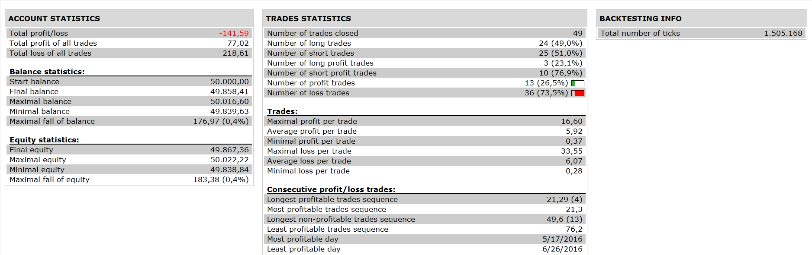

# RSI Peak Trough Strategy

> Source: https://fxcodebase.com/code/viewtopic.php?f=31&t=64098  
> Forum: 31 · Topic 64098 · 2 post(s)

---

## RSI Peak Trough Strategy

**Apprentice** · Tue Nov 15, 2016 3:43 am

 

Open Long
C > C(at time when have peak rsi)
Open Short
 C < C(at time when have trough rsi)

 [RSI Peak Trough Strategy.lua](files/109079/RSI%20Peak%20Trough%20Strategy.lua)

The Strategy was revised and updated on January 18, 2019.

---

## Re: RSI Peak Trough Strategy

**Apprentice** · Sun Dec 18, 2016 8:26 am

Strategy was revised and updated.
