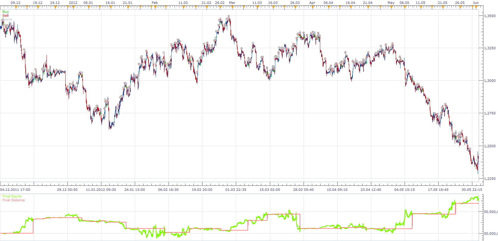

# RSI STOCHASTIC TREND ENTRY STRATEGY

> Source: https://fxcodebase.com/code/viewtopic.php?f=31&t=22984  
> Forum: 31 · Topic 22984 · 4 post(s)

---

## RSI STOCHASTIC TREND ENTRY STRATEGY

**Apprentice** · Tue Sep 04, 2012 2:49 am

time frame : H4,D1

indicators used:

1.sma- period 150
2.atr- period 7 multiplier 1
3.rsi period 3
with buy level 30 , sell level 70
4.stochastic (6,3,3)
with buy level 20, sell level 80

buy when:
1. price > sma
2.price< sma +atr
3.rsi <buy level
4.stochastic < buy level and k cross over d

sell when:
1. price< sma
2.price> sma - atr
3.rsi> sell level
4.stochastic> sell level and k cross under d

 [RSI STOCHASTIC TREND ENTRY STRATEGY .lua](files/39620/RSI%20STOCHASTIC%20TREND%20ENTRY%20STRATEGY%20.lua)

---

## Re: RSI STOCHASTIC TREND ENTRY STRATEGY

**gmiller** · Tue Sep 04, 2012 8:38 pm

please rename second "ATR Calculation" with "STO Calculation", Thank you

---

## Re: RSI STOCHASTIC TREND ENTRY STRATEGY

**Apprentice** · Wed Sep 05, 2012 4:57 pm

Fixed.

---

## Re: RSI STOCHASTIC TREND ENTRY STRATEGY

**Apprentice** · Thu Jan 18, 2018 10:36 am

The strategy was revised and updated.
