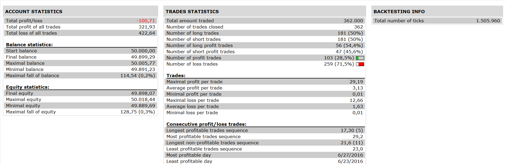

# RSI Strategy

> Source: https://fxcodebase.com/code/viewtopic.php?f=31&t=64105  
> Forum: 31 · Topic 64105 · 2 post(s)

---

## RSI Strategy

**Apprentice** · Wed Nov 16, 2016 8:37 am

 

peakRSI = rsi > ref(rsi,-1) and rsi > ref(rsi,+1);
troughRSI = rsi <ref(rsi,-1) and rsi < ref(rsi,+1);

Long:
crossover(rsi,peakRSI) and C > C (at time have last peak RSI)
Short:
crossunder(rsi, troughRSI) and C < C( at time have last trough RSI)

 [RSI Strategy.lua](files/109105/RSI%20Strategy.lua)

The Strategy was revised and updated on January 18, 2019.

---

## Re: RSI Strategy

**Apprentice** · Sun Dec 18, 2016 10:12 am

Strategy was revised and updated.
