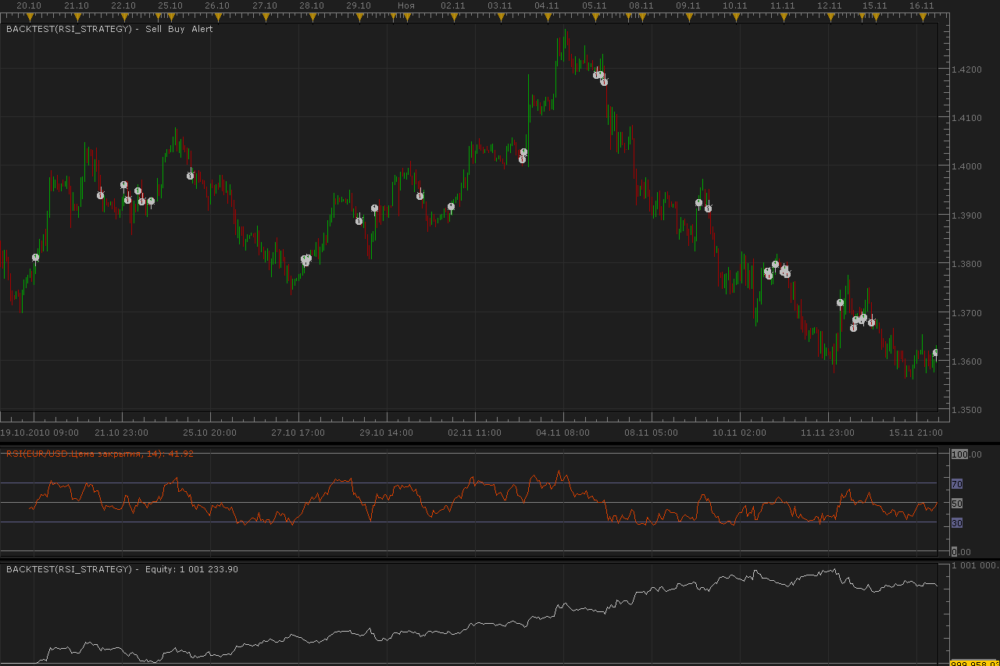
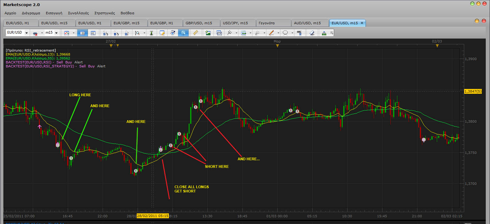
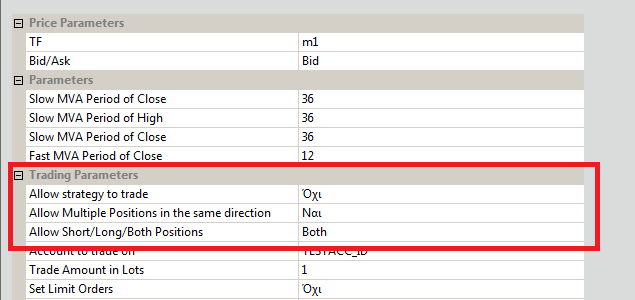

# RSI strategy

> Source: https://fxcodebase.com/code/viewtopic.php?f=31&t=2828  
> Forum: 31 · Topic 2828 · 37 post(s)

---

## RSI strategy

**Alexander.Gettinger** · Tue Nov 30, 2010 2:01 am

BUY condition: RSI crosses over [Level].
SELL condition: RSI crosses under [Level].

 

Download:

 [RSI_Strategy.lua](files/6453/RSI_Strategy.lua)

---

## Re: RSI strategy

**psaros** · Tue Nov 30, 2010 4:51 am

Thank you very Much

---

## Re: RSI strategy

**Ancient** · Thu Dec 16, 2010 3:07 am

Strategy is not Opening Orders?

---

## Re: RSI strategy

**ramsfxcode** · Sun Jan 09, 2011 10:33 am

Hi Alex

Am using the latest version of FXCM TS II as of 08-Jan-2011.

TestCase-1

MarketscopeChart=EURJPY/m15
BackTest-SetSignal=No/AccountInitial=500/LotSize=10000
Strategy=RSI/AllDefaultSettings/14/Close/50/TF=m30/Equity=16480

Report Output for the above TF
Strategy Performance Report
=================================================
Strategy Tested RSI_STRATEGY(EUR/JPY.m30,RSI(14))
Price Source EUR/JPY
From 2011-01-04 13:45:01
To 2011-01-07 16:00:01
Ticks Simulated 3268
Profit Trades 1 (14%)
Total Profit 9080
Maximal Profit 9080
Average Profit 9080.00
Loss Trades 6 (85%)
Total Loss 5160
Maximal Loss 1330
Average Loss 860.00
Gross Profit/Loss 3920

Query:
1. If this strategy was actually executed with the above settings, would it have resulted in the same exactly.
2. What does the Simulated Ticks imply here ?
3. Report shows 7 trades with 1 Profit Trade=9080
4. How is this calculated...when there is only 7 trades?
5. Probably i did not understand the LotSize in the BackTest Parameters !
 (LotSize=10000 i believe is equal to Mini 10K Amount)
6. Account is a Demo account (10K=1 Pip)

rams

---

## Re: RSI strategy

**sho-me-pips** · Fri Jan 21, 2011 4:12 pm

Could you modify this strategy to buy on cross up of 30 and sell on cross down of 70.

---

## Re: RSI strategy

**sho-me-pips** · Sun Feb 06, 2011 9:12 am

Would someone tell me how to modify this code so this strategy will not close trades automatically.

Thanks in advance.

PS: I was able to modify a stochastic strategy to fit my needs..

---

## Re: RSI strategy

**alepan72** · Mon Feb 28, 2011 4:44 am

> **sho-me-pips wrote:**
> Could you modify this strategy to buy on cross up of 30 and sell on cross down of 70.

It 's good and usefull tool from this way.
Is it possible Alexander?

Best regards!
Kisses from Greece

---

## Re: RSI strategy

**Alexander.Gettinger** · Thu Mar 03, 2011 11:26 pm

> **sho-me-pips wrote:**
> Could you modify this strategy to buy on cross up of 30 and sell on cross down of 70.

OK.
I work on it.

---

## Re: RSI strategy

**Alexander.Gettinger** · Fri Mar 04, 2011 12:36 am

> **sho-me-pips wrote:**
> Could you modify this strategy to buy on cross up of 30 and sell on cross down of 70.

Please, see this strategy.

Download:

 [RSI_Strategy2.lua](files/8615/RSI_Strategy2.lua)

---

## Re: RSI strategy

**alepan72** · Fri Mar 04, 2011 7:45 am

BEST, it 's simply the best. Thanx a lot Alexander!!!
Just a simple correction... Could you, please, add an option to allow multiple longs and shorts trades?

 

---

## Re: RSI strategy

**sho-me-pips** · Sat Mar 05, 2011 10:26 am

Thanks Alexander!!

You guys are awesome.

---

## Re: RSI strategy

**NID007** · Thu Mar 10, 2011 12:51 am

> **Alexander.Gettinger wrote:**
>
>
> > **sho-me-pips wrote:**
> > Could you modify this strategy to buy on cross up of 30 and sell on cross down of 70.
>
>
>
> Please, see this strategy.
>
> Download:
>
>
> RSI_Strategy2.lua

i

It wont launch any trades lon or short ?? advice please

---

## Re: RSI strategy

**komotose** · Thu Mar 17, 2011 1:00 pm

im having the same issue, any help? It acts as though it is running but will not open any long or short trades and will not backtest.

---

## Re: RSI strategy

**komotose** · Thu Mar 17, 2011 5:42 pm

It seems this strategy will not trade on live accounts? I cannot seem to find the issue, any help? Thank you in advance.

---

## Re: RSI strategy

**alepan72** · Tue Mar 22, 2011 6:20 pm

> **alepan72 wrote:**
> BEST, it 's simply the best. Thanx a lot Alexander!!!
> Just a simple correction... Could you, please, add an option to allow multiple longs and shorts trades?

The option that I need is the one below. It would be perfect for my trading system I use. I wish you do it as soon as possible...
Thanx a lot for ALL your services!!!

 

The strategy that option included... [http://www.fxcodebase.com/code/viewtopi ... =31&t=3691](http://www.fxcodebase.com/code/viewtopic.php?f=31&t=3691)

---

## Re: RSI strategy

**Apprentice** · Wed Mar 23, 2011 4:04 am

Your request has been added to developmental cue.

---

## Re: RSI strategy

**alepan72** · Wed Mar 30, 2011 12:31 pm

I wait for with distress. It is very important parameter and will help me biggest in my transactions.
Thanks and best regards for your services!!!

---

## Re: RSI strategy

**alepan72** · Sun Dec 11, 2011 12:07 pm

Hi all...
Still wait for the above....

---

## Re: RSI strategy

**martini31** · Tue Dec 13, 2011 1:03 am

hi all,

cant seem to get this to do trades in tradestation II

anyone know why????

Thanks

---

## Re: RSI strategy

**martini31** · Tue Dec 13, 2011 6:25 pm

got it to trade but it will not honor the limit/stop parameters

anyone?

Thanks

---

## Re: RSI strategy

**arindam89** · Fri Jan 13, 2012 1:58 am

> **Alexander.Gettinger wrote:**
> BUY condition: RSI crosses over [Level].
> SELL condition: RSI crosses under [Level].
>
>
>
> RSI_Strategy.png
>
>
>
> Download:
>
>
> RSI_Strategy.lua

hi
plzzz add risk management and profit/loss care to this strategy link [viewtopic.php?f=31&t=1985&p=23197&hilit=profit%2Floss+care#p23197](https://fxcodebase.com/code/viewtopic.php?f=31&t=1985&p=23197&hilit=profit%2Floss+care#p23197)
thanks
by

---

## Re: RSI strategy

**Apprentice** · Fri Jan 13, 2012 4:04 am

Your request is added to the developmental cue.

---

## Re: RSI strategy

**zmender** · Sun Apr 08, 2012 10:40 am

Also, can we add a trend confirmation by buy only above 200MVA and sell only below?

---

## Re: RSI strategy

**Apprentice** · Tue Apr 10, 2012 2:31 am

Your request is added to the development list.

---

## Re: RSI strategy

**jaricarr** · Thu Sep 01, 2016 9:42 pm

Hi Apprentice,

Can you please make a MTF RSI Strategy (3 timeframes) ?

BUY
RSI lines 1,2,3 cross over 20 (adjustable) level

SELL
RSI lines 1,2,3 cross under 80 (adjustable) level

EXIT BUY
RSI line 2 **cross under** RSI line 3

EXIT SELL
RSI line 2 **cross over** RSI line 3

Many thanks,
JariCarr

---

## Re: RSI strategy

**jaricarr** · Fri Sep 02, 2016 1:39 am

Hi Apprentice,

Can you please add:
Close on opposite (yes/no)
End of Turn / Live

---

## Re: RSI strategy

**Apprentice** · Fri Sep 02, 2016 3:41 am

Close on opposite (yes/no)
End of Turn / Live
Added.

---

## Re: RSI strategy

**Apprentice** · Fri Sep 02, 2016 4:43 am

Try MTF RSI strategy
[viewtopic.php?f=31&t=63832](https://fxcodebase.com/code/viewtopic.php?f=31&t=63832)

---

## Re: RSI strategy

**jaricarr** · Fri Sep 02, 2016 9:06 pm

> **Apprentice wrote:**
> Close on opposite (yes/no)
> End of Turn / Live
> Added.

Many thanks for you prompt response.

looks like its missing one of the entry levels.

Thanks again

---

## Re: RSI strategy

**dnwatson2** · Thu Sep 08, 2016 8:23 am

Can you add moving average confirmation?

Long:
RSI - above 50
MA - price above MA
Open only long orders

Short:
RSI - below 50
MA - price below MA
Open only short orders

Close order if price moves above/below MA

---

## Re: RSI strategy

**Avignon** · Thu Sep 08, 2016 1:43 pm

> **dnwatson2 wrote:**
> Can you add moving average confirmation?
>
> Long:
> RSI - above 50
> MA - price above MA
> Open only long orders
>
> Short:
> RSI - below 50
> MA - price below MA
> Open only short orders
>
> Close order if price moves above/below MA

[viewtopic.php?p=107773](http://www.fxcodebase.com/code/viewtopic.php?p=107773) ?

---

## Re: RSI strategy

**dnwatson2** · Thu Sep 08, 2016 2:16 pm

Yes.. is there a strategy built for the Price_MA Cross with RSI confirmation?

---

## Re: RSI strategy

**Avignon** · Sun Sep 11, 2016 6:55 pm

I read too fast, sorry. This is only an indicator.

---

## Re: RSI strategy

**Apprentice** · Sat Dec 17, 2016 10:34 am

Strategy was revised and updated.

---

## Re: RSI strategy

**Desrow** · Thu Jan 26, 2017 2:25 pm

Apprentice,

The Strategy will enter each new Trade, but how do I set this screen up to use only the "Trailing Stop" as an exit?

I want the Strategy to enter all new trades but not close them, I want to let the "Trailing Stop" do the exits.

Thanks

---

## Re: RSI strategy

**Apprentice** · Fri Jan 27, 2017 3:19 am

Set optinal Exit to no.
Close on Opposite to no

---

## Re: RSI strategy

**Apprentice** · Mon Jan 15, 2018 8:27 am

The strategy was revised and updated.
