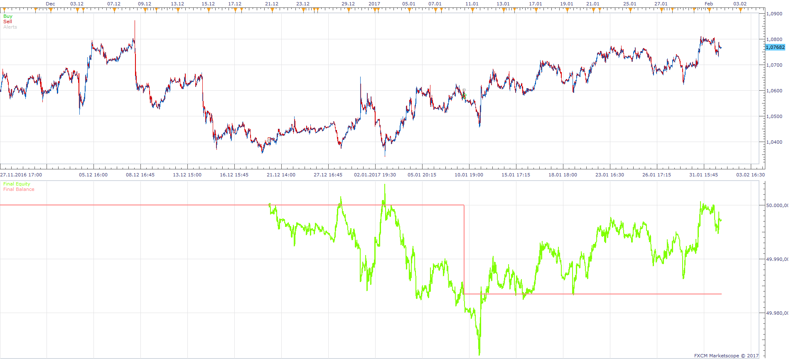
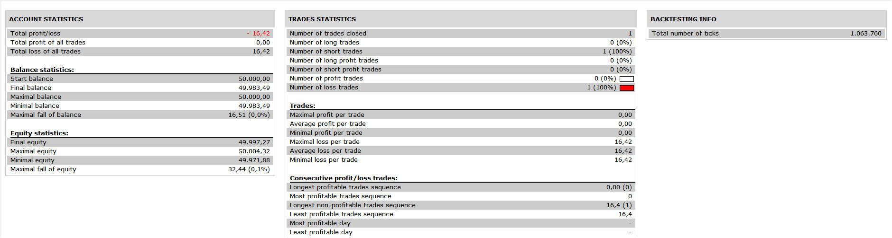

# RSIOMA Strategy

> Source: https://fxcodebase.com/code/viewtopic.php?f=31&t=64769  
> Forum: 31 · Topic 64769 · 6 post(s)

---

## RSIOMA Strategy

**Apprentice** · Mon Jun 05, 2017 2:23 pm

 

1. RSI OMA > SIGNAL AND SIGNAL > BUY LEVEL{20} IN H4
2. RSI OMA > SIGNAL AND SIGNAL > BUY LEVEL{20} IN H1
3.SIGNAL < BUY LEVEL{-20} AND RSI OMA CROSS OVER SIGNAL IN M15

SELLING CONDITIONS ARE AS FOLLOW:

1. RSI OMA < SIGNAL AND SIGNAL < SELL LEVEL{-20} IN H4
2. RSI OMA < SIGNAL AND SIGNAL < SELL LEVEL{-20} IN H1
3.SIGNAL> SELL LEVEL{20} AND RSI OMA CROSS UNDER SIGNAL IN M15

 [RSIOMA Strategy.lua](files/112782/RSIOMA%20Strategy.lua)

RSIOMA.lua is available here.
[viewtopic.php?f=17&t=34066&p=112781#p112781](https://fxcodebase.com/code/viewtopic.php?f=17&t=34066&p=112781#p112781)
Averages indicator is available here.
[viewtopic.php?f=17&t=2430](https://fxcodebase.com/code/viewtopic.php?f=17&t=2430)
Momentum is available here.
[viewtopic.php?f=17&t=896&p=1638](https://fxcodebase.com/code/viewtopic.php?f=17&t=896&p=1638)

The Strategy was revised and updated on January 21, 2019.

---

## Error in strategy

**albertparis** · Tue Jun 06, 2017 4:27 am

Hello

Error in strategy

Program Files (x86)/Candleworks/FXTS2/Strategies/Custom/RSIOMA Strategy.lua:503: Specified index is out of range

---

## Re: RSIOMA Strategy

**Apprentice** · Tue Jun 06, 2017 7:49 am

Try it now.

---

## Re: RSIOMA Strategy

**albertparis** · Tue Jun 06, 2017 9:03 am

Thank you, it works

---

## Re: RSIOMA Strategy

**papynou34** · Thu Nov 30, 2017 7:09 am

Hello,
I tried to use this strategy but infortunately, the strategy asks for MOMEMTUM indicator. I didn't find it?

Thanks in advance

---

## Re: RSIOMA Strategy

**Apprentice** · Fri Dec 01, 2017 3:59 am

Averages indicator is available here.
[viewtopic.php?f=17&t=2430](https://fxcodebase.com/code/viewtopic.php?f=17&t=2430)
Momentum is available here.
[viewtopic.php?f=17&t=896&p=1638](https://fxcodebase.com/code/viewtopic.php?f=17&t=896&p=1638)
