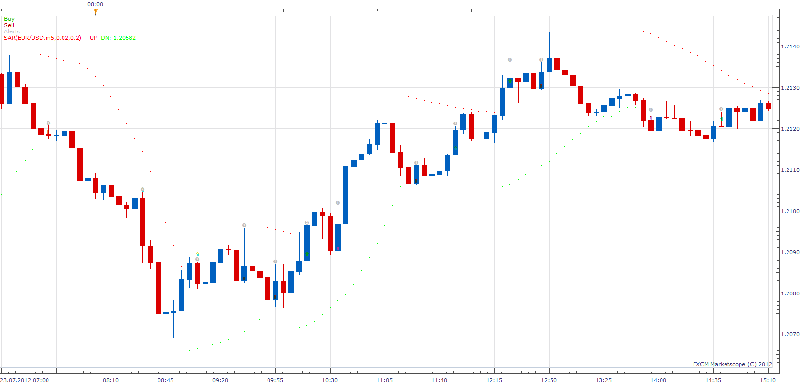

# SAR Candle Reversal Strategy

> Source: https://fxcodebase.com/code/viewtopic.php?f=31&t=27300  
> Forum: 31 · Topic 27300 · 2 post(s)

---

## SAR Candle Reversal Strategy

**Apprentice** · Sun Dec 02, 2012 11:58 am

Open Long
Sar ( period) -- buy ,
Sar( period-1) -- sell,
Price (close) ( period) > Price (high)(previous two bars )

Open Short
Sar(period)--sell
Sar(period-1)--buy
Price(close)(period)< Price(low)(previous two bars)

Exit (Optinal)
Exit Long
Sar ( period) -- sell (Optinal)
Price (close) ( period) < Price (low)(previous two bars )
Exit Short
Sar ( period) -- buy (Optinal)
Price (close) ( period) > Price (high)(previous two bars ) (Optinal)

 [SAR Candle Reversal Strategy.lua](files/47676/SAR%20Candle%20Reversal%20Strategy.lua)

---

## Re: SAR Candle Reversal Strategy

**Apprentice** · Sat Jan 13, 2018 10:42 am

The strategy was revised and updated.
