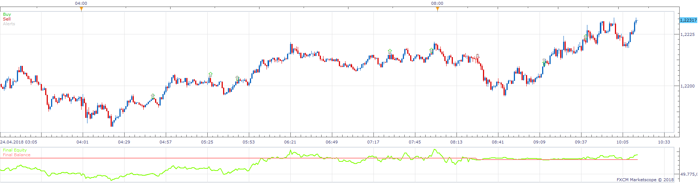
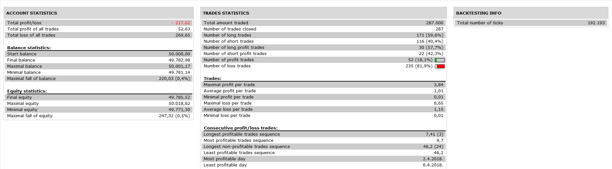

# SAR ICH MACD RSI Strategy

> Source: https://fxcodebase.com/code/viewtopic.php?f=31&t=67180  
> Forum: 31 · Topic 67180 · 1 post(s)

---

## SAR ICH MACD RSI Strategy

**Apprentice** · Wed Dec 19, 2018 6:38 am

 

Based on request.
[viewtopic.php?f=27&t=67178](https://fxcodebase.com/code/viewtopic.php?f=27&t=67178)

Open Long
if SAR change
source > tenkan
source > kinjun
source > SA
source > SB
tenkan > previus tenkan
macd histogram > previus macd histogram
rsi < rsi buy level (66 )

Vice versa for short.

 [SAR ICH MACD RSI Strategy.lua](files/122946/SAR%20ICH%20MACD%20RSI%20Strategy.lua)
