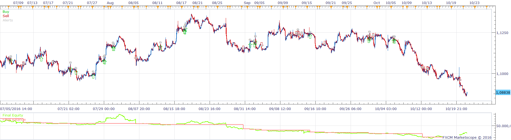
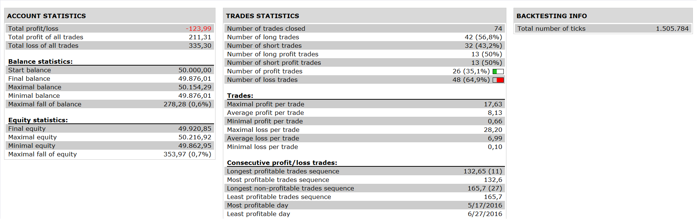

# SAR MACD MA Strategy

> Source: https://fxcodebase.com/code/viewtopic.php?f=31&t=64038  
> Forum: 31 · Topic 64038 · 4 post(s)

---

## SAR MACD MA Strategy

**Apprentice** · Sun Oct 30, 2016 6:32 am

 

 Long
	Sar < Price
	MACD > 0
	Price / MVA CrossOver

	Short
	Sar > Price
	MACD < 0
	Price / MVA CrossUnder

 [SAR MACD MA Strategy.lua](files/108853/SAR%20MACD%20MA%20Strategy.lua)

---

## Re: SAR MACD MA Strategy

**Apprentice** · Sun Dec 18, 2016 9:07 am

Strategy was revised and updated.

---

## Re: SAR MACD MA Strategy

**Golani** · Thu Apr 27, 2017 4:51 pm

Hi,
I hope you can help me.
The strategy works, but the time parameters are not clearly for me.
The mandatory closing time and the start and stop time parameters are not working how I expected.
What is my mistake ?

Thank you for helping in advance.

---

## Re: SAR MACD MA Strategy

**Apprentice** · Thu Jan 11, 2018 8:44 am

The strategy was revised and updated.
