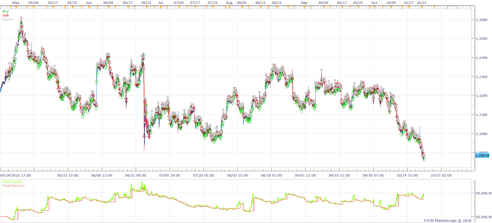
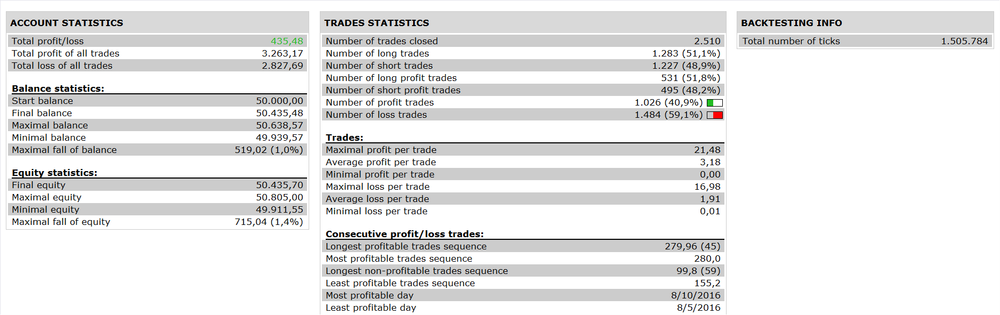

# SAR MACD Strategy

> Source: https://fxcodebase.com/code/viewtopic.php?f=31&t=12527  
> Forum: 31 · Topic 12527 · 25 post(s)

---

## SAR MACD Strategy

**Apprentice** · Tue Jan 31, 2012 5:40 am

 

Long
Sar < Price
Histogram > 0

Short
Sar > Price
Histogram < 0

 [SAR MACD Strategy.lua](files/24714/SAR%20MACD%20Strategy.lua)

MT4 version.
[https://fxcodebase.com/code/viewtopic.php?f=38&t=71361](https://fxcodebase.com/code/viewtopic.php?f=38&t=71361)

---

## Re: SAR MACD Strategy

**briansummy** · Thu Mar 22, 2012 7:45 pm

Excellent strategy here. Can you add stochastics? Or take the MACD-Stoch and add SAR?

---

## Re: SAR MACD Strategy

**Apprentice** · Fri Mar 23, 2012 2:49 am

I do not understand your request.
Can you give more eloquent description of the strategy you want to be coded.

---

## Re: SAR MACD Strategy

**noozak** · Tue Mar 27, 2012 2:45 pm

Thanks for this strategy! I have an idea to make it a decent scalping strategy in the H1 time-frame. I was wondering if there is there any way you can modify the entry signal to wait until a 3rd SAR dot in the trend shows up (instead of the first) before it buys or sells. The MACD histogram requirements would stay the same.The stop loss would be when the SAR reverses to the opposite way. Thank you!

---

## Re: SAR MACD Strategy

**Apprentice** · Wed Mar 28, 2012 6:28 am

This modification is possible.

---

## Re: SAR MACD Strategy

**noozak** · Wed Mar 28, 2012 8:15 am

Awesome! thank you! If you have time to do that I would love to donate and help the website out for everything you guys do!

---

## Re: SAR MACD Strategy

**cekodokpisang** · Wed Nov 13, 2013 10:28 pm

Hello guys,

I am a new to forex and this automated trading. Already download several strategies and backtested, but all give loss, but Apprentice give advice to tweak the strategies parameter. Do you guys mind share the item that you guys tweak/modify in this strategy parameter. Hope you guys dont mind.

---

## Re: SAR MACD Strategy

**hibaaryan** · Wed Dec 31, 2014 1:43 am

I haven't given up on this yet. Just took a little vacation with my family and being a stay at home dad with four kids, time gets a little tight to work on this sort of stuff. Also, it being summer I have more work outside as well.

I would love to see your modifications.

---

## Re: SAR MACD Strategy

**jupiter ange** · Mon Oct 03, 2016 6:40 am

hello mario
can you add bollinger band at this strategy
when the price cross below the mm 20 shell
when the price cross above the mm 20 buy
thanks you

---

## Re: SAR MACD Strategy

**Apprentice** · Tue Oct 04, 2016 3:58 am

> Long
> Sar < Price
> Histogram > 0
>
> Short
> Sar > Price
> Histogram < 0

On top of this?

Long
Sar < Price
Histogram > 0
Price / MA CrossOver

Short
Sar > Price
Histogram < 0
Price / MA CrossUnder

MM is Moving Average?
If you are using MA only, BB is unnecessary.

---

## Re: SAR MACD Strategy

**jupiter ange** · Tue Oct 04, 2016 5:10 am

i m very sorry mario
like this please
Long
Sar < Price
12,26 > 0
Price / MA BB CrossOver

Short
Sar > Price
12,26 < 0
Price / MA BB CrossUnder

MM is BB Moving Average
just like this with stop and limite, no other instrument please
many thanks

---

## Re: SAR MACD Strategy

**Apprentice** · Wed Oct 12, 2016 3:37 am

Your request is added to the development list, Under Id Number 3646
 If someone is interested to do this task, please contact me.

---

## Re: SAR MACD Strategy

**Apprentice** · Sun Oct 30, 2016 6:33 am

Try this version.
[viewtopic.php?f=31&t=64038](https://fxcodebase.com/code/viewtopic.php?f=31&t=64038)

---

## Re: SAR MACD Strategy

**Apprentice** · Thu Jan 11, 2018 8:41 am

The strategy was revised and updated.

---

## Re: SAR MACD Strategy

**chai88888** · Tue Jun 15, 2021 5:19 am

can you please tweak the strategy a little bit....

buy only

macd slope is greater than zero line and the SAR is green

sell only

macd slope line is less than zero line and sar is red

thanks

---

## Re: SAR MACD Strategy

**Apprentice** · Tue Jun 15, 2021 1:58 pm

Your request is added to the development list.
Development reference 577.

---

## Re: SAR MACD Strategy

**chai88888** · Wed Jun 16, 2021 4:14 am

addition to that can you please use the classic MACD slope thanks

---

## Re: SAR MACD Strategy

**Apprentice** · Wed Jun 16, 2021 1:31 pm

[SAR_MACD_2_Strategy.lua](files/142539/SAR_MACD_2_Strategy.lua)

Try this version.

---

## Re: SAR MACD Strategy

**chai88888** · Thu Jun 17, 2021 2:58 am

can you please make it exit the open trade on the opposite sar appears or macd slope which comes first

thanks

---

## Re: SAR MACD Strategy

**Apprentice** · Fri Jun 18, 2021 4:49 am

Your request is added to the development list.
Development reference 587.

---

## Re: SAR MACD Strategy

**Apprentice** · Tue Jun 29, 2021 4:38 am

[SAR_MACD_2_Strategy.lua](files/142633/SAR_MACD_2_Strategy.lua)

Try this version.

---

## Re: SAR MACD Strategy

**ammjam** · Fri Jul 16, 2021 4:48 pm

Please include a MQL4 version for MT4

---

## Re: SAR MACD Strategy

**Apprentice** · Sat Jul 17, 2021 5:49 am

Your request is added to the development list.
Development reference 652.

---

## Re: SAR MACD Strategy

**Apprentice** · Sat Jul 17, 2021 5:51 am

Your request is added to the development list.
Development reference 653.

---

## Re: SAR MACD Strategy

**Apprentice** · Thu Jul 22, 2021 9:46 am

MT4 version.
[https://fxcodebase.com/code/viewtopic.php?f=38&t=71361](https://fxcodebase.com/code/viewtopic.php?f=38&t=71361)
