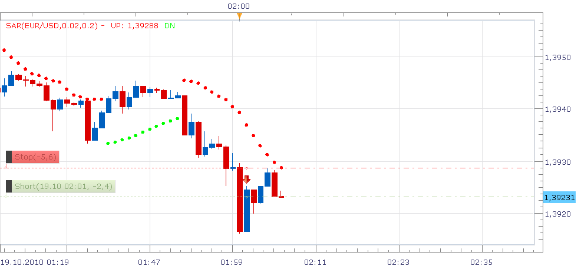

# SAR trailing stop

> Source: https://fxcodebase.com/code/viewtopic.php?f=31&t=2449  
> Forum: 31 · Topic 2449 · 24 post(s)

---

## SAR trailing stop

**Nikolay.Gekht** · Mon Oct 18, 2010 9:11 pm

The strategy sets stop value for the chosen trade using SAR indicator.

Note: Since SAR is a bar indicator, the stop value is changed only in the moment when new candle of chosen time frame appears. I.e. if you choose 1 minute time frame - the stop will be changed every minute. If you choose 1 hour time frame - the stop will be changed every hour.

Note: SAR sometimes generates a stop value which is very close to the price. So, choose ask price to set stops on shorts and bid prices to set stops on longs.

 

download:

 [sarstop.lua](files/5318/sarstop.lua)

The Strategy was revised and updated on December 11, 2018.

---

## Re: SAR trailing stop

**ronald3rg** · Sun Jan 29, 2012 5:44 pm

Strategy does not work

---

## Re: SAR trailing stop

**sunshine** · Mon Jan 30, 2012 1:03 am

Please tell me the error message you are getting. You can see it in the Events window.
The strategy works for me. Please note that the strategy is not intended to be used on US based accounts.

---

## Re: SAR trailing stop

**ronald3rg** · Mon Jan 30, 2012 3:59 pm

Ok that might be the problem Im in the US.

---

## Re: SAR trailing stop

**tradaplaya** · Tue Nov 13, 2012 1:45 pm

I have a question about this strategy;

What happens if I am in a long trade, and the sar value is current showing the down value. How will the stop be calculated, or will it automatically enter the stop order once the sar value is in the right direction?

Can this program be modified to execute as soon as you get into a position or will that result in a loss if the sar value is opposite that of trade.

I am trying to add this strategy to the NEW PIVOT STRATEGY to make pivot stratgey that uses the sar value as the trailing stop once the pivot strategy generates an order.

Please help me, I can do some coding I just need help with where to start.

---

## Re: SAR trailing stop

**Nikolay.Gekht** · Wed Nov 14, 2012 9:12 am

> **tradaplaya wrote:**
> What happens if I am in a long trade, and the sar value is current showing the down value. How will the stop be calculated, or will it automatically enter the stop order once the sar value is in the right direction?

The strategy uses only down part of SAR for "B" (long) trades and up part of SAR for "S" (short) trades. If SAR is above long TRADE the stop isn't touched at all. The same for SAR below a short trade.

Here is a part of the logic which is in charge for this:

Code: [Select all](https://fxcodebase.com/code/)
`if trade.BS == "B" then
                if sar.DN:hasData(period) then
                    stopValue = sar.DN[period];
                else
                    return ;
                end
                stopSide = "S";
                if stopValue >= instance.bid[NOW] then
                    return ;
                end
            else
                if sar.UP:hasData(period) then
                    stopValue = sar.UP[period];
                else
                    return ;
                end
                stopSide = "B";
                if stopValue <= instance.ask[NOW] then
                    return ;
                end
            end`

---

## Re: SAR trailing stop

**tradaplaya** · Wed Nov 14, 2012 2:25 pm

okay perfect. Thanks for pointing that bit out there.

---

## Re: SAR trailing stop

**tradaplaya** · Wed Nov 14, 2012 7:44 pm

is there a way to change the order id to accept pending orders not just existing trades? That way once is order is filled the strategy kicks in and places the sar stop automatically.

---

## Re: SAR trailing stop

**Nikolay.Gekht** · Mon Dec 03, 2012 1:47 pm

Yes, it is possible to change trade selector to order selector (by using core.FLAG_ORDER instead of core.FLAG_TRADE in the parameters).

The the strategy should watch changes in the orders table (until order disappears) and trades table (until a trade created by the order appears) and then implement the existing logic. I hope that Alex Gettinger or Apprentice can easily do this.

---

## Re: SAR trailing stop

**dell123** · Tue Apr 09, 2013 10:40 pm

Is there a sar stop strategy strategy for US based accounts and if not, can this one be modified to work? Thank you for your help.

---

## Re: SAR trailing stop

**Apprentice** · Fri Apr 12, 2013 4:35 am

Your request is added to the development list.

---

## Re: SAR trailing stop

**zoltanh** · Tue Sep 16, 2014 3:22 pm

Can someone advise what to change to make this strategy work on a currency pair in general, without selecting the trade or the order?
thanks

---

## Re: SAR trailing stop

**Apprentice** · Wed Sep 17, 2014 10:52 am

Can you explain your request.
I do not understand it.

---

## Re: SAR trailing stop

**zoltanh** · Sat Sep 20, 2014 5:54 am

The strategy works well, the only point that every time i have an open deal I need to start the strategy and select the deal.
I would need a strategy which just closes the deals if the SAR signal changes without selecting a certain deal, all short deals for a currency pair would be closed if Sar changes.

---

## Re: SAR trailing stop

**Apprentice** · Sun Sep 28, 2014 1:03 pm

Your request is added to the development list.

---

## Re: SAR trailing stop

**dell123** · Sat Jan 31, 2015 7:24 pm

Hi,
posted back in 4/2013 just checking in to see if there is a sar stop strategy for US based accounts available on CodeBase or anywhere else that you may know of. Thanks

---

## Re: SAR trailing stop

**Apprentice** · Tue Feb 03, 2015 9:36 am

No update was made.

---

## Re: SAR trailing stop

**losingstreak** · Thu Feb 19, 2015 4:38 am

I have entered a Long trade while SAR is beeing long already for 10 periods.

Then I applied SAR Trailing Stop Strategy - next candle the active strategy would adjust my Stop.

But in fact the strategy sets my Stop to the first SAR-period instead of the current 11th period.

Why is that?

---

## Re: SAR trailing stop

**losingstreak** · Thu Feb 19, 2015 7:28 am

I'm absolutely not capable to track SAR-Strategy's odd behavior.

Looks like this ain't a strategy to rely on. What a bummer.
The indicator itself looks nice but it won't get into play by strategy.

It may be a matter of taste but I am interested in strategies that deal with Exit points rather than Entries. It occurs to me that all input of writing codes get sucked into Entry-Strategies. What I need is reliable automation in order to close open positions. Can't find any.

---

## Re: SAR trailing stop

**losingstreak** · Sun Feb 22, 2015 3:11 pm

I must apologize. Instead of standard SAR indicator I used the custom Tick SAR - the SARSTOP strategy matches standard SAR perfectly.

---

## Re: SAR trailing stop

**agentpipen** · Tue Apr 28, 2015 4:26 pm

Hi, Is it at possible to use MVA STOP 4 four FIFO logic to create this SAR for U.S. based clients? Since, MVA Stop 4 can create a trailing stop based on Moving Averages, would it be considered perhaps that same logic to use SAR instead of MVA?

Thanks

---

## Re: SAR trailing stop

**Apprentice** · Wed Apr 29, 2015 4:34 am

Your request is added to the development list.

---

## Re: SAR trailing stop

**RVK2211** · Thu Jun 18, 2015 10:54 pm

Hi,

I have been using the SAR trailing stop and really like it.
However, I have uncovered a snag that hopefully can be fixed pretty quickly...?

If I use two SAR-Stop strategies at the same time (on a different chart for two different pairs), the stop value for both active trades are updated to the same value each time the trailing stop changes, which is obviously undesirable!!!

I am hoping somebody that understands LUA code can fix it.

RVK

[viewtopic.php?f=31&t=2449](https://fxcodebase.com/code/viewtopic.php?f=31&t=2449)

---

## Re: SAR trailing stop

**Apprentice** · Mon Dec 12, 2016 3:49 pm

Strategy was revised and updated.
