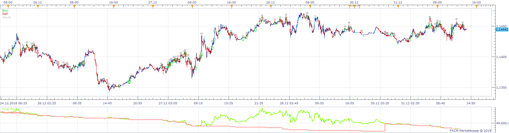
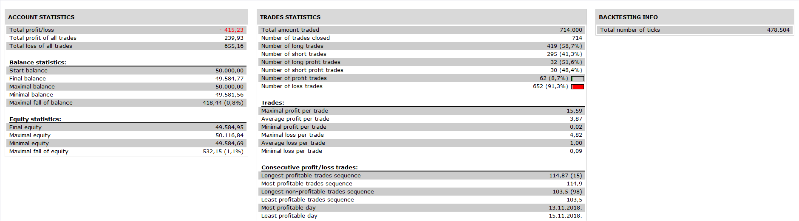

# Scalping_Strategy

> Source: https://fxcodebase.com/code/viewtopic.php?f=31&t=69184  
> Forum: 31 · Topic 69184 · 1 post(s)

---

## Scalping_Strategy

**Apprentice** · Tue Dec 03, 2019 7:12 am

 

Based on video.
[https://www.youtube.com/watch?v=zhEukjCzXwM](https://www.youtube.com/watch?v=zhEukjCzXwM)

Long
H1
EMA(8) >EMA(21)
Close > EMA(8)
m5
EMA(13)>EMA(21)
EMA(8) >EMA(13)
Close> EMA(8)

If all conditions are met, we have an uptrend, long positions are allowed.

Trigger bar
looking backward, find the last candle that meets all these conditions
EMA(13)>EMA(21)
EMA(8) >EMA(13)
Close> EMA(8)
Low< EMA(8)
We will look for a Trigger bar only within the current uptrend.

Starting from trigger candle, find the max of last 5 candles
Add 3 pips to that value
Enter long on price/max value crossover

The stop will be 3 pips below the trigger candle low

Profit targets
Risk= Abs(Entry-Stop)
1. TP 1x Risk
Exit 50 %
Move Stop to breakeven
2. TP 2x Risk
Exit 50 %

(option to trail the stop for second 1/2 of position)
if on, the trade will NOT ve closed on TP2 level.

Vice versa for short

 [Scalping_Strategy.lua](files/130048/Scalping_Strategy.lua)
