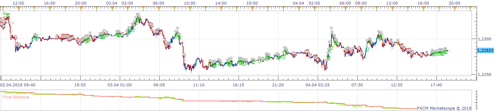
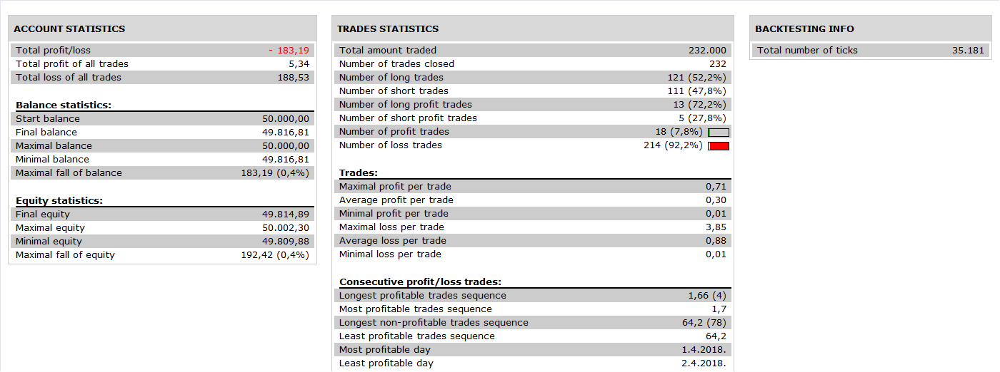

# Semafor Stochastic HeikenAshiZone Strategy

> Source: https://fxcodebase.com/code/viewtopic.php?f=31&t=66919  
> Forum: 31 · Topic 66919 · 1 post(s)

---

## Semafor Stochastic HeikenAshiZone Strategy

**Apprentice** · Tue Nov 13, 2018 7:16 am

 

Based on request.
[viewtopic.php?f=27&t=66911](https://fxcodebase.com/code/viewtopic.php?f=27&t=66911)

 [Semafor Stochastic HeikenAshiZone Strategy.lua](files/122087/Semafor%20Stochastic%20HeikenAshiZone%20Strategy.lua)

Heiken Ashi Zone Trade
[viewtopic.php?f=17&t=62332](https://fxcodebase.com/code/viewtopic.php?f=17&t=62332)
3_Level_ZZ_Semafor
[viewtopic.php?f=17&t=954](https://fxcodebase.com/code/viewtopic.php?f=17&t=954)
CCI_Histogram
[viewtopic.php?f=17&t=60294](https://fxcodebase.com/code/viewtopic.php?f=17&t=60294)
Stochastic RSI with Alert
[viewtopic.php?f=17&t=451](https://fxcodebase.com/code/viewtopic.php?f=17&t=451)
