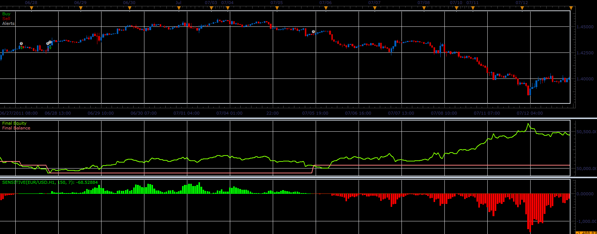

# Sensitive strategy

> Source: https://fxcodebase.com/code/viewtopic.php?f=31&t=10554  
> Forum: 31 · Topic 10554 · 5 post(s)

---

## Sensitive strategy

**Alexander.Gettinger** · Wed Dec 28, 2011 8:28 am

This strategy based on Sensitive oscillator: [viewtopic.php?f=17&t=10502](https://fxcodebase.com/code/viewtopic.php?f=17&t=10502)

 

Download strategy:

 [Sensitive_Strategy.lua](files/21845/Sensitive_Strategy.lua)

For this strategy must be installed Sensitive oscillator from [viewtopic.php?f=17&t=10502](https://fxcodebase.com/code/viewtopic.php?f=17&t=10502).

The Strategy was revised and updated on December 10, 2018.

---

## Re: Sensitive strategy

**Apprentice** · Sun Dec 04, 2016 6:12 am

Bump up.

---

## Re: Sensitive strategy

**mulligan** · Tue Dec 06, 2016 11:23 am

Getting the following error after loading - C:/Program Files(x86)/Candleworks/FXTS2/Strategies/Custom/Sensitive_Strategy.lua:-1:nil

Thanks for your help

---

## Re: Sensitive strategy

**Apprentice** · Wed Dec 07, 2016 3:02 am

I was not able to reproduce this issue.
A similar error messages will be generated, if you try to add a strategy on your ts,
which is currently used.

---

## Re: Sensitive strategy

**mulligan** · Wed Dec 07, 2016 9:58 am

Thank you for checking the strategy. I completely removed and reloaded on two different computers. Experienced the same problem. Using 1 minute time frame, EUR/USD, period 34 sensitive 7, allow strategy to trade-no. The message will appear after a time and pause the strategy. Hope this will help.

Thanks
