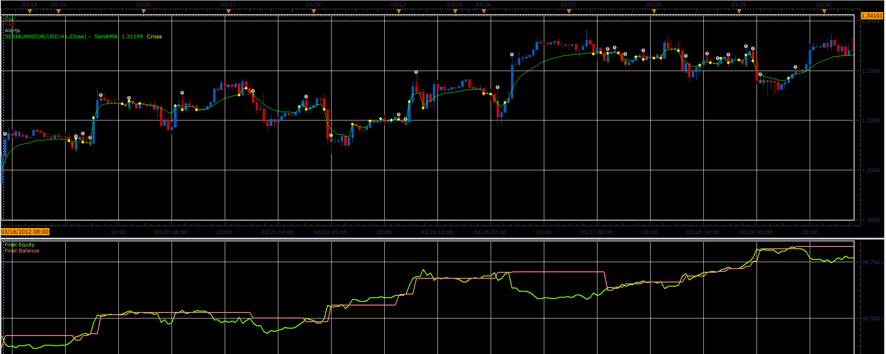

# Serial moving average strategy

> Source: https://fxcodebase.com/code/viewtopic.php?f=31&t=16211  
> Forum: 31 · Topic 16211 · 2 post(s)

---

## Serial moving average strategy

**Alexander.Gettinger** · Tue Apr 17, 2012 1:27 pm

Strategy based on Serial MA indicator ([viewtopic.php?f=17&t=15886](https://fxcodebase.com/code/viewtopic.php?f=17&t=15886)).

BUY condition:
SerialMA crosses the price and close above the SerialMA.

SELL condition:
SerialMA crosses the price and close below the SerialMA.

 

Download strategy:

 [SerialMA_Strategy.lua](files/30250/SerialMA_Strategy.lua)

For this strategy must be installed SerialMA indicator ([viewtopic.php?f=17&t=15886](https://fxcodebase.com/code/viewtopic.php?f=17&t=15886)).

The Strategy was revised and updated on November 22, 2018.

---

## Re: Serial moving average strategy

**Apprentice** · Sun Dec 04, 2016 9:29 am

Bump up.
