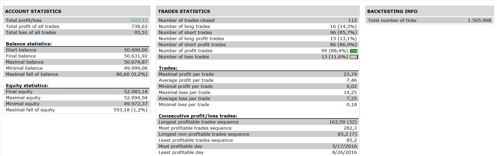

# SET Strategy

> Source: https://fxcodebase.com/code/viewtopic.php?f=31&t=64020  
> Forum: 31 · Topic 64020 · 13 post(s)

---

## SET Strategy

**Apprentice** · Sun Oct 23, 2016 4:49 pm

 

Open Long
1. price < ema
2. schaff trend cycle > buy level
3. trdsig line of trader dynamic index > buy level
4. price line of traders dynamic index cross over market base line of traders dynamic index

Open Short
1.price > ema
2. schaff trend cycle < sell level
3.market base line of traders dynamic index < sell level
4. price line of traders dynamic indes cross under market base line of traders dynamic index

 [SET Strategy.lua](files/108765/SET%20Strategy.lua)

traders dynamic index is available here
[viewtopic.php?f=17&t=2069](https://fxcodebase.com/code/viewtopic.php?f=17&t=2069)

schaff trend cycle is available here
[viewtopic.php?f=17&t=249&start=10](https://fxcodebase.com/code/viewtopic.php?f=17&t=249&start=10)

The Strategy was revised and updated on January 18, 2019.

---

## Re: SET Strategy

**Apprentice** · Sun Dec 18, 2016 7:42 am

Strategy was revised and updated.

---

## Re: SET Strategy

**PAULUC02** · Fri Nov 27, 2020 12:17 pm

hello apprentice
I would like to make some modification to this strategy if possible.
could you add an optional break-even.
I would like to modify the conditions for a purchase and a sale.
buy: if the schaff trend is between 0 and 30 and the tradersdynamicindex the green line crosses the red line below 50.
sale: if the schaff trend is between 70 and 100 and tradersdynamicindex the green line crosses the red line above 50.
I am attaching a picture for further understanding.
thank you for your work.

---

## Re: SET Strategy

**PAULUC02** · Fri Nov 27, 2020 12:52 pm

I want to add a 200 moving average as a filter when the price is above the mva we only take purchases and sales when the price is below the mva.
thank you.

---

## Re: SET Strategy

**Apprentice** · Sun Nov 29, 2020 3:15 am

Your request is added to the development list.
Development reference 2373.

---

## Re: SET Strategy

**henryfxcodebase** · Wed Dec 16, 2020 8:55 am

Hi Apprentice, thanks for all your effort, this SET strategy can only sell or go for short trade during simulation. Please help us fix this. Once again thank you.

---

## Re: SET Strategy

**foxbat** · Wed Feb 17, 2021 2:08 am

The SET strategy backtests fine, but it does not seem to actively trade.
Does anybody else have this problem? Is there a specific setting or account type that this strategy needs to actively trade? ("Allow strategy to trade" is set to 'Yes')

Thank you

---

## Re: SET Strategy

**Apprentice** · Wed Feb 17, 2021 10:38 am

Your request is added to the development list.
Development reference 209.

---

## Re: SET Strategy

**Apprentice** · Sat Feb 20, 2021 2:53 pm

[SET Strategy.lua](files/140851/SET%20Strategy.lua)

Try this version.

---

## Re: SET Strategy

**henryfxcodebase** · Tue Jul 06, 2021 10:40 am

> **Apprentice wrote:**
>
>
> SET Strategy.lua
>
>
> Try this version.

I really appreciate your efforts for us. Could you please make this strategy to MT4 EA, I mean mq4 format.
Thank you.

---

## Re: SET Strategy

**Apprentice** · Wed Jul 07, 2021 5:16 am

Your request is added to the development list.
Development reference 618.

---

## Re: SET Strategy

**Apprentice** · Wed Jul 07, 2021 5:17 am

Your request is added to the development list.
Development reference 618.

---

## Re: SET Strategy

**Apprentice** · Wed Feb 05, 2025 2:32 pm

MT4 version.
[https://fxcodebase.com/code/viewtopic.php?f=38&t=75573](https://fxcodebase.com/code/viewtopic.php?f=38&t=75573)
