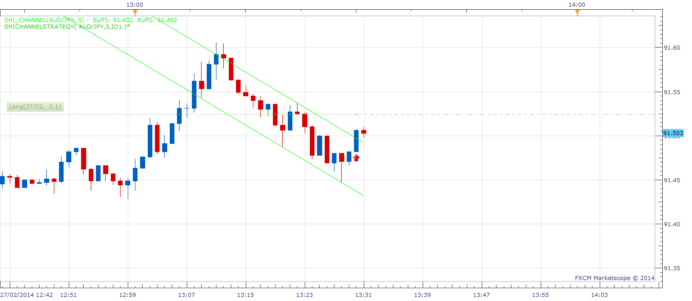

# SHI Channel Strategy

> Source: https://fxcodebase.com/code/viewtopic.php?f=31&t=60355  
> Forum: 31 · Topic 60355 · 2 post(s)

---

## SHI Channel Strategy

**moomoofx** · Wed Feb 26, 2014 9:57 pm

As requested here: [viewtopic.php?f=17&t=2305#p92272](https://fxcodebase.com/code/viewtopic.php?f=17&t=2305#p92272)

 

A strategy based off the SHI Channel Indicator.
- Supports two modes: Breakout or Reversion. Screenshot above shows Breakout mode.
- Execution (supports tick) and Chart timeframes are different.

Keep in mind that if the channel's timeframe is too short, it will change values too often.
Also, when backtesting this there is no way to verify historical channel values at the time of trade execution.

I recommend **forward testing** this in demo to ensure it works accordingly.

Cheers,
MooMooFX

The Strategy was revised and updated on December 10, 2018.

---

## Re: SHI Channel Strategy

**Apprentice** · Sun Dec 11, 2016 5:22 am

Strategy was revised and updated.
