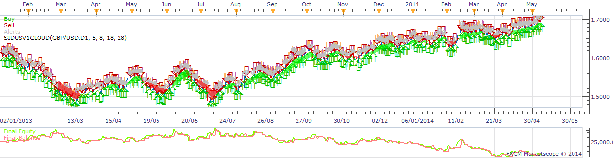

# Sidus V1 Strategy

> Source: https://fxcodebase.com/code/viewtopic.php?f=31&t=60696  
> Forum: 31 · Topic 60696 · 5 post(s)

---

## Sidus V1 Strategy

**moomoofx** · Thu May 15, 2014 4:36 am

A strategy based off the Sidus V1 indicator as requested on here: [viewtopic.php?f=27&t=60259](https://fxcodebase.com/code/viewtopic.php?f=27&t=60259)

 

The indicator can be found here: [viewtopic.php?f=17&t=60695](https://fxcodebase.com/code/viewtopic.php?f=17&t=60695)

The indicator does not need to be installed to run the strategy.
I made the exit conditions configurable, and I also added an additional one.

Cheers,
MooMooFX

The Strategy was revised and updated on December 18, 2018.

---

## Re: Sidus V1 Strategy

**mulligan** · Wed Apr 06, 2016 1:51 pm

I get the following messages when attempting to load - attempt to index global 'strategy' (a nil value) and the parameter with the specified id already exists. Assistance appreciated.

---

## Re: Sidus V1 Strategy

**mulligan** · Tue Apr 19, 2016 11:55 am

Would be very nice if you could find the time to take a look at this strategy. The problem is probably due to the Trade Station update. All was working fine prior. Re downloading everything hasn't helped. Thanks.

---

## Re: Sidus V1 Strategy

**Apprentice** · Wed Apr 20, 2016 4:36 am

Fixed.

---

## Re: Sidus V1 Strategy

**Apprentice** · Fri Dec 16, 2016 5:48 am

Strategy was revised and updated.
