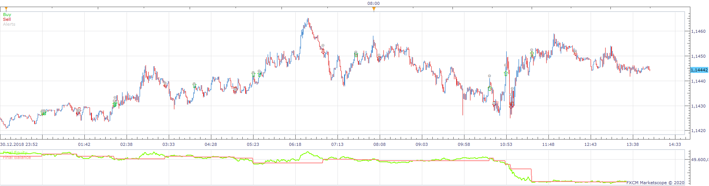
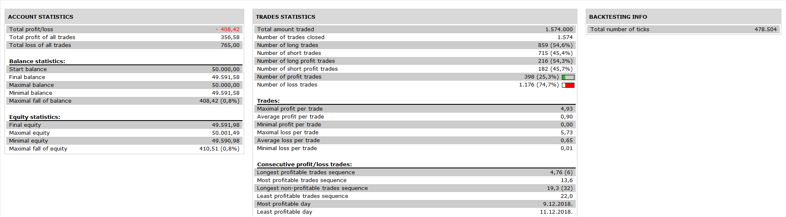

# SILA Strategy

> Source: https://fxcodebase.com/code/viewtopic.php?f=31&t=69992  
> Forum: 31 · Topic 69992 · 4 post(s)

---

## SILA Strategy

**Apprentice** · Wed Jun 10, 2020 4:50 am

 

 [SILA Strategy.lua](files/134755/SILA%20Strategy.lua)

SILA Indicator.lua
[viewtopic.php?f=17&t=69991](https://fxcodebase.com/code/viewtopic.php?f=17&t=69991)

---

## Re: SILA Strategy

**MC. Trend Trader** · Thu Jun 11, 2020 4:18 am

Hello

please insert PositionCount and Breakeven in this strategy so that we can open several options with different limits and stops.

Best Regards

---

## Re: SILA Strategy

**Apprentice** · Thu Jun 11, 2020 5:25 am

Your request is added to the development list.
Development reference 1458.

---

## Re: SILA Strategy

**Apprentice** · Fri Jun 12, 2020 3:51 am

[SILA Strategy v2.lua](files/134879/SILA%20Strategy%20v2.lua)

Try this version.
