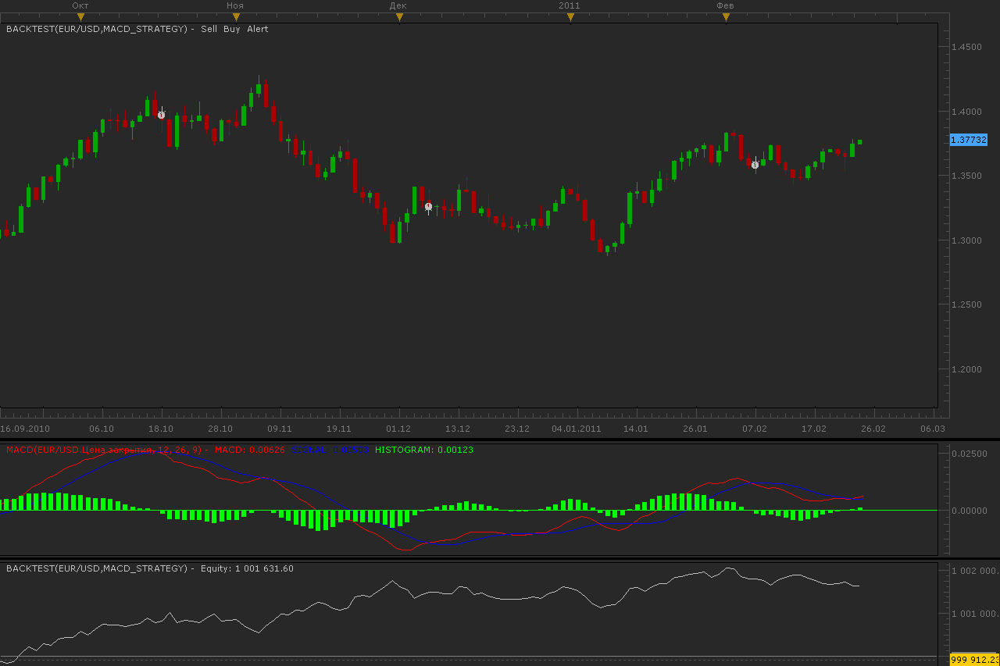

# Simple MACD strategy

> Source: https://fxcodebase.com/code/viewtopic.php?f=31&t=3517  
> Forum: 31 · Topic 3517 · 2 post(s)

---

## Simple MACD strategy

**Alexander.Gettinger** · Wed Feb 23, 2011 11:58 pm

Strategy use MACD indicator only.

BUY conditions:
MACD line crosses above the signal line AND the signal line is positive (>0)

SELL conditions:
MACD line crosses below the signal line AND the signal line is negative (<0)

 

Download:

 [MACD_Strategy.lua](files/8402/MACD_Strategy.lua)

---

## Re: Simple MACD strategy

**Apprentice** · Mon Jan 29, 2018 7:40 am

The strategy was revised and updated.
