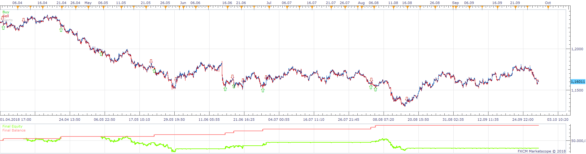
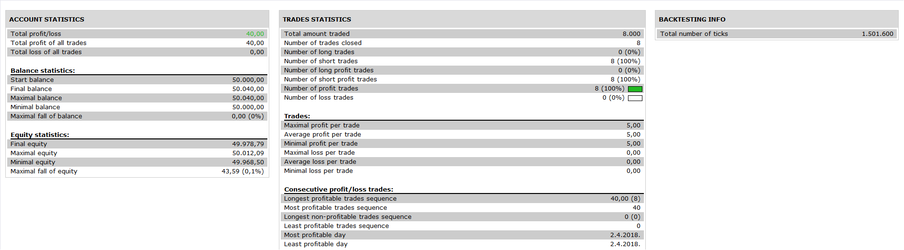
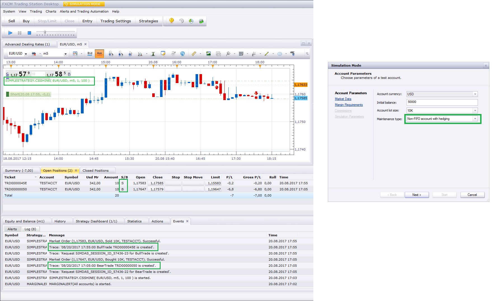

# SimpleStrategy.csshine

> Source: https://fxcodebase.com/code/viewtopic.php?f=31&t=67168  
> Forum: 31 · Topic 67168 · 3 post(s)

---

## SimpleStrategy.csshine

**Apprentice** · Fri Dec 14, 2018 1:14 pm

 

Based on request.
[viewtopic.php?f=27&t=67052](https://fxcodebase.com/code/viewtopic.php?f=27&t=67052)

 [SimpleStrategy.csshine.lua](files/122837/SimpleStrategy.csshine.lua)

---

## Re: SimpleStrategy.csshine

**csshine** · Tue Dec 18, 2018 11:35 pm

> -- enter into the specified direction
> function MarketOrder(BuySell)
> valuemap = core.valuemap();
>
> valuemap.Command = "CreateOrder";
> valuemap.OrderType = "OM";
> valuemap.OfferID = OfferID;
> valuemap.AcctID = Account;
> valuemap.Quantity = Amount * BaseSize;
> valuemap.BuySell = BuySell;
> valuemap.CustomID = CustomID;
>
> -- add stop/limit
> valuemap.PegTypeStop = "O";
> if SetStop then
> if BuySell == "B" then
> valuemap.RateStop = Offer.Ask - Offer.PointSize * Stop;
> else
> valuemap.RateStop = Offer.Bid + Offer.PointSize * Stop;
> end
> end
>
> if IsNeedTrailing then
> valuemap.TrailStepStop = (IsNeedDynamicTrailing and 1 or TrailingStop);
> end
>
> --valuemap.PegTypeLimit = "O";
> if SetLimit then
> if BuySell == "B" then
> valuemap.RateLimit = Offer.Ask + Offer.PointSize * Limit;
> else
> valuemap.RateLimit = Offer.Bid - Offer.PointSize * Limit;
> end
> end
>
> if (not CanClose) and (instance.parameters.SetStop or instance.parameters.SetLimit) then
> valuemap.EntryLimitStop = 'Y'
> end
>
> success, msg = terminal:execute(200, valuemap);
>
> if not(success) then
> terminal:alertMessage(instance.bid:instrument(), instance.bid[instance.bid:size() - 1], "Open order failed" .. msg, instance.bid:date(instance.bid:size() - 1));
> return false, msg;
> end
>
> return true, msg;
> end

Dear, I found a issue when running the strategy.
If there is already a buy trade, during the cycle of buy trade, new generated sell order will force the buy trade to be close and new sell order will be closed too. I think the correct situation is that these two trades will be run separately.
Could you help to debug why this situation happened?

---

## Re: SimpleStrategy.csshine

**Apprentice** · Thu Dec 20, 2018 1:58 pm

We think it depends on the type of account. we assume you have an account without hedging?
See attach test using sim mode with hedging.
