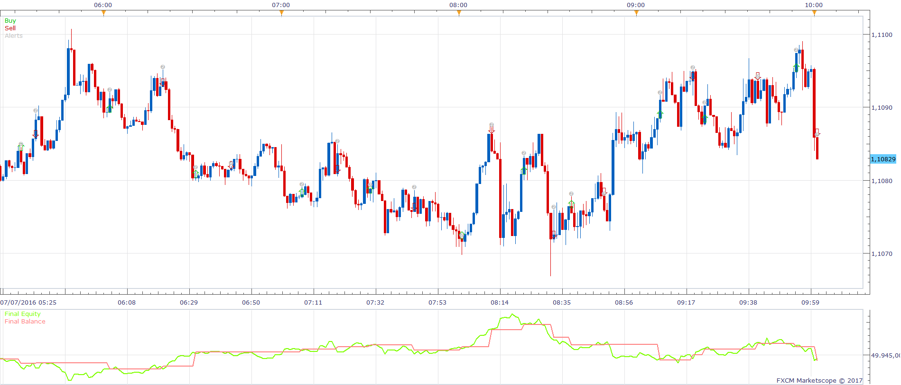
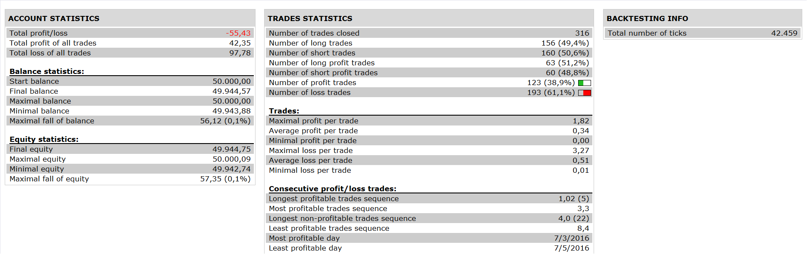

# Sine Wave Indicator Strategy

> Source: https://fxcodebase.com/code/viewtopic.php?f=31&t=64272  
> Forum: 31 · Topic 64272 · 2 post(s)

---

## Sine Wave Indicator Strategy

**Apprentice** · Sat Jan 07, 2017 9:19 am

 

Open Long: BS CROSS OVER LS AND BS < BUY LEVEL
Open Short : BS CROSS UNDER LS AND BS > SELL LEVEL

 [Sine Wave Indicator Strategy.lua](files/110388/Sine%20Wave%20Indicator%20Strategy.lua)

JESineWave.lua is available here.
[viewtopic.php?f=17&t=349](https://fxcodebase.com/code/viewtopic.php?f=17&t=349)

The Strategy was revised and updated on January 22, 2019.

---

## Re: Sine Wave Indicator Strategy

**Apprentice** · Tue Jan 09, 2018 8:05 am

The strategy was revised and updated.
