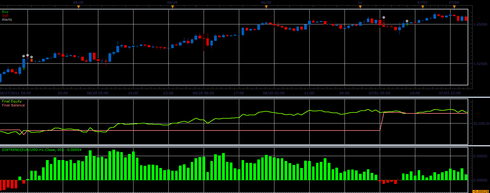

# SinTrend strategy

> Source: https://fxcodebase.com/code/viewtopic.php?f=31&t=10686  
> Forum: 31 · Topic 10686 · 5 post(s)

---

## SinTrend strategy

**Alexander.Gettinger** · Fri Dec 30, 2011 2:09 am

This strategy based on SinTrend indicator: [viewtopic.php?f=17&t=10495](https://fxcodebase.com/code/viewtopic.php?f=17&t=10495)

 

Download strategy:

 [SinTrend_Strategy.lua](files/22016/SinTrend_Strategy.lua)

For this strategy must be installed SinTrend indicator ([viewtopic.php?f=17&t=10495](https://fxcodebase.com/code/viewtopic.php?f=17&t=10495))

The Strategy was revised and updated on November 22, 2018.

---

## Re: SinTrend strategy

**Exolon** · Fri Feb 03, 2012 6:19 pm

It doesn't work for me with the "typical" price, in the Strategy Optimizer (not debugger). In fact a few prices seem to be missing. An assertion is thrown by this code in Strategies\Standard\include\helper.lua:

Code: [Select all](https://fxcodebase.com/code/)
`if sub.tick then
        return sub.stream;
    else
        if type == "open" then
            return sub.stream.open;
        elseif type == "high" then
            return sub.stream.high;
        elseif type == "low" then
            return sub.stream.low;
        elseif type == "close" then
            return sub.stream.close;
        elseif type == "bar" then
            return sub.stream;
        else
            assert(false, type .. " is unknown");
        end
    end`

---

## Re: SinTrend strategy

**Alexander.Gettinger** · Mon Feb 06, 2012 1:43 pm

I fix this problem.
Please, download strategy again.

---

## Re: SinTrend strategy

**briansummy** · Wed Mar 21, 2012 12:59 pm

Does this repaint by chance? I have been noticing to watch out for those. This would be a great strategy with Heikin-Ashi Agreement trading to enter and exit for N+1 close.

---

## Re: SinTrend strategy

**Apprentice** · Sun Dec 04, 2016 9:35 am

Bump up.
