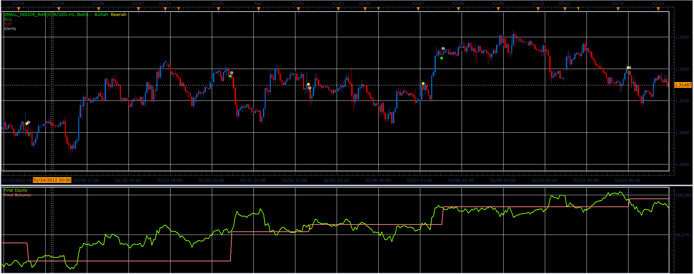

# Small inside bar strategy

> Source: https://fxcodebase.com/code/viewtopic.php?f=31&t=18180  
> Forum: 31 · Topic 18180 · 3 post(s)

---

## Small inside bar strategy

**Alexander.Gettinger** · Fri May 11, 2012 3:29 pm

Strategy based on Small inside bar indicator ([viewtopic.php?f=17&t=18178](https://fxcodebase.com/code/viewtopic.php?f=17&t=18178)).

 

Download strategy:

 [Small_Inside_Bar_Strategy.lua](files/32811/Small_Inside_Bar_Strategy.lua)

For strategy must be installed Small inside bar indicator ([viewtopic.php?f=17&t=18178](https://fxcodebase.com/code/viewtopic.php?f=17&t=18178)).

The Strategy was revised and updated on January 21, 2019.

---

## Re: Small inside bar strategy

**Apprentice** · Mon Dec 05, 2016 5:22 am

Bump up.

---

## Re: Small inside bar strategy

**maximekaribi** · Mon Dec 11, 2017 1:16 pm

HELLO
IS THERE A STRATEGY BASED ON SIMPLE INSIDE BAR AND WHERE IT IS POSSIBLE TO TAKE ONLY INSIDE BAR WITH A NUMBER OF PIPS PREDETERMINED FOR EACH PAIR?
THANK YOU VERY MUCH
