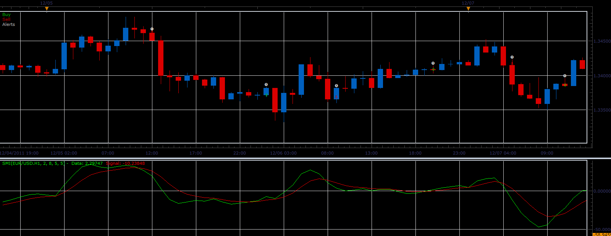

# SMI strategy

> Source: https://fxcodebase.com/code/viewtopic.php?f=31&t=12168  
> Forum: 31 · Topic 12168 · 2 post(s)

---

## SMI strategy

**Alexander.Gettinger** · Mon Jan 23, 2012 1:37 am

Strategy based on SMI indicator ([viewtopic.php?f=17&t=2071](https://fxcodebase.com/code/viewtopic.php?f=17&t=2071)).
Opening/closing orders correspond to the intersections of the indicator lines.

 

Download strategy:

 [SMI_Strategy.lua](files/24125/SMI_Strategy.lua)

For this strategy must be installed SMI indicator from [viewtopic.php?f=17&t=2071](https://fxcodebase.com/code/viewtopic.php?f=17&t=2071)

The Strategy was revised and updated on November 21, 2018.

---

## Re: SMI strategy

**Apprentice** · Sun Dec 04, 2016 6:03 am

Bump up.
