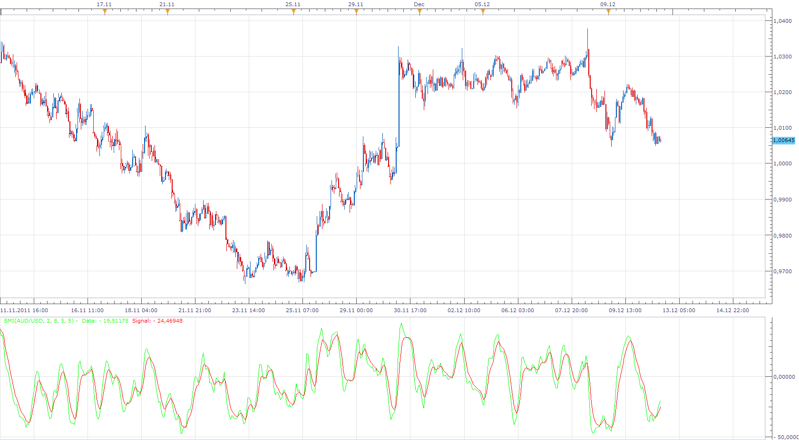

# SMI Strategy

> Source: https://fxcodebase.com/code/viewtopic.php?f=31&t=9510  
> Forum: 31 · Topic 9510 · 4 post(s)

---

## SMI Strategy

**Apprentice** · Mon Dec 12, 2011 3:24 pm

Long
SMI / SIgnal CrossOver
Short
SMI / Signal CrossUnder

 [SMI Strategy.lua](files/20430/SMI%20Strategy.lua)

Please install the SMI indicator from here.
 [viewtopic.php?f=17&t=2071&p=18489&hilit=SMI](https://fxcodebase.com/code/viewtopic.php?f=17&t=2071&p=18489&hilit=SMI) # p18489

The Strategy was revised and updated on December 18, 2018.

---

## Re: SMI Strategy

**mulligan** · Tue Mar 29, 2016 7:45 pm

Buy and sell signals seem reversed on show alert. Thanks for your help.

---

## Re: SMI Strategy

**Apprentice** · Wed Apr 06, 2016 11:23 am

Major Update.

---

## Re: SMI Strategy

**Apprentice** · Fri Dec 16, 2016 6:18 am

Strategy was revised and updated.
