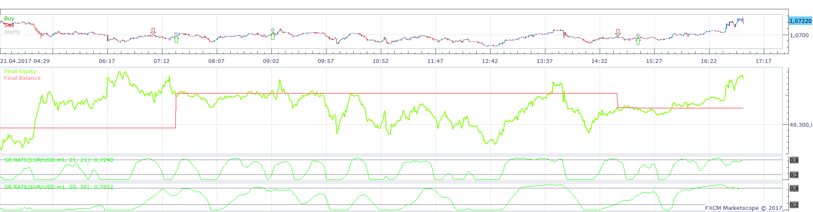
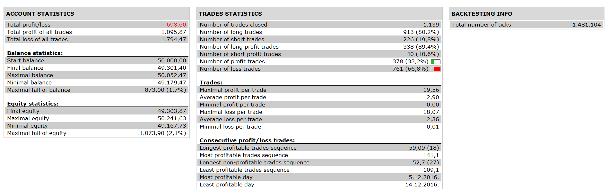

# SR Rate Strategy

> Source: https://fxcodebase.com/code/viewtopic.php?f=31&t=64638  
> Forum: 31 · Topic 64638 · 1 post(s)

---

## SR Rate Strategy

**Apprentice** · Thu May 04, 2017 12:34 pm

 

Open Long:
Long SR RATE > BUY LEVEL AND Short SR RATE CROSS OVER ITS BUY LEVEL
Open Short:
Long SR < SELL LEVEL AND Short SR RATE CROSS UNDER ITS SELL LEVEL

 [SR Rate Strategy.lua](files/112309/SR%20Rate%20Strategy.lua)

SR Rate.lua is available here.
[viewtopic.php?f=17&t=32211](https://fxcodebase.com/code/viewtopic.php?f=17&t=32211)
Gauss.lua is available here.
[viewtopic.php?f=17&t=32208](https://fxcodebase.com/code/viewtopic.php?f=17&t=32208)

The Strategy was revised and updated on January 19, 2019.
