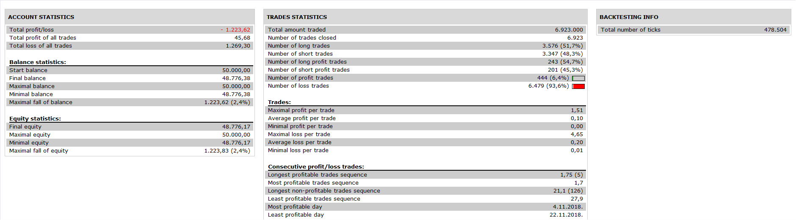

# SSL strategy

> Source: https://fxcodebase.com/code/viewtopic.php?f=31&t=69824  
> Forum: 31 · Topic 69824 · 4 post(s)

---

## SSL strategy

**Apprentice** · Fri May 08, 2020 4:50 am

 

Based on request.
[viewtopic.php?f=27&t=69811](https://fxcodebase.com/code/viewtopic.php?f=27&t=69811)

 [SSL strategy.lua](files/133704/SSL%20strategy.lua)

SSL Indicator
[viewtopic.php?f=17&t=139](https://fxcodebase.com/code/viewtopic.php?f=17&t=139)

---

## Re: SSL strategy

**Lucclucas** · Thu May 14, 2020 6:53 am

Hello Apprentice,
i did download SSL straregy but every time i try to use it i have this message, download SSL lua indicator, of corse i did but nothing work.
Is it possible to explain what i have to do ?
Many thanks,
Luc
sorry for my english i am from Belgium

---

## Re: SSL strategy

**Lucclucas** · Thu May 14, 2020 6:56 am

Hello Apprentice,
i did download SSL straregy but every time i try to use it i have this message, download SSL lua indicator, of corse i did but nothing work.
Is it possible to explain what i have to do ?
Many thanks,
Luc
sorry for my english i am from Belgium

---

## Re: SSL strategy

**Apprentice** · Thu May 14, 2020 3:48 pm

You need to download SSL Indicator also, it is available here.
[viewtopic.php?f=17&t=139](https://fxcodebase.com/code/viewtopic.php?f=17&t=139)
