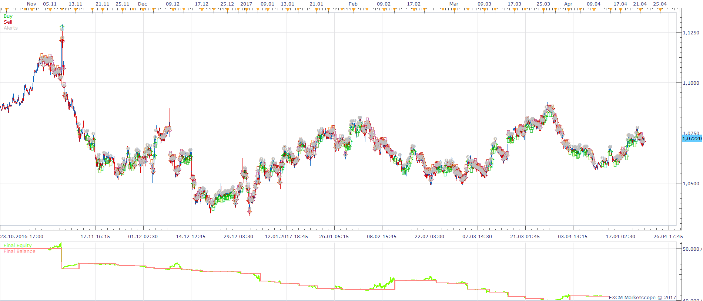
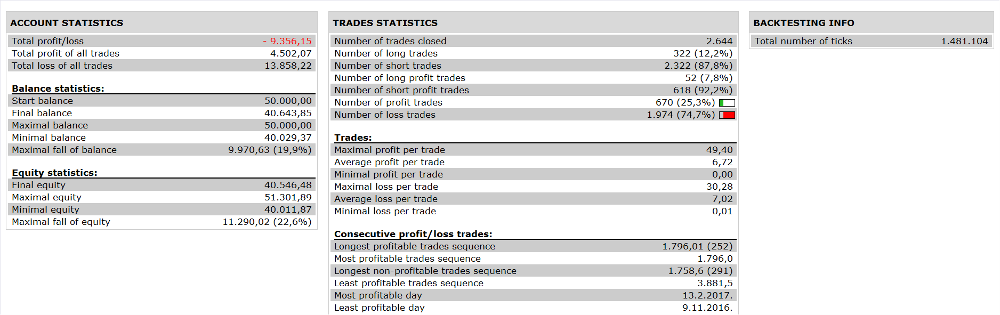
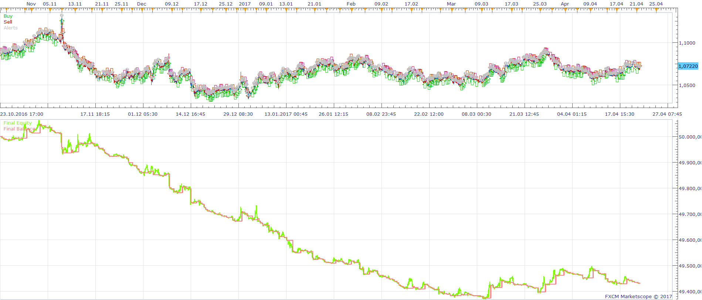
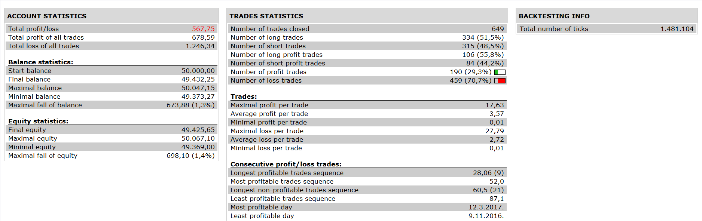

# Stoch BB RSI Indicator Strategy

> Source: https://fxcodebase.com/code/viewtopic.php?f=31&t=64632  
> Forum: 31 · Topic 64632 · 3 post(s)

---

## Stoch BB RSI Indicator Strategy

**Apprentice** · Sun Apr 30, 2017 6:59 am

 

Open Long
1 . sto_sig line> buy level and rsi cross over sto_signal line (or)
rsi > sto_signal and sto cross over -2 sigma line
2.and stochatic k > d and d< over bought level in D1 time frame

Open Short
1. sto_signal< sell level and rsi cross under sto_signal line(or)
rsi<sto_signal and sto cross under +2 sigma line
2. and stochastic k<d and d>oversold level in D1 time frame

 [Stoch BB RSI Indicator Strategy.lua](files/112221/Stoch%20BB%20RSI%20Indicator%20Strategy.lua)

Stoc_BB_RSI.lua is available here.
[http://www.fxcodebase.com/code/viewtopi ... 17&t=27881](http://www.fxcodebase.com/code/viewtopic.php?f=17&t=27881)
StdDev.lua is available here.
[viewtopic.php?f=17&t=870](https://fxcodebase.com/code/viewtopic.php?f=17&t=870)

The Strategy was revised and updated on January 19, 2019.

---

## Re: Stoch BB RSI Indicator Strategy

**fxlion** · Sun Apr 30, 2017 4:28 pm

hi apprendice ,

nice strategy.

i request a simple strategy based on this useful indicator

buy: rsi>buy level and sto_signal > buy level and sto crossesover lower band
sell: rsi< sell level and sto signal< sell level and sto cross under upper band

thank you

---

## Re: Stoch BB RSI Indicator Strategy

**Apprentice** · Mon May 01, 2017 4:15 am

 

Open Long:
rsi>buy level and sto_signal > buy level and sto crossesover lower band
Open Short:
rsi< sell level and sto signal< sell level and sto cross under upper band

 [Stoc_BB_RSI Strategy.lua](files/112230/Stoc_BB_RSI%20Strategy.lua)

Stoc_BB_RSI.lua is available here.
[http://www.fxcodebase.com/code/viewtopi ... 17&t=27881](http://www.fxcodebase.com/code/viewtopic.php?f=17&t=27881)
StdDev.lua is available here.
[viewtopic.php?f=17&t=870](https://fxcodebase.com/code/viewtopic.php?f=17&t=870)
