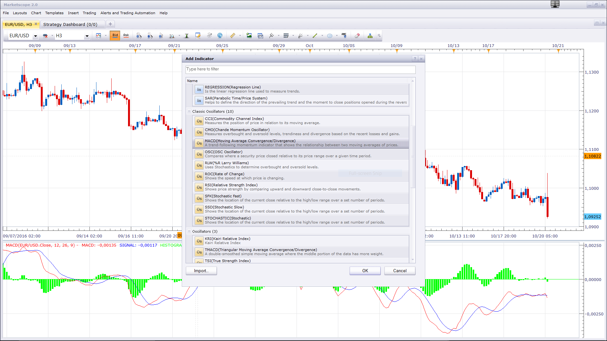

# Stochastic MA Strategy

> Source: https://fxcodebase.com/code/viewtopic.php?f=31&t=62156  
> Forum: 31 · Topic 62156 · 13 post(s)

---

## Stochastic MA Strategy

**Apprentice** · Tue Apr 28, 2015 6:36 am


Based on request.
[viewtopic.php?f=27&t=62151#p100065](https://fxcodebase.com/code/viewtopic.php?f=27&t=62151#p100065)

Buy: EMA25 > EMA100 and stochastic cross in oversold.
Sell: EMA25 < EMA100 and stochastic cross in overbought.

Exit (Optinal)
Close Buy: cross in overbought.
Close Sell: cross in oversold.

 [Stochastic MA Strategy.lua](files/100104/Stochastic%20MA%20Strategy.lua)

The Strategy was revised and updated on January 22, 2019.

---

## Re: Stochastic MA Strategy

**jupiter ange** · Sat Oct 08, 2016 7:20 am

hello prgogrammer
can you add one ema and macd original mt4 at this strategy
many thanks

---

## Re: Stochastic MA Strategy

**Apprentice** · Wed Oct 12, 2016 3:52 am

Can you explain.
In original, I do not see any MACD anywhere.

---

## Re: Stochastic MA Strategy

**jupiter ange** · Wed Oct 12, 2016 4:03 am

> **Apprentice wrote:**
> Can you explain.
> In original, I do not see any MACD anywhere.

Hello
thank you yes I know that there are n no macd but it drops.
by cons I seek the origin of macd on the mt4 I have not found in lua
of origin without modification
thank you

---

## Re: Stochastic MA Strategy

**Apprentice** · Sat Oct 15, 2016 3:04 pm

Minor update.

---

## Re: Stochastic MA Strategy

**jupiter ange** · Mon Oct 17, 2016 4:59 am

> **Apprentice wrote:**
> Minor update.

i mario
where can i find the macd original of mt4 here in lua please
thank

---

## Re: Stochastic MA Strategy

**Apprentice** · Tue Oct 18, 2016 8:21 am

Unfortunately, I do not know how iMACD is calculated.
U can use pre-installed MACD indicator.

---

## Re: Stochastic MA Strategy

**jupiter ange** · Thu Oct 20, 2016 6:23 am

> **Apprentice wrote:**
> Unfortunately, I do not know how iMACD is calculated.
> U can use pre-installed MACD indicator.

i mario
this is the code can you convert it for me please
thanks

```
#property description "Moving Averages Convergence/Divergence"
#property strict

#include <MovingAverages.mqh>

//--- indicator settings
#property  indicator_separate_window
#property  indicator_buffers 2
#property  indicator_color1  Silver
#property  indicator_color2  Red
#property  indicator_width1  2
//--- indicator parameters
input int InpFastEMA=12;   // Fast EMA Period
input int InpSlowEMA=26;   // Slow EMA Period
input int InpSignalSMA=9;  // Signal SMA Period
//--- indicator buffers
double    ExtMacdBuffer[];
double    ExtSignalBuffer[];
//--- right input parameters flag
bool      ExtParameters=false;

//+------------------------------------------------------------------+
//| Custom indicator initialization function                         |
//+------------------------------------------------------------------+
int OnInit(void)
  {
   IndicatorDigits(Digits+1);
//--- drawing settings
   SetIndexStyle(0,DRAW_HISTOGRAM);
   SetIndexStyle(1,DRAW_LINE);
   SetIndexDrawBegin(1,InpSignalSMA);
//--- indicator buffers mapping
   SetIndexBuffer(0,ExtMacdBuffer);
   SetIndexBuffer(1,ExtSignalBuffer);
//--- name for DataWindow and indicator subwindow label
   IndicatorShortName("MACD("+IntegerToString(InpFastEMA)+","+IntegerToString(InpSlowEMA)+","+IntegerToString(InpSignalSMA)+")");
   SetIndexLabel(0,"MACD");
   SetIndexLabel(1,"Signal");
//--- check for input parameters
   if(InpFastEMA<=1 || InpSlowEMA<=1 || InpSignalSMA<=1 || InpFastEMA>=InpSlowEMA)
     {
      Print("Wrong input parameters");
      ExtParameters=false;
      return(INIT_FAILED);
     }
   else
      ExtParameters=true;
//--- initialization done
   return(INIT_SUCCEEDED);
  }
//+------------------------------------------------------------------+
//| Moving Averages Convergence/Divergence                           |
//+------------------------------------------------------------------+
int OnCalculate (const int rates_total,
                 const int prev_calculated,
                 const datetime& time[],
                 const double& open[],
                 const double& high[],
                 const double& low[],
                 const double& close[],
                 const long& tick_volume[],
                 const long& volume[],
                 const int& spread[])
  {
   int i,limit;
//---
   if(rates_total<=InpSignalSMA || !ExtParameters)
      return(0);
//--- last counted bar will be recounted
   limit=rates_total-prev_calculated;
   if(prev_calculated>0)
      limit++;
//--- macd counted in the 1-st buffer
   for(i=0; i<limit; i++)
      ExtMacdBuffer[i]=iMA(NULL,0,InpFastEMA,0,MODE_EMA,PRICE_CLOSE,i)-
                    iMA(NULL,0,InpSlowEMA,0,MODE_EMA,PRICE_CLOSE,i);
//--- signal line counted in the 2-nd buffer
   SimpleMAOnBuffer(rates_total,prev_calculated,0,InpSignalSMA,ExtMacdBuffer,ExtSignalBuffer);
//--- done
   return(rates_total);
  }
//+------------------------------------------------------------------+
```

---

## Re: Stochastic MA Strategy

**Apprentice** · Thu Oct 20, 2016 10:27 am



I do not see any major difference between this implementation and preinstall MACD.
Can you point out one?

---

## Re: Stochastic MA Strategy

**jupiter ange** · Fri Oct 21, 2016 2:08 am

> **Apprentice wrote:**
>
>
> Capture.PNG
>
>
> I do not see any major difference between this implementation and preinstall MACD.
> Can you point out one?

Hello Mario
you have trouble reading my message or precedent I told you to let my request fell, I just wanted the MACD indicator mt4 converts lua, is found not anywhere on the site.
thank you

---

## Re: Stochastic MA Strategy

**Apprentice** · Sun Dec 18, 2016 7:37 am

Strategy was revised and updated.

---

## Re: Stochastic MA Strategy

**AndyMac** · Wed Jan 25, 2017 9:53 am

Hi,

I suspect there is a bug when using multiple strategies against different currency pairs, whereby the "Close on Opposite" can trigger the closure of a trade on a different pair.

My suggestion would be to change line 583 and 673 of the current version from this:

[codeif row.AccountID == Account and row.OfferID == Offer and row.QTXT == CustomID and (row.BS == BuySell or BuySell == nil) then
[/code]

To include an Instrument check like this:

[codeif row.AccountID == Account and row.Instrument == instance.bid:instrument() and row.OfferID == Offer and row.QTXT == CustomID and (row.BS == BuySell or BuySell == nil) then
[/code]

In my case, this was a solution for me as I'm running multiple copies of this strategy on a few currency pairs, however, this wouldn't solve the possible scenario of someone running multiple copies of this strategy on a single pair.

---

## Re: Stochastic MA Strategy

**Apprentice** · Sun Jan 07, 2018 9:00 am

The strategy was revised and updated.
