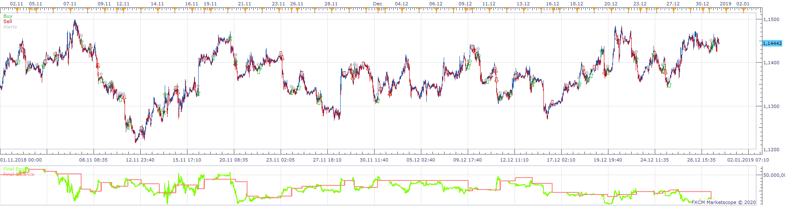
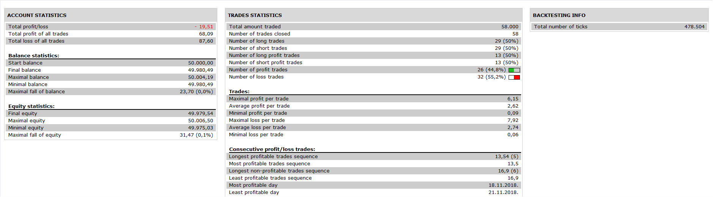

# Stochastic_Strategy with RSI

> Source: https://fxcodebase.com/code/viewtopic.php?f=31&t=70140  
> Forum: 31 · Topic 70140 · 2 post(s)

---

## Stochastic_Strategy with RSI

**Apprentice** · Wed Jul 08, 2020 4:47 am

 

Based on request.
[viewtopic.php?f=27&t=70128](https://fxcodebase.com/code/viewtopic.php?f=27&t=70128)

 [Stochastic_Strategy with RSI.lua](files/135741/Stochastic_Strategy%20with%20RSI.lua)

---

## Re: Stochastic_Strategy with RSI

**OzzyTrader** · Thu Jul 09, 2020 12:16 am

Just did some quick live testing on a demo account and thought I would share how this one behaves for any users.

For reference I tested it with the Stoch signal set on the 1m and the RSI reading on m30

If you have "close on opposite" activated it will close the trade and open one in the reverse direction if the RSI goes above or below 50. It will do this even if at that time there is not a stochastic signal telling it to do so. Essentialy it will take its que from the RSI not the stochastic which is where it took it's entry signal from. If you have the strategy set to trade with a "Live" instead of End of Turn on the stochastic it will by default use End of Turn on the RSI. Which means if you use a 30minute RSI to determine trade direction it will only check this every 30 minutes to determine the allowed trade direction.

Also while i tested it on 1m and a 30m chart be aware this will be prertty volatile so i dont recommend these setting. I did this just for the purposes to test the behaviour of the strategy.
