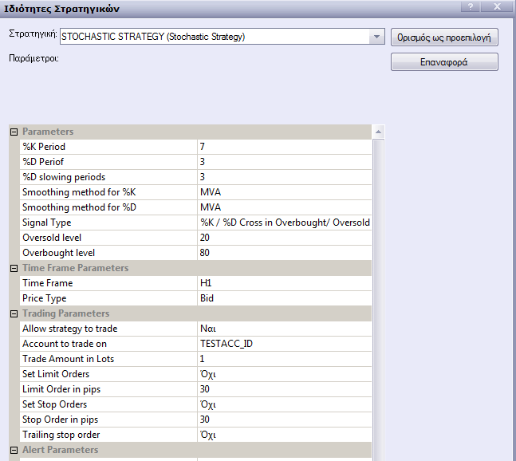
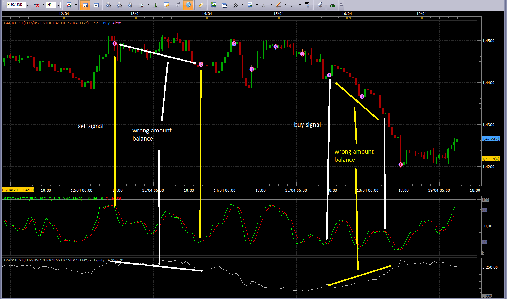
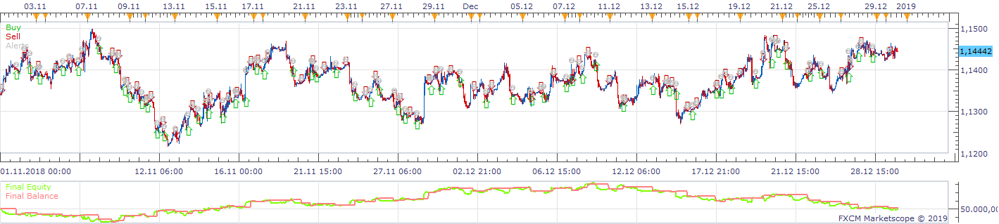
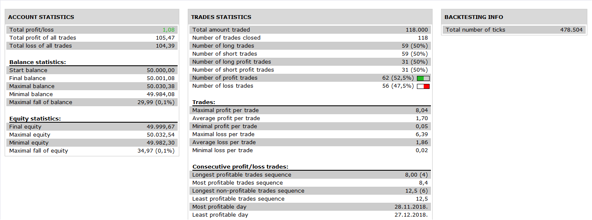

# Stochastic Strategy

> Source: https://fxcodebase.com/code/viewtopic.php?f=31&t=2533  
> Forum: 31 · Topic 2533 · 123 post(s)

---

## Stochastic Strategy

**Apprentice** · Wed Oct 27, 2010 11:28 am

In addition to the two signal already present on a standard indicator,
Buy
K% or D% Rise above Oversold.
Sell
K% or D% Falls below Overbought.

I added two additional features.
Buy
Simple K% - D% Crossover
K% - D% Crossover in Oversold.
Sell
K% - D% Crossover in Overbought.
Simple K% - D% Crossover

The signals generated while the market is in Oversold / Overbought From my experience are more reliable.

 [Stochastic Strategy.lua](files/5602/Stochastic%20Strategy.lua)

 [Stochastic Strategy with Filters.lua](files/5602/Stochastic%20Strategy%20with%20Filters.lua)

 [Stochastic Fast Strategy with Filters.lua](files/5602/Stochastic%20Fast%20Strategy%20with%20Filters.lua)

1. Filter Price/MA Position
Open Long
Price > MA
Open Short
Price < MA

2. Filter ADX / Level Position
Open Trade if ADX > ADX Level

The Strategy was revised and updated on January 18, 2019.

---

## Re: Stochastic Strategy

**wizardpro** · Wed Oct 27, 2010 1:33 pm

For email notification such as
1) Content to be send to emails content body instead of emails header as mobile phone such a Windows Mobile or Iphone let it be text or html is uanble to review the full email headers to seen the trade informations.
2) Auto Trade such as buying or selling with stop loss,take profit and trailing
This is other good indicator too

---

## Re: Stochastic Strategy

**wizardpro** · Wed Oct 27, 2010 1:41 pm

Hi,
This is a great product as it a powerfully indicator and yet user friendly.
PLease do advise for the parameter under Set Limit Order Yes and No what does it mean as I am a new user in FXCM upgrade from MT4 enviornment.
2)IT come with trailing stop order ,Yes or NO, but it does not allow me to enter how many Pip to enter my trailing or dynamic ?
Other excellent product

---

## Re: Stochastic Strategy

**alepan72** · Wed Oct 27, 2010 2:22 pm

Hi !!!
I tried this strategy and have the message below....
Best regards and millions thanx for your work!

---

## Re: Stochastic Strategy

**wizardpro** · Thu Oct 28, 2010 1:06 am

Hi
Excellent product
It would be good if to add such feature such as
1) Auto Trade only enable Sell or Buy instead of trading all Selling and Buying
2) I am wondering can the emails notifications be working together such as opening of trade emails will be send and also closing of the trade.
That would be a perfect system

---

## Re: Stochastic Strategy

**wizardpro** · Thu Oct 28, 2010 1:21 am

Hi
base on this auto, can add 1 feature waiting for 1 Bar confirmations before playing the trade.
curently this stochastic Strategy trade once cros without confirmatiosn so if I can select wait for 1 or xx bar before confirmation auto trade buy or sell
2) The Auto Trade can be select such as Only Buy trade or Sell trade

---

## Re: Stochastic Strategy

**fabfxcm** · Fri Mar 18, 2011 2:37 am

Hi Apprentice,
I think stochastic is a great indicator of an entry strategy, but the problem is that it enters both "in trend" and "against trend". I mean even when the cross is going up if there is an overbought it goes in sell. What may solve the problem is to add the strategy a trend indicator that allows to enter only in the direction of the trend (oversell for up trend and overbought for down trend). It does exist anything similar? It is possible to build up something similar?
Thank you,

---

## Re: Stochastic Strategy

**Apprentice** · Fri Mar 18, 2011 2:31 pm

This strategy uses the old template.
When I find time, I will adapt it to new template
that supports this feature.

---

## Re: Stochastic Strategy

**serchfx** · Wed Apr 06, 2011 1:37 pm

Hello Aprenttice

I like the standar stochastic strategy, but This strategy can't autotrade.
I download a Strategy Builder but can't autotrade, woul you up grade the standar stochastic indicator????

Thank's

---

## Re: Stochastic Strategy

**Apprentice** · Wed Apr 06, 2011 5:14 pm

Strange, both strategies have Autotrading features available.
On the other hand, the indicators do not have Autotrading, possibility.

Two questions.
Do you have a U.S. account.
Did you set "Allow strategy to trade" to Yes.

---

## Re: Stochastic Strategy

**brandmailbox** · Tue Apr 12, 2011 1:06 am

Hello Apprentice,

I have download the stochastic strategy and use it and when I use it on the FXCM marketscope 2.0, a signal to buy(K% or D% line crosses over oversold level) became a sell order on my account.

Pls help on this issue.

Thank you.

---

## Re: Stochastic Strategy

**Apprentice** · Tue Apr 12, 2011 4:12 am

This strategy uses four different signals.
Which, Signal Type are you using.

---

## Re: Stochastic Strategy

**brandmailbox** · Tue Apr 12, 2011 10:22 pm

Hi Apprentice,

I use the (%K Overbought/Oversold) and (%k/%D Cross in Overbought/Oversold) and getting the same result.

Thanks for helping.

---

## Re: Stochastic Strategy

**brandmailbox** · Tue Apr 12, 2011 10:39 pm

Hi Apprentice,

I only try the two signals. As for the other two signal, i'm not sure if it getting the same result as well.

---

## Re: Stochastic Strategy

**brandmailbox** · Wed Apr 13, 2011 11:39 pm

Hi Apprentice,

Is it possible to have a Slow Stochastic Strategy with 5 EMA line to comfirm trade and that can set to only trade Overbought or only trade OverSold signal?

For example, trade when Slow Stochastic crosses Oversold with faster EMA over slower EMA (5EMA over 10EMA, 10EMA over 20EMA, 20EMA over 50EMA, 50EMA over 100EMA, 100EMA over 200EMA).

Thank You.

---

## Re: Stochastic Strategy

**Apprentice** · Thu Apr 14, 2011 3:02 am

It is possible.
Only one question, to assist in the development.
Signals are provided on the Cross in Over Overbought/OverSold, Cross Out of Over Overbought/OverSold.

---

## Re: Stochastic Strategy

**brandmailbox** · Thu Apr 14, 2011 8:41 pm

Hi Apprentice,

Signals are provided on the Cross Out of Over Overbought/OverSold.

And Do you or anyone assist in the development of the EA?
Do I have to pay for it?
If yes, How much do I have to pay for a EA like the one I want?

Thank you.

---

## Re: Stochastic Strategy

**Apprentice** · Fri Apr 15, 2011 2:13 am

If you're willing to share this strategy, make it publicly available, it is free for you.
If not, I will contact you via PM.

---

## Re: Stochastic Strategy

**serchfx** · Tue Apr 19, 2011 1:57 am

Hello Apprentice

I really like your work.
I use simple stochastic strategy but I cant use it for auto trade.
Can you make this one with this option?
and one option for long or short entry.

Thank you.

---

## Re: Stochastic Strategy

**alepan72** · Tue Apr 19, 2011 4:23 am

Goodmorning everyone!
I have a problem with my backtest result. As the cross signal give a long oportunity and the price rise on... the amount balance get oposite...
Where am I wrong...?
Thanks in advance!

 

 

---

## Re: Stochastic Strategy

**Apprentice** · Tue Apr 19, 2011 11:09 am

Corrected.

---

## I need help

**serchfx** · Tue Apr 19, 2011 1:35 pm

Hello Apprentice

I really like your work.
I use simple stochastic strategy but I cant use it for auto trade.
Can you make this one with this option?
and one option for long or short entry.

Please HELP ME.

Thank you.

---

## Re: Stochastic Strategy

**brandmailbox** · Thu Apr 28, 2011 9:20 pm

Hi Apprentice,

I don't wish to share this strategy and make it publicly available but wish to add 4 more function in it.

Pls sms me.

Thank you.

---

## Re: Stochastic Strategy

**Apprentice** · Fri Apr 29, 2011 5:24 am

For this purpose you can use our Premium Services.
[viewforum.php?f=32](https://fxcodebase.com/code/viewforum.php?f=32)
Or you can send mail to me personally.

---

## Re: Stochastic Strategy

**lisa_baby_xx** · Fri May 27, 2011 10:44 am

Apprentice,

This is just what I am looking for!

Much love and many thanks. X-X-X.
lisa_baby_xx

---

## Re: Stochastic Strategy

**lisa_baby_xx** · Wed Jun 01, 2011 5:37 am

Hi,

I would like to request a slight addition to this excellent stratagy, it is this:

-Only ONE position open in a single direction at any one time.

I hope this is clear, if not then drop me a line. Okay sweetie.

Many thanks and much love. XX.
lisa_baby-xx

---

## Re: Stochastic Strategy

**sachouille** · Wed Jun 22, 2011 6:43 am

Hello Apprentice !

I must admit, you did a great job Bravo!

I use it for the EUR / USD and it works fine except ... automatically. To do so would require that the system buys or sells 1-2 pips above or below the stochastic signal. Currently, the system automatically responds to the price indicated and the signal. But, when the trend is reversed, we're going negative.

Do you think you can add this parameter?

Thank you for your help and congratulations!

P.S. Sorry for my bad English French greetings

---

## Re: Stochastic Strategy

**Apprentice** · Wed Jun 22, 2011 1:54 pm

Your request is added to the developmental cue.

---

## Re: Stochastic Strategy

**p_vansia** · Sun Oct 30, 2011 7:28 pm

Hi Apprentice,

 Excellent work. Can I request you to tweak this strategy?

 I use this strategy to work only one side (buy or sell). I use %k/%d crossover/under to generate signal.

 Now what I like it to do.

 **BUY side**

 1. I want it to buy 2 lots with limit **'N'** whenever %k crosses over %d.
 2. Now there are two ways this order gets closed out.
 i. It hits limit**'N'**
 Now when this happens I want it to close only 1 lot out of 2 open, and set stoploss on the
 remaining order to breakeven. And leave it alone unless I close it manually or it hits stop.

 ii. When %k crosses under %d.
 Now when this happens I want it to close 2 lots if the current price level is below initial
 BUY level.If current price level is above initial BUY level then it closes only 1 lot out of 2, and set stoploss on the remaining order to breakeven. And leave it alone unless I close it manually or it hits stop.

 **SELL side**

 1. I want it to sell 2 lots with limit **'N'** whenever %k crosses under %d.
 2. Now there are two ways this order gets closed out.
 i. It hits limit**'N'**
 Now when this happens I want it to close only 1 lot out of 2 open, and set stoploss on the
 remaining order to breakeven. And leave it alone unless I close it manually or it hits stop.

 ii. When %k crosses over %d.
 Now when this happens I want it to close 2 lots if the current price level is above initial
 SELL level.If current price level is below initial SELL level then it closes only 1 lot out of 2, and set stoploss on the remaining order to breakeven. And leave it alone unless I close it manually or it hits stop.

 END

 I am no good with programming. I hope you will help me if it is possible to tweak this strategy as per the steps above. But thanks any way in advance.

---

## Re: Stochastic Strategy

**Apprentice** · Mon Oct 31, 2011 4:36 pm

Your request is added to the development queue.

---

## Re: Stochastic Strategy

**bomberone3** · Tue Nov 01, 2011 5:50 am

Dear apprentice,

is it possible add a signal of buy or sell about divergence between stochastic and the price?

---

## Re: Stochastic Strategy

**Apprentice** · Tue Nov 01, 2011 4:43 pm

Your request is added to the development queue.

---

## Re: Stochastic Strategy

**bomberone3** · Tue Nov 01, 2011 5:31 pm

Thanks

---

## Re: Stochastic Strategy

**zorokw** · Tue Nov 15, 2011 2:11 am

Dear Apprentice,

I would like to thank you for your efforts and developements, I appreciate if you can add DMI indicator to the strategy as follows:

When the strategy gives an order to open a buy trade, the strategy will check the DI+>DI- if the Di+ is > DI- then will open a buy trade, if the Di+< DI- then no trades will be oppened.
and the opposite for sell trade: when the current strategy gives an order to open a sell trade then it will check the DI->DI+, if the DI-<DI+ then no trades will be oppened.

Kind regards,
Zain

---

## Re: Stochastic Strategy

**Apprentice** · Tue Nov 15, 2011 4:22 am

Your request is added to the development queue.

---

## Re: Stochastic Strategy

**Alexander.Gettinger** · Thu Dec 22, 2011 7:37 am

Stochastic divergence and DMI strategy.

Download:

 [Stochastic_Divergence_and_DMI_Strategy.lua](files/21440/Stochastic_Divergence_and_DMI_Strategy.lua)

---

## Re: Stochastic Strategy

**zorokw** · Fri Dec 30, 2011 2:04 pm

> **Alexander.Gettinger wrote:**
> Stochastic divergence and DMI strategy.
>
> Download:
>
>
> Stochastic_Divergence_and_DMI_Strategy.lua

Thank you for the strategy, I tried to use the strategy but there was an error that : the indicator with Id STOCHASTIC_DIVERGENCE is not exist, please can u help me in this issue please.

on other hand, I can't see in this strategy the Smoothing Methods for K and D, nor oversold level and over bought level ? can you please keep them to the Stochastic Strategy as before, plus add the DMI reguest as of my previous request?

Thaks and appreciate your efforts

---

## Re: Stochastic Strategy

**Alexander.Gettinger** · Wed Jan 04, 2012 2:58 am

You may find indicator in this post: [viewtopic.php?f=29&t=1864&p=14822](https://fxcodebase.com/code/viewtopic.php?f=29&t=1864&p=14822)

---

## Re: Stochastic Strategy

**zorokw** · Thu Jan 12, 2012 3:55 pm

Thank you Alexander, the strategy is working now but I noticed that the profit limit is not working properly, I checked the Option (yes) for it but the trade stay oppened. can you help me in this please.

Many thanks..

---

## Re: Stochastic Strategy

**zorokw** · Mon Jan 23, 2012 3:54 pm

Hello gentlemen,
The Profit limit is not working properly for the above strategy, can you help me in this please.
Thanks

---

## Re: Stochastic Strategy

**blessing** · Sun Sep 09, 2012 6:56 am

hi,

stochastic divergence and dmi strategy is very useful strategy .
can you add stochastic level in this strategy.

stochastic buy level: 40
stochastic sell level:60

**stochastic K < buy level and stochastic bullish divergence and dmi + >dmi - ----buy
stochastic K >sell level and stochastic bearish divergence and dmi-<dmi+ ----sell**

thank you.

---

## Re: Stochastic Strategy

**Apprentice** · Tue Sep 11, 2012 4:14 am

Your request is added to the development list.

---

## Re: Stochastic Strategy

**Ghostship** · Thu Oct 10, 2013 9:39 am

Hello,

This strategy is working perfectly for me in FXCM's TradingStationII/MarketScope 2.0, except:
I am unable to choose a three-minute timeframe to work on a three-minute chart (m3). Is there an easy fix for this?

Thank you

---

## Re: Stochastic Strategy

**raheel22** · Thu Oct 10, 2013 12:06 pm

Hi can you explain how I can implement this on FXCM Market Scope and what time frame it works best on and which trading session ?

---

## Re: Stochastic Strategy

**Apprentice** · Fri Oct 11, 2013 2:04 am

Unfortunately now, only standard TS time frames are available.
Problem is, we do not have data source for m3

---

## Re: Stochastic Strategy

**ngigliet** · Sun Oct 20, 2013 8:13 am

Just a question: when applied to a renko view , does the strategy act according to stochastic calculated renko values or to effective price scale ? The difference is obviously in the much clearer crossovers possible with renko and the reliability of signals. Thanks a lot.

---

## Re: Stochastic Strategy

**Apprentice** · Tue Oct 22, 2013 5:08 am

As far as I know strategy will use regular price sources.
For now, Views can be can not be used as strategy sources.
U can still hard code View as Strategy source, within strategy.
Stochastic Indicator added to Renko View will work as expected.

---

## Re: Stochastic Strategy

**neosimeone** · Tue Jun 03, 2014 11:33 pm

Hello, thank you very much for this strategy.
It works very well in a range market but not in the trend market.

1) Could you add the following condition in order to take position :

If indicator ADX<32 or an another value we sell or buy
Also when we are in the overbought zone or oversell zone and ADX<X we take position.
2) Another little thing :

When we cross in overbought or oversell we sell or we buy OK but if we stay in this zone (overbougt or oversell) and we cross again it takes a second position in the same way. IS there a way to avoid this ?
3) is it possible to put hours of trading for the robot, for example tell to the robot to trade only between 9h and 12h ?

Thanks for advance and thank you for your work

---

## Re: Stochastic Strategy

**Apprentice** · Wed Jun 04, 2014 5:13 am

Your request is added to the development list.

---

## Re: Stochastic Strategy

**devisr** · Wed Oct 01, 2014 5:26 am

Good morning.
I just registered.
I'm testing some strategies.
Please, I would like information on strategy "stochastic".
By testing it on my trading station, I note that a long transaction is closed without a reason.
I enclose the report of the setup: test on GER30, 5 min, October 4 - October 8, 2013.
Kindly, can you tell me how to set the setup so that the long position 10.7 of 2:45 does not close the 7/10 at 8:05?
Thanks.
Devis

---

## Re: Stochastic Strategy

**Apprentice** · Sat Oct 04, 2014 2:16 am

Strategy do not have any exit logic.
Position can be closed in two ways.
1) Set Stop / Limit level is reached
2) The opposite position was opened.

---

## Re: Stochastic Strategy

**nweiss** · Mon Oct 06, 2014 11:29 am

Is it possible to enter an ema conformation ?

---

## Re: Stochastic Strategy

**Apprentice** · Tue Oct 07, 2014 11:24 am

Can u Please Define confirmation rules.

---

## Re: Stochastic Strategy

**nweiss** · Thu Oct 09, 2014 4:42 pm

It will be nice when we had 2 Conformation Indicators

So only buy action when

When the Price is above EMA 50
and ADX is over 25

Sell action

when the Price is under EMA
and ADX is over 25

is that Possible ?

---

## Re: Stochastic Strategy

**Apprentice** · Fri Oct 10, 2014 2:50 am

Stochastic Strategy with Filters added.
(See the first post of this topic)

---

## Re: Stochastic Strategy

**nweiss** · Fri Oct 10, 2014 4:42 am

Great work thanks

I have 2 questions is it possible that i could choose the time frame of the ema ?
So i would use a daily ema on an h4 chart

2. Could you please add the atr for money management so atr 14 200 % for stop and also for limit and trailing stop ?

Thx nikita

---

## Re: Stochastic Strategy

**Apprentice** · Tue Oct 14, 2014 3:56 am

Your request is added to the development list.

---

## Re: Stochastic Strategy

**val567** · Fri Oct 17, 2014 6:39 pm

I request additional functionality: exit logic: when Stochastic %K line crosses 50: close all open positions.

---

## Re: Stochastic Strategy

**blessing** · Tue Oct 28, 2014 9:09 pm

> **blessing wrote:**
> hi,
>
> stochastic divergence and dmi strategy is very useful strategy .
> can you add stochastic level in this strategy.
>
> stochastic buy level: 40
> stochastic sell level:60
>
> **stochastic K < buy level and stochastic bullish divergence and dmi + >dmi - ----buy
> stochastic K >sell level and stochastic bearish divergence and dmi-<dmi+ ----sell**
>
> thank you.

hi apprendice ,

this is to remember my old request posted on 2012 to add stochastic level to this divergence strategy.

thank you.

---

## Re: Stochastic Strategy

**JOKER83** · Tue Dec 09, 2014 9:05 pm

CAN YOU MAKE A CLOSE OPTION

ALLOWED SIDE - SELL
CLOSE SIDE - BYE

ALLOWED SIDE - BUY
CLOSE SIDE - SELL

THANKS

---

## Re: Stochastic Strategy

**Apprentice** · Fri Dec 12, 2014 4:31 am

Your request is added to the development list.

---

## Re: Stochastic Strategy

**JOKER83** · Fri Mar 20, 2015 6:54 am

CAN YU MAKE TWO STOCHASTIC

1 STOCHASTIC
TIMEFRAME
EXIT ON/OF

1 STOCHASTIC
TIMEFRAME
EXIT ON/OF

---

## Re: Stochastic Strategy

**cekodokpisang** · Mon Mar 23, 2015 9:40 am

Hello sir,

can you make the filter, moving average have their own timeframe?
for example I want to trade in 4hour timeframe, but I want to see SMA period on 1Day timeframe.
Hope that you can develop in this strategy. Thanks.

And sir, can you explain how the entry logic, buy and sell on the stochastic. because on the parameter, I dont know which one should I pick.

In buy condition, usually I will start long when the stochastic cross back from oversold area, and vice versa for short. In the strategy about 4 option can be choose. Hope that you can help me. Tq Sir.

---

## Re: Stochastic Strategy

**Apprentice** · Wed Mar 25, 2015 11:30 am

Your request is added to the development list.

---

## Re: Stochastic Strategy

**cekodokpisang** · Sun Apr 12, 2015 3:08 am

> **Apprentice wrote:**
> Your request is added to the development list.

Thank you sir,

regarding on my question above, I still cant figure out, which option should i use, because I confuse on the option on the parameter given.

There are 4 choices:

K% overbought/oversold
D% overbought/oversold
K%/D% cross
K%/D% cross in overbought/oversold

My question is, if I want to enter the market at crossover the oversold, and crossunder the overbought level, which option should I pick? I confuse on the first 3 option.

Thanks in advance.

---

## Re: Stochastic Strategy

**Apprentice** · Sun Apr 12, 2015 10:07 am

if K% overbought/oversold is used u will have
Buy
K% Rise above Oversold.
Sell
K% Falls below Overbought.

---

## Re: Stochastic Strategy

**cekodokpisang** · Tue Apr 14, 2015 2:06 am

> **Apprentice wrote:**
> if K% overbought/oversold is used u will have
> Buy
> K% Rise above Oversold.
> Sell
> K% Falls below Overbought.

Thank you sir.

---

## Re: Stochastic Strategy

**cekodokpisang** · Thu Apr 16, 2015 9:21 pm

Hello sir,

Another thing sir, Can or cannot this thing would be done for this strategy.

Adding ATR indicator,
When Position is enter, the stop and limit is trigger aswell,

for example, the market trigger to long, at this point the atr give 1.100 value, so the stop will trigger 100 pips from the position,

for the limit, usually, I will make it double, so I put 200 pips, so at this point, 2 steps from the stop.

Can be develop sir on this strategy?

---

## Re: Stochastic Strategy

**Apprentice** · Fri Apr 17, 2015 4:48 am

Your request is added to the development list.

---

## Re: Stochastic Strategy

**devisr** · Thu May 07, 2015 11:28 am

Good morning.
I kindly ask if you can add a selection of the action to be taken at the intersection with the lines of oversold and overbought: long or short when the% K line passes indifferently lines oversold and overbought.
Also ask is added confirmation of the passage of the line to the% k oversold before opening a position on the line overbought. And the opposite.
Thank you.
Devis

---

## Re: Stochastic Strategy

**Apprentice** · Fri May 08, 2015 5:05 am

Your request is added to the development list.

---

## Re: Stochastic Strategy

**devisr** · Tue Sep 15, 2015 11:35 am

Good evening!
Someone can help me?
I already made this request: I need a change of stochastic:
- opening positions to step through ob/os, indifferently from the direction
- opening only one position, alternately
- if the previous one was opened in the direction long/short, the next one can only be opened in the direction short/long, as soon as %K intersects ob or os
Anyone could help me to modify the stochastic.lua?
From my analysis on excel, with the right setup, the strategy is profitable!!!
Thanks.
D

---

## Re: Stochastic Strategy

**mulligan** · Tue Sep 29, 2015 12:15 pm

Wanted to know if we could get the same list of moving averages that the highlighted stochastic indicator has. Would be very nice if we could use all the options of this strategy and match the highlighted stochastic.

Thanks very much

---

## Re: Stochastic Strategy

**Apprentice** · Wed Sep 30, 2015 7:48 am

Your request is added to the development list.

---

## Re: Stochastic Strategy

**JOKER83** · Tue Nov 24, 2015 7:33 am

Stochastische Strategie mit Filters

can you make with Stochastische Strategie mit Filters

When price cross Ema Filters make a Trade open
with On / OFF option

---

## Re: Stochastic Strategy

**Apprentice** · Thu Nov 26, 2015 3:36 am

Current Stochastic Strategy with Filters algorithm.
Buy
Stochastic OS CrossOver
Close > ma
Sell
Stochastic OB CrossUnder
Close < ma

Desired modification is?

Buy
Stochastic < OS
Close CrossOver ma
Sell
Stochastic > OB
Close CrossUnder ma

---

## Re: Stochastic Strategy

**Apprentice** · Thu Nov 26, 2015 4:00 am

Try this Version
[viewtopic.php?f=31&t=62911&p=103506#p103506](https://fxcodebase.com/code/viewtopic.php?f=31&t=62911&p=103506#p103506)

---

## Re: Stochastic Strategy

**JOKER83** · Thu Nov 26, 2015 6:53 am

THIS NOT GOD
Stochastische Strategie mit Filters

Its better
i want trade open to stochastic
and ema filters

can you make this
i very happy

---

## Re: Stochastic Strategy

**devisr** · Wed Dec 02, 2015 4:20 am

Good morning.

Can you add two confirmation levels to the stochastic strategy?
Thanks.Devis

---

## Re: Stochastic Strategy

**bakoor2** · Sun Dec 13, 2015 3:23 am

hi,

I am new to forex automation, I am trying to use some strategies from this forum, however whenever I set a stop or limit (in the strategy params), I am getting the following error

"Open order failed Due to a limitation in MT4, Peg orders are not available"

I am using FXCM trading station platform with a demo account to test the strategies, does that mean I can't set stop/limit order from a strategy code (because I can set stop/limit order directly from the Trading station charts), what kind of account I need to test this (don't tell me live-account as I am not ready yet to go live)...

---

## Re: Stochastic Strategy

**Apprentice** · Wed Dec 16, 2015 5:50 am

We have a number of strategies in this topic.
Can you identify problematic one.

---

## Re: Stochastic Strategy

**JOKER83** · Wed Mar 23, 2016 7:09 pm

Can you make AVERAGE to this strategy
But ALL time and close Trades

price down of Average
stochastic make trades sell
price cross average close trade

price up of Average
stochastic make trades buy
price cross average close trade

THANKS

---

## Re: Stochastic Strategy

**panos59** · Thu Mar 24, 2016 4:14 am

is it possible to make a strategy for fast stochastic ?

---

## Re: Stochastic Strategy

**Apprentice** · Fri Mar 25, 2016 4:59 am

Stochastic Fast Strategy with Filters.lua Added.

---

## Re: Stochastic Strategy

**JOKER83** · Fri Mar 25, 2016 6:30 pm

Stochastic Strategie mit Filters.lua

IN BACKTEST

 ( the parameter with the specified id already exists )

WHAT THAT

---

## Re: Stochastic Strategy

**JOKER83** · Mon Mar 28, 2016 5:46 pm

Stochastic Strategy with Filters.lua

Nice strategy
Can you make two Filter
Of other time
One Filter
Periode
TIME
Exit yes no

TWO Filter
Periode
TIME
Exit yes no
THANKS

---

## Re: Stochastic Strategy

**etus79** · Sun Oct 02, 2016 11:03 am

Hi guys,

I am a newbie and I have a question/observation regarding the stochastic strategy with filters.
I have backtested it with default parameters (both MA and/or ADX filters turned off).
Here comes the interesting part, even though the filters are turned off changing the
MAperiod or the ADXperiod will change the outcome, i.e., the trade statistics and P/L.
(keep all parameters unchanged, USE MA Filter = NO
but only change the MAfilter from 50 to 10 or 100 or ...) run the tests check the results.

I would have thought that the filters only affect the results while they are turned on.
Can anyone reproduce this and or explain me why this would be right/wrong behavior?

Thanks in advance,
e

---

## Re: Stochastic Strategy

**Apprentice** · Tue Oct 04, 2016 3:53 am

Try it now.
(Topmost/First Post)

---

## Re: Stochastic Strategy

**etus79** · Tue Oct 04, 2016 5:19 am

> **Apprentice wrote:**
> Try it now.
> (Topmost/First Post)

Hi and thanks

Unfortunately it is still the same, although I saw that the if logic was corrected
I still have the same issue.
I am wondering where the MAperiod and ADXperiod are used effectively because for some reason it seams to me that those are overwritten.
I have tested it (with MA Filter OFF) and found that: say you fix the %K period to 50
now until MAperiod < %K period everything looks fine
but once MAperiod > %K period things become very different.

cheers,
e

---

## Re: Stochastic Strategy

**Apprentice** · Sun Dec 18, 2016 5:53 am

Strategy was revised and updated.

---

## Re: Stochastic Strategy

**Gilles** · Thu Oct 10, 2019 5:44 am

Hi Apprentice !

Could we get a SFK strategy ?

The rules are the same as for stochastic strategy.

Fine thanks,
See you soon.

---

## Re: Stochastic Strategy

**Apprentice** · Mon Oct 14, 2019 5:16 am

 

 [SFK Strategy.lua](files/129185/SFK%20Strategy.lua)

---

## Re: Stochastic Strategy

**MadMan** · Fri Jun 12, 2020 1:36 am

Hi Apprentice,

Thank you so much for all the good work.

Can we replace the ADX with HA .. or just add HA as a confirmation indicator but with the option to choose the time frame for HA (different than the entry time frame) and if possible .. to choose multiple time frames for HA.

Thanks.

---

## Re: Stochastic Strategy

**Apprentice** · Fri Jun 12, 2020 3:12 am

Your request is added to the development list.
Development reference 1471.

---

## Re: Stochastic Strategy

**Apprentice** · Fri Jun 12, 2020 6:35 am

It's unclear what version of these strategies should be modified.
Can you specify file name and date and time of the post?

---

## Re: Stochastic Strategy

**MadMan** · Fri Jun 12, 2020 6:49 am

First Page second attachment "Stochastic Strategy with Filters.lua"

---

## Re: Stochastic Strategy

**Apprentice** · Tue Jun 16, 2020 6:02 am

Try this version.

 [Stochastic Strategy with Filters.lua](files/134993/Stochastic%20Strategy%20with%20Filters.lua)

---

## Re: Stochastic Strategy

**MadMan** · Tue Jun 16, 2020 6:37 am

Thank You.

---

## Re: Stochastic Strategy

**MadMan** · Fri Jul 03, 2020 4:32 am

Hello .. is it possible to make the alert work in one direction (Buy only or Sell only) in order to minimize unwanted alerts

---

## Re: Stochastic Strategy

**Apprentice** · Fri Jul 03, 2020 5:08 am

Sure, for which version?

---

## Re: Stochastic Strategy

**MadMan** · Mon Jul 06, 2020 2:53 am

The attached

---

## Re: Stochastic Strategy

**Apprentice** · Mon Jul 06, 2020 11:33 am

Your request is added to the development list.
Development reference 1641.

---

## Re: Stochastic Strategy

**Apprentice** · Tue Jul 07, 2020 10:53 am

[Stochastic Strategy with Filters v2.lua](files/135728/Stochastic%20Strategy%20with%20Filters%20v2.lua)

Try this version.

---

## Re: Stochastic Strategy

**MadMan** · Tue Jul 07, 2020 2:01 pm

Great .. thanks

---

## Re: Stochastic Strategy

**MadMan** · Mon Jul 20, 2020 3:03 am

Hello Apprentice,

Can you add"Extreme TMA Line" as a confirmation method with an on-off option and time frame selection?

I attached the versions for your convenience.

Thanks in advance

---

## Re: Stochastic Strategy

**Apprentice** · Tue Jul 21, 2020 8:07 am

Your request is added to the development list.
Development reference 1747.

---

## Re: Stochastic Strategy

**MadMan** · Tue Jul 21, 2020 9:01 am

just to make it clear

If TMA is Green .. Buy only
If TMA is Red ......Sell only
If TMA is Grey (Neutral) .. No trading

Regards

---

## Re: Stochastic Strategy

**Apprentice** · Thu Jul 23, 2020 5:44 am

[Stochastic Strategy with Filters v3.lua](files/136222/Stochastic%20Strategy%20with%20Filters%20v3.lua)

Something like this.

---

## Re: Stochastic Strategy

**Protrader** · Thu Aug 20, 2020 6:11 am

Hi man,

Could you please create a scalping strategy with the stochastic please ?

Just use the %D ; it does'nt matter if it is over buy or over sell. We just need that it's over.

When the current red candle close in over -> short ( at the end of turn )
When the current green candle close in over -> long ( at the end of turn )

Please, add the breakeven, lock profit at X pip's, trailing stop and stop loss.
Add also the time trading please.

---

## Re: Stochastic Strategy

**Apprentice** · Fri Aug 21, 2020 5:53 am

Your request is added to the development list.
Development reference 1918.

---

## Re: Stochastic Strategy

**Apprentice** · Thu Aug 27, 2020 3:54 am

Something like this?
[viewtopic.php?f=31&t=70334](https://fxcodebase.com/code/viewtopic.php?f=31&t=70334)

---

## Re: Stochastic Strategy

**MadMan** · Fri Apr 30, 2021 8:01 am

Hi,

Can we add TSI as a confirmation with the option to choose the time frame of TSI

---

## Re: Stochastic Strategy

**Apprentice** · Sat May 01, 2021 4:25 am

Can you please define filter rules?

---

## Re: Stochastic Strategy

**MadMan** · Mon May 03, 2021 8:11 am

above 0 buy only, below 0 sell only

---

## Re: Stochastic Strategy

**Apprentice** · Mon May 03, 2021 10:49 am

Your request is added to the development list.
Development reference 436.

---

## Re: Stochastic Strategy

**Apprentice** · Wed May 05, 2021 11:59 am

[Stochastic_TSI_scalping_strategy.lua](files/141894/Stochastic_TSI_scalping_strategy.lua)

Try this version.

---

## Re: Stochastic Strategy

**MadMan** · Thu May 06, 2021 8:03 am

Thank you but this is not what am looking for

What I need is to add TSI as a confirmation option on the the attached strategy

---

## Re: Stochastic Strategy

**Apprentice** · Fri May 07, 2021 4:01 am

Your request is added to the development list.
Development reference 447.

---

## Re: Stochastic Strategy

**Apprentice** · Tue May 11, 2021 4:04 am

Try this version.

 [Stochastic_Strategy_with_Filters.lua](files/142013/Stochastic_Strategy_with_Filters.lua)

---

## Re: Stochastic Strategy

**MadMan** · Sun May 23, 2021 9:53 am

Hi Apprentice,

Going back to the original strategy with ADX filter .. Is it possible to add a time frame for the ADX?

Thanks in advance.

---

## Re: Stochastic Strategy

**Apprentice** · Tue May 25, 2021 4:12 am

Your request is added to the development list.
Development reference 513.

---

## Re: Stochastic Strategy

**Apprentice** · Wed May 26, 2021 8:34 am

Try this version.

 [Stochastic Strategy with Filters.lua](files/142288/Stochastic%20Strategy%20with%20Filters.lua)

---

## Re: Stochastic Strategy

**MadMan** · Wed May 26, 2021 11:43 am

Thank you Apprentice .. much appreciated.
