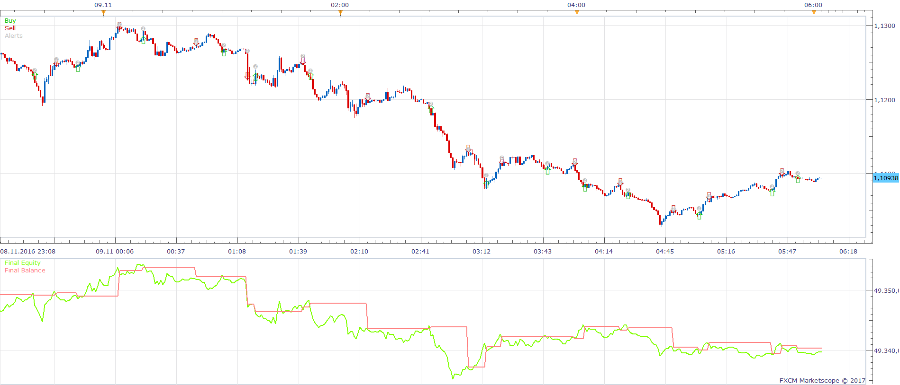
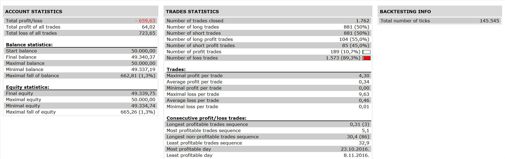

# Stochastics Bands Strategy

> Source: https://fxcodebase.com/code/viewtopic.php?f=31&t=64646  
> Forum: 31 · Topic 64646 · 1 post(s)

---

## Stochastics Bands Strategy

**Apprentice** · Wed May 10, 2017 6:55 am

 

Open Long
k>d and source .low (period-1) < os line and source.close(period)>os line
Open Short
k< d and source.high(period-1)>ob line and source.close(period)<ob line

 [Stochastics Bands Strategy.lua](files/112377/Stochastics%20Bands%20Strategy.lua)

Stochastics bands is available here.
[viewtopic.php?f=17&t=33974](https://fxcodebase.com/code/viewtopic.php?f=17&t=33974)

The Strategy was revised and updated on January 19, 2019.
