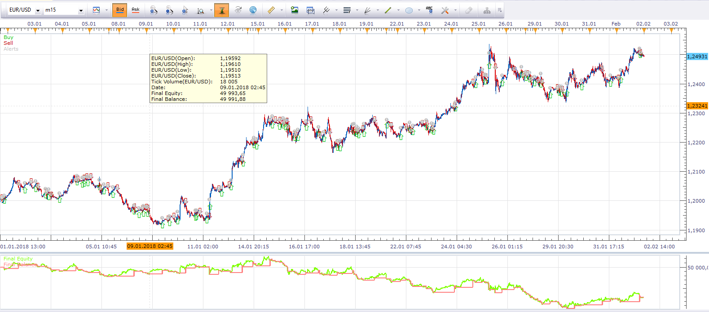
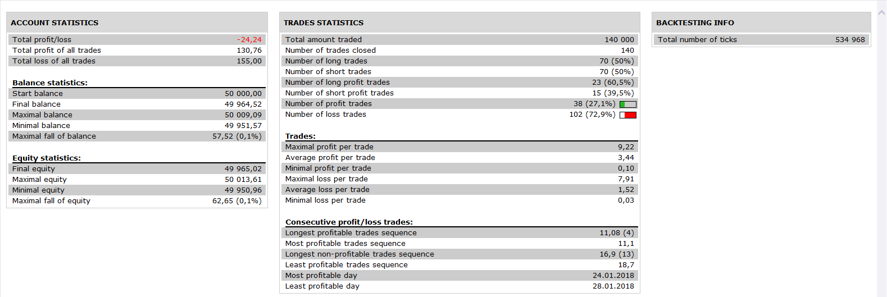
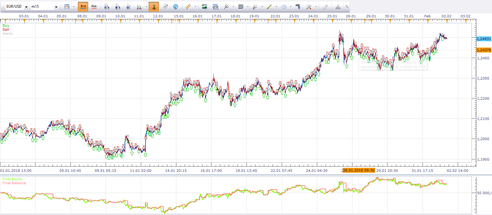
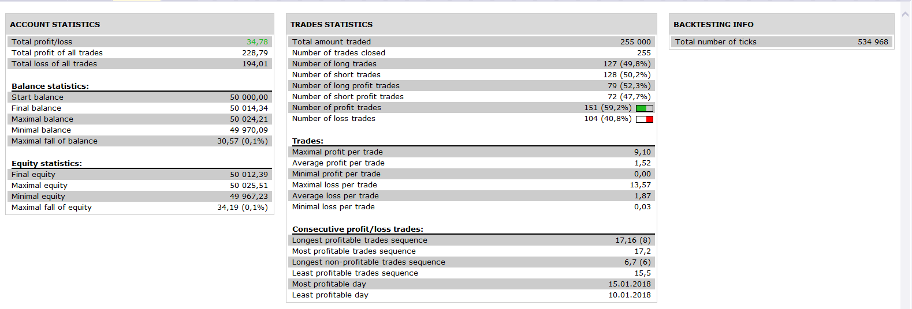
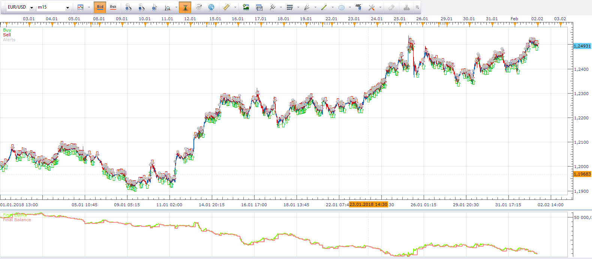
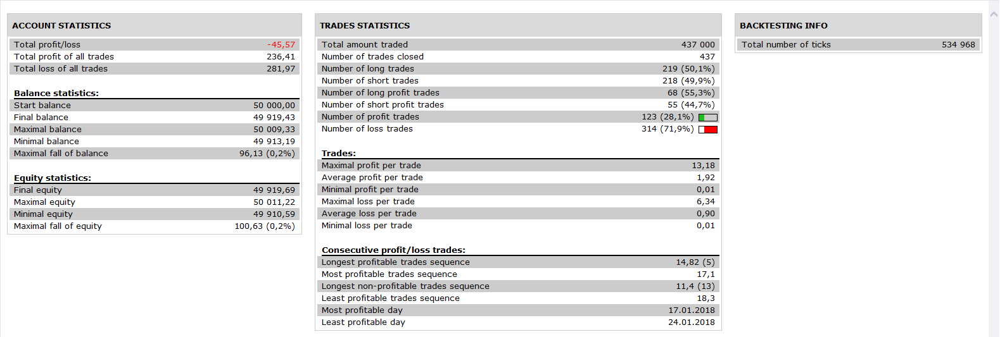

# Strategies of fan oscillators.

> Source: https://fxcodebase.com/code/viewtopic.php?f=31&t=4106  
> Forum: 31 · Topic 4106 · 2 post(s)

---

## Strategies of fan oscillators.

**Alexander.Gettinger** · Wed May 04, 2011 2:03 am

Strategies based on fan oscillators([viewtopic.php?f=17&t=4104](https://fxcodebase.com/code/viewtopic.php?f=17&t=4104)).

BUY condition:
Oscillator more than [Level for BUY].

SELL condition:
Oscillator less than [Level for SELL].

Download strategy of EMA fan:

 [Fan_MA_Strategy.lua](files/10293/Fan_MA_Strategy.lua)

 

 

Download strategy of CCI fan:

 [Fan_CCI_Strategy.lua](files/10293/Fan_CCI_Strategy.lua)

 

 

Download strategy of RSI fan:

 [Fan_RSI_Strategy.lua](files/10293/Fan_RSI_Strategy.lua)

 

 

For this strategies must be installed fan oscillators([viewtopic.php?f=17&t=4104&p=10294#p10294](https://fxcodebase.com/code/viewtopic.php?f=17&t=4104&p=10294#p10294)).

The Strategy was revised and updated on November 19, 2018.

---

## Re: Strategies of fan oscillators.

**Apprentice** · Wed Nov 30, 2016 5:47 am

Bump up.
