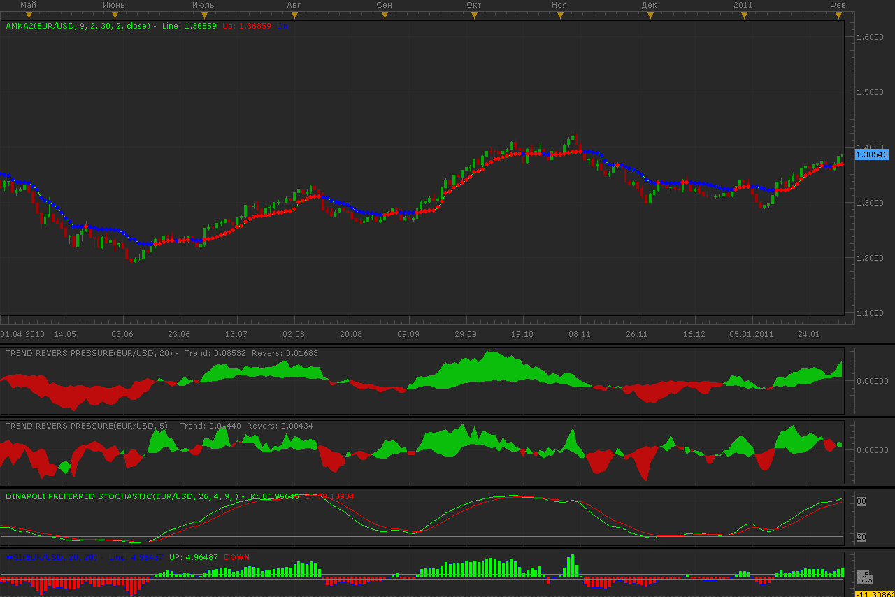
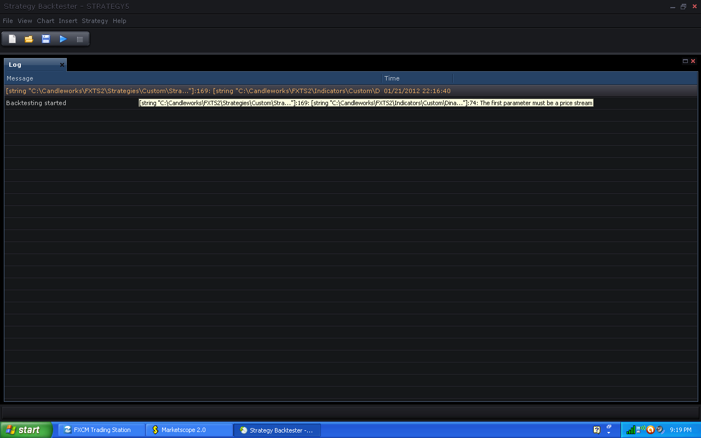
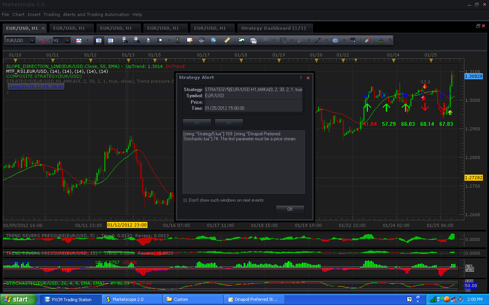

# Strategy 5

> Source: https://fxcodebase.com/code/viewtopic.php?f=31&t=3308  
> Forum: 31 · Topic 3308 · 14 post(s)

---

## Strategy 5

**Alexander.Gettinger** · Tue Feb 01, 2011 11:27 pm

Strategy based on data of 5 indicators.

Conditions for BUY:
1. AMKA change direction to up
2. Trend Pressure #1 is green and previous Trend Pressure #1 is green
3. Trend Pressure #2 become green, previous Trend pressure #2 was red
4. Dinapoli Preferred Stochastic is bellow [Level]
5. WSI is green and previous WSI is green

Conditions for SELL:
1. AMKA change direction to down
2. Trend Pressure #1 is red and previous Trend Pressure #1 is red
3. Trend Pressure #2 become red, previous Trend pressure #2 was green
4. Dinapoli Preferred Stochastic is above [Level]
5. WSI is red and previous WSI is red

All indicators is seen at picture:

 

Download strategy:

 [Strategy5.lua](files/7862/Strategy5.lua)

For this strategy must be installed indicators:
AMKA2: [viewtopic.php?f=17&t=1124](https://fxcodebase.com/code/viewtopic.php?f=17&t=1124)
Trend Revers Pressure: [viewtopic.php?f=17&t=3092&p=7202](https://fxcodebase.com/code/viewtopic.php?f=17&t=3092&p=7202)
Dinapoli Preferred Stochastic: [viewtopic.php?f=17&t=1874](https://fxcodebase.com/code/viewtopic.php?f=17&t=1874)
WSI2: [viewtopic.php?f=17&t=1060&p=7861#p7861](https://fxcodebase.com/code/viewtopic.php?f=17&t=1060&p=7861#p7861)

---

## Re: Strategy 5

**kgsmith69** · Sat Jan 21, 2012 5:32 pm

I would like to run multiple instances of this strategy say on 5 different currency pairs. Maybe use ROC as a filter as to which of the currency pairs it opens a trade on. Say there is a signal to trade on two currency pairs, the one with the highest rate of change is the one it would trade on. I don't know if ROC would be the best filter you would know better than I what filter might be best. It could be call Strategy 5in5.

---

## Re: Strategy 5

**kgsmith69** · Sat Jan 21, 2012 10:24 pm

I get this error while backtesting.

 

---

## Re: Strategy 5

**Apprentice** · Sun Jan 22, 2012 5:28 pm

I have forwarded message to Alex.

---

## Re: Strategy 5

**kgsmith69** · Wed Jan 25, 2012 3:22 pm

I get this while its running.

 

---

## Re: Strategy 5

**kgsmith69** · Wed Jan 25, 2012 4:38 pm

Problem solved.
I redownloaded Dinapoli Preferred Stochastic and downloaded the first one this time and Strategy 5 works. Then I downloaded the second one posted again just to confirm result. The second posted Dinapoli Preferred Stochastic doen't work with Strategy 5 and doen't run on MarketScope charts on my computer.

---

## Re: Strategy 5

**mulligan** · Wed May 16, 2012 4:53 pm

I've loaded all the indicators and the strategy apparently successfully. I've created a layout with the indicators and all looks well. I've redownloaded the strategy (not the tick version). Everything looks normal as I've set up multiple stratrgies from the codebase without a hitch. However the strategy simply will not run. It does not show up on the TS2 Marketscope chart either as active or in shadow as paused. Any suggestions?

Thanks

---

## Re: Strategy 5

**Apprentice** · Thu May 17, 2012 2:20 am

Have you try to test it in Backtester.

---

## Re: Strategy 5

**mulligan** · Fri May 18, 2012 11:07 am

I ran a backtest and it worked fine in the backtest. It just won't show up as active on my charts. I have other strategies set up that either show up lighted on the cart as active or in shadow as paused. This one just refuses to show up either way.

Thanks

---

## Re: Strategy 5

**Apprentice** · Mon Dec 05, 2016 5:20 am

Bump up.

---

## Re: Strategy 5

**ANTONIO** · Wed May 01, 2019 5:04 am

Hi,

It doesn’t work and it appears the following message
C:/Program Files(x86)/Candleworks/FXTS2/Strategies/Custom/Strategy5.lua:186:
C:/Program Files(x86)/Candleworks/FXTS2/Indicators/Custom/Dinapoli Preferred Stochastic.lua (-1,-1):E19 -nil

Thank you

---

## Re: Strategy 5

**Apprentice** · Wed May 01, 2019 6:06 am

Unfortunately, I can not repeat it.
Can you please share your settings?

---

## Re: Strategy 5

**ANTONIO** · Wed May 01, 2019 6:15 pm

The settings are those which have the strategy

---

## Re: Strategy 5

**Apprentice** · Wed May 22, 2019 2:22 am

Can't repeat it. And there is nothing suspicious in the indicator's code.
