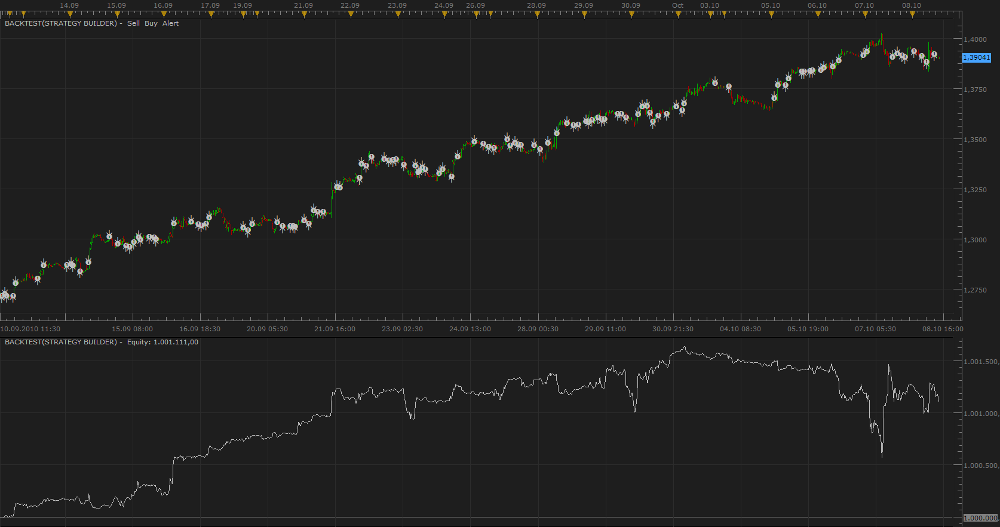
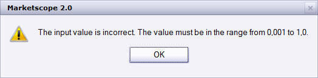
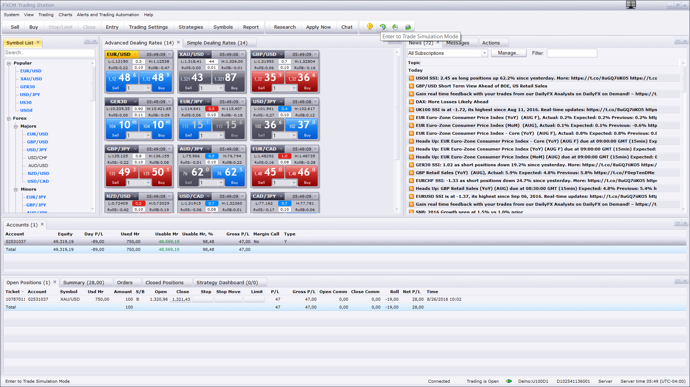
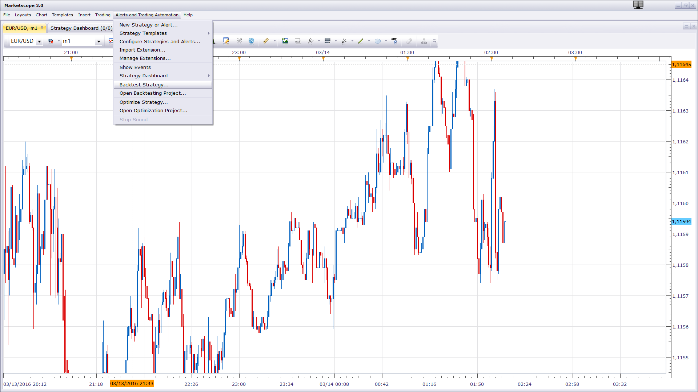
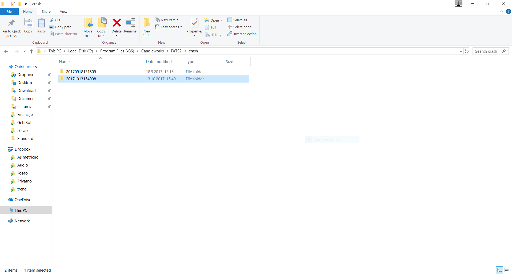

# Strategy Builder

> Source: https://fxcodebase.com/code/viewtopic.php?f=31&t=2368  
> Forum: 31 · Topic 2368 · 240 post(s)

---

## Strategy Builder

**Apprentice** · Fri Oct 08, 2010 1:30 pm

This is a concept, the first beta version of the Strategy Builder.

Currently supports most standard indicator.
Use a very primitive algorithms.

These are areas on which i should continue to work.

With it you can generate, test and trade, different strategies.

 [Strategy Builder.lua](files/5100/Strategy%20Builder.lua)

If you use Pivot indicator, use Historical mode.

 Supported Indicators are "TSI", "RSI", "EMA" , "MVA", "KAMA", "PPMA", "TMA", "ADX", "DMI", "AROON",
 "ARSI", "HA", "ICH", "MD", "SAR", "CCI", "MACD", "RLW", "SFK", "ROC", "SSD",
 "STOCHASTIC", "KRI", "TMACD", "ZZZCOMPOSITE", "PERCENTAGE PRICE FOLLOWER", "FIBOAVERAGES", "RB_CLEAR", "ITREND", "AC", "AO", "PIVOT","STOCHRSI",
 "HASM", "DSS", "SMMA", "REGRESSION", "TRENDSTOP","ST", "HMA", "QQE", "LRS","LAGUERRE_RSI","LAGUERRE_FILTER"

---

## Re: Strategy Builder

**borsaty** · Thu Oct 14, 2010 4:17 pm

Dear
Please can you make strategy where it can take buy and sell pending order at specific breakout time example ( low and high for the period 3am and 6am i.e before London session by three hours ) or any other time
and indicator which can draw box for this period
the parameter
# Begin Period
# End Period
# Box End
# Number of lot
# Buy and sell or buy only or sell only
# Box breakout offset ( number of pips added to the high for buy position or subtracted from the low for sell position

sorry for my poor language
thanks so much for your help
Selim Selim
[[email protected]](https://fxcodebase.com/cdn-cgi/l/email-protection#b5c6d4c6d6daead8d0f5ccd4dddada9bd6dad8)

---

## Re: Strategy Builder

**Nortal** · Fri Oct 15, 2010 7:59 am

Great idea borsaty, I trade the london breakout. If you create a automatic box, you can use a breakout indicator, I find it here [viewtopic.php?f=17&t=966&hilit=breakout](http://www.fxcodebase.com/code/viewtopic.php?f=17&t=966&hilit=breakout).

---

## Re: Strategy Builder

**borsaty** · Sun Oct 17, 2010 9:40 am

thanks

---

## Re: Strategy Builder

**kanaphe** · Fri Oct 22, 2010 2:32 pm

hi ? it seems that the strategy builder only woks on a single time frame.if it can b used on multiple time frames please le mi know coz i use tha 4hr to determine the direction of the trend and trade the 30min charts.thanks for the good work.

---

## Re: Strategy Builder

**Lucas Izidoro** · Thu Oct 28, 2010 1:56 pm

I was able to load Strategy Builder without a problem. However, when trying to replicate the Backtest function shown on fxcodebase ([download/file.php?id=1912&mode=view](https://fxcodebase.com/code/download/file.php?id=1912&mode=view)) I ran into the problem shown in the attached screenshot. The backtest just shows a horizontal line for equity – in other words, it doesn’t work. Am I doing something wrong here?

---

## Re: Strategy Builder

**Apprentice** · Thu Oct 28, 2010 3:10 pm

Set Allow Strategy to Trade parametar no Yes

---

## Re: Strategy Builder

**sunshine** · Fri Oct 29, 2010 7:11 am

Hello,
It seems that you've set the parameter for the strategy, not for the indicator.

To allow a strategy to trade when backtesting, you should set the parameter "Allow trading" to "Yes" for the strategy chosen in the properties of the BACKTEST indicator.
For this:
1. Open the BACKTEST properties.
2. Click Signal and then click the appeared button.
3. The Strategy Properties dialog will appear.
4. Set the parameter "Allow Trading" to "Yes".
5. Click OK.

Hope this will help.

---

## Re: Strategy Builder

**Lucas Izidoro** · Fri Oct 29, 2010 9:16 am

It worked. Thanks for the help.

---

## Re: Strategy Builder

**Apprentice** · Sat Nov 06, 2010 11:41 am

Inverse Indicator Logic Added.

The Strategy now checks, whether selected Indicator is Supported.

If the required indicator is not supported, post a request, in order to add support for the requested indication.

---

## Re: Strategy Builder

**thetruth** · Thu Nov 11, 2010 1:10 pm

Apprentice, good work!! i am trying to test bf_AdvancedFractal.lua in a strategy, can you put this indicator in your strategy.
thanks

---

## Re: Strategy Builder

**Apprentice** · Fri Nov 26, 2010 12:01 pm

Inverse Trade Parameter Added.
You have to distinguish between the trade Inverse Inverse and Indicator Parameter.
Inverse Trade reverses the trade that would otherwise have been generated,
Inverse Indicator is a parameter that is passed to the indicator.

---

## Re: Strategy Builder

**alepan72** · Mon Nov 29, 2010 12:22 pm

Hello!
I use a multi indicators strategy. It seems not supported the "Super Sar" indicator. Can you put it in for me?
Thanx and best regards for your services!!!

---

## Re: Strategy Builder

**alepan72** · Fri Jan 07, 2011 5:26 am

Hi there!
I use this strategy but, I have some problems. First, for some reason strategy does nt corresponds το τηε οπτιον "Allow strategy to trade" to all pairs. For example for eurusd or GER30, strategy trading well. For eurgbp only activate the "show alert" option...
The other problem with this strategy is... in previous post.

Thanx and sorry for my english...

---

## Re: Strategy Builder

**boursicoton** · Tue Jan 11, 2011 11:35 am

a problem : eurusd

Open order failed:The Quantity value is incorrect. It must be a number between 10000 and 50000000 divisible by 10000.

i put : 10000 on the strategy ( i change 100 --> 10000 in lua code) but no order !

where is the problem ..;

---

## Re: Strategy Builder

**alepan72** · Wed Jan 12, 2011 4:56 am

> **alepan72 wrote:**
> Hello!
> I use a multi indicators strategy. It seems not supported the "Super Sar" indicator. Can you put it in for me?
> Thanx and best regards for your services!!!

Is it so much difficult I have be it a answer if it becomes to be added or not...?

---

## Re: Strategy Builder

**Apprentice** · Wed Jan 12, 2011 5:14 am

It seems that I overlooked your request.
I will add it.

---

## Re: Strategy Builder

**alepan72** · Wed Jan 12, 2011 7:17 am

Thanx man!

---

## Re: Strategy Builder

**snakewob** · Mon Jan 17, 2011 9:06 am

Open order failed:The Quantity value is incorrect. It must be a number between 10000 and 50000000 divisible by 10000.

Has someone a solution for this problem?

---

## Re: Strategy Builder

**boursicoton** · Mon Jan 17, 2011 5:24 pm

same problem at home....

---

## Re: Strategy Builder

**knightflyer** · Wed Jan 19, 2011 7:37 pm

Hi, just wondering if I could get the HPF added, I see its in the list but if I attempt to use it I get a not supported message. Ta

---

## Re: Strategy Builder

**basicstrategy** · Mon Jan 24, 2011 1:49 am

Hi,
is it possible to add "SHIFT_I" into your strategy builder please ?
Thank you very much in advance.

---

## Re: Strategy Builder

**alepan72** · Tue Jan 25, 2011 2:51 pm

> **Apprentice wrote:**
> It seems that I overlooked your request.
> I will add it.

There is someone who forget meeee....

---

## Re: Strategy Builder

**snakesandladders** · Tue Feb 01, 2011 1:27 pm

> **snakewob wrote:**
> Open order failed:The Quantity value is incorrect. It must be a number between 10000 and 50000000 divisible by 10000.
>
> Has someone a solution for this problem?

Stumbled across a fix: within function "enter (BuySell)"

Amend the line: valuemap.Quantity = Amount * baseunitsize;

to: valuemap.Quantity = Amount;

Please don't ask me for any coding requests as I've only been at this a couple of days without any prior programming experience.

---

## Re: Strategy Builder

**alepan72** · Wed Feb 02, 2011 10:45 am

> **alepan72 wrote:**
> Hello!
> I use a multi indicators strategy. It seems not supported the "Super Sar" indicator. Can you put it in for me?
> Thanx and best regards for your services!!!

I posted it 2 months ago. I work with Super sar and fractal indicator, and must be good to me to add them in strategy builder if you can.
Also, I wonder why don't you insert all of standards indicators so that we can make our own trade strategy without asking again and again an extra insertion.
Best regards!
Kisses from Greece!!!

---

## Re: Strategy Builder

**snakesandladders** · Wed Feb 02, 2011 2:05 pm

I don't know how many have noticed, but there is a flaw in the logic of how the ADX is working:

 elseif instance.parameters:getString("IN"..i) == "ADX" then

 if indicator[i].DATA[p] > 25 then
 PLUS(i);
 else
 MINUS(i);
 end

The net result of this means that if all the indicators are positive for a buy signal and the ADX is over 25 then the ADX counts toward the Level target and should work fine. However, in the negitive senerio if the ADX is below 25 it counts towards a sell signal. Surely you don't want buy or sell trades if the ADX is below 25. Is this correct or have I misunderstood?

---

## Re: Strategy Builder

**Apprentice** · Wed Feb 02, 2011 2:46 pm

To alepan72

Sorry for waiting.
I simply have no time.

But I have better news for you.
The development team is working on a solution that will allow users to build their own strategies.

The solution that I offer has many limitations.
Algorithms we use are very simple.

---

## Re: Strategy Builder

**snakesandladders** · Thu Feb 03, 2011 7:33 am

> **Apprentice wrote:**
> Good observation.
> I wrote a few lines of code to fix this problem.
>
>
>
> Strategy Builder.lua

Apprentice,

Thanks.

However, the logic now double counts (yes, I did test it: you can set the level 1 above the number of select indicators and results still show). You could use the following (which works), but it means you can't use the ADX indictor on it's own (not that I can see you would want to)

 if TEST > 0 and indicator[i].DATA[p] > 25 then PLUS(i);
 elseif TEST < 0 and indicator[i].DATA[p] > 25 then
 MINUS(i);
 end

Additionally, you need to remove the addtional ";" on: MINUS(i);; (as this version won't load) and the " * BaseSize" on: valuemap.Quantity = Amount * BaseSize (thats the only way I could get autotrading to work).

"The development team is working on a solution that will allow users to build their own strategies."

Sounds interesting, is there an further information available at this stage?

---

## Re: Strategy Builder

**Apprentice** · Thu Feb 03, 2011 8:28 am

Sorry for error.
I wrote it during the lunch break.

Not for now.

---

## Re: Strategy Builder

**fabfxcm** · Mon Feb 21, 2011 4:53 pm

We have a lot of avaliable interesting indicators and strategies. What we really need now is a strategy builder upgraded that is able to support how many indicators as possible. I think this would really change the way of trading. I really encourage to develop strategy builder.

---

## Re: Strategy Builder

**OilyFish** · Mon Mar 21, 2011 3:49 pm

Is there any chance of developing this a bit further; so that individual time frames can be assigned to different component strategies and also can it be expanded to allow more than 3 strategies in it, say around 6?

---

## Re: Strategy Builder

**Apprentice** · Tue Mar 22, 2011 1:20 am

Your request has been added to developmental cue.

---

## Re: Strategy Builder

**STEIGO** · Fri Apr 08, 2011 4:48 am

How does this strategy work?
How do I use it?
What is it trying to do?
Is there a thread or coding request link that will explain what it tries to do?

---

## Re: Strategy Builder

**Apprentice** · Fri Apr 08, 2011 1:49 pm

This is not a classic strategy.
In the first place i am using it for test different combinations of indicators.
When I find a promising strategy.
I continue to develop it as an independent strategy.

Although there is the possibility of trading.
Do not give the possibility of fine tuning.
Adding advanced functionality.

---

## Re: Strategy Builder

**bingyunid** · Wed Apr 13, 2011 10:19 am

Hi,thanks for developping this strategy. Now i have a problem on this,why it open orders,why it didn't set stop/limit,it just open without set the stop or limit. I have already changing the setting to set stop/limit,anybody can help me ,thanks very much

---

## Re: Strategy Builder

**bingyunid** · Fri Apr 15, 2011 2:11 am

I have solved the problem i mentioned above, it is because the account type, my demo accout cannot set, but my live accout works correctly.

BTW, if i want to add a rule to this logic, when the TMACD bar above/below 0 AND **it just cross the zero line**, then plus(i)/minus(i) .

The oraginal source code is:
elseif instance.parameters:getString("IN"..i) == "TMACD" then
 STREAMS[0]=indicator[i]:getStream(0);
 if STREAMS[0][p] > 0 then
 PLUS(i);
 elseif STREAMS[0][p] < 0 then
 MINUS(i);
 end

I change to
elseif instance.parameters:getString("IN"..i) == "TMACD" then
 STREAMS[0]=indicator[i]:getStream(0);
 if STREAMS[0][p] > 0 and core.crosses(STREAMS[0], 0, p) then
 PLUS(i);
 elseif STREAMS[0][p] < 0 and core.crosses(STREAMS[0], 0, p) then
 MINUS(i);
 end

it seems work ok, but when i backtest it, it give errors: index is out of range,Apprentice,could you help me ,thanks very much

---

## Re: Strategy Builder

**Apprentice** · Fri Apr 15, 2011 2:20 am

core.crosses function should have two data periods that would work.
Former and current period, P and P-1
This check should fix things.

if not STREAMS[0]:hasData(p) or not STREAMS[0]:hasData(p-1) then
return;
end

And this piece of code before the Cross Check.

---

## Re: Strategy Builder

**bingyunid** · Fri Apr 15, 2011 4:25 am

Thanks very much, Apprentice . The error has been fixed after adding your code.

Could you help on another problem which trouble me very long time. In the Strategy Builder.lua, if i want to combine two indicators(Two indicators both signal sell/buy then sell/buy,). For example.
rule: When TMACD > 0 ; in the meantime, the CCI >0, then buy.

That means, the two indicator both signal buy (PLUS(i)), then buy (PLUS(i)), is it possible to code it?

CCI code
 elseif instance.parameters:getString("IN"..i) == "CCI" then

 STREAMS[0]=indicator[i]:getStream(0);

 if STREAMS[0][p] > 0 then
 PLUS(i);
 elseif STREAMS[0][p] < 0 then
 MINUS(i);
 end
TMACD code
 elseif instance.parameters:getString("IN"..i) == "TMACD" then

 STREAMS[0]=indicator[i]:getStream(0);

 if STREAMS[0][p] > 0 then
 PLUS(i);
 elseif STREAMS[0][p] < 0 then
 MINUS(i);
 end

---

## Re: Strategy Builder

**Apprentice** · Fri Apr 15, 2011 7:04 am

This is no easy task.

This requires a complete change of codes.

There are Two solutions.

FIrst, Add an option, mandatory confirmation.
So you can define which individual signals must be positive.
To have a positive indication.

Second, change the selection algo. from individual indicators to strategy.
Currenty strategy only works with the individual indicators.
You should develop a different engine.

---

## Re: Strategy Builder

**bingyunid** · Tue Apr 19, 2011 11:01 pm

Got it. Thanks very much,Apprentice !

---

## Re: Strategy Builder

**pylim15** · Mon Jul 04, 2011 9:14 am

hi. i tried plugging in BTF_CCI, it says it doesn't work on the strategy builder. why so?

---

## Re: Strategy Builder

**Apprentice** · Mon Jul 04, 2011 1:39 pm

The reason is.
I have to write a Signal / Trading Rules for each indicator.
But for this I have no time.
That's why I managed to write them only for a few of them.

However.
CCI is supported, as well as the majority of standard indicators.
Simply select the time frame in which you want to trade.
Unfortunately it will not help you if you want to trade on multiple time frame.

---

## Re: Strategy Builder

**ctejeiro** · Thu Nov 24, 2011 10:07 pm

Hi,
I was wondering If it would be possible to add the Pivot indicator to the strategy builder, its quite a common indicator, also what about MA Crossover is it possible to add it, i know integrating these is not so easy, I actually tried it for a few days with no results.
Thanks!

---

## Re: Strategy Builder

**Apprentice** · Sat Nov 26, 2011 4:44 am

What conditions would you like to add for pivots.

---

## Re: Strategy Builder

**jackfx09** · Mon Nov 28, 2011 10:43 am

Apprentice,

As always, love your work and I appreciate your efforts!

Is it possible to have the Strategy Builder support any/all of the following indicators:

iTrend, RB Clear and Fibonacci Averages?

Thanks!

sjc

---

## Re: Strategy Builder

**Apprentice** · Mon Nov 28, 2011 6:18 pm

Your request is added to the developmental cue.

---

## Re: Strategy Builder

**Apprentice** · Wed Nov 30, 2011 3:04 am

One clarification, I'm not sure, what Fibonacci Averages are.

---

## Re: Strategy Builder

**Coondawg71** · Wed Nov 30, 2011 11:43 am

[viewtopic.php?f=17&t=5277&hilit=fibo+averages](https://fxcodebase.com/code/viewtopic.php?f=17&t=5277&hilit=fibo+averages)

Please pardon my lack of understanding for programming. I see that the Fibo Averages Indicator relies on the Averages Indicator itself in order for production. So my request may not be even possible regarding the Fibo Averages. If so, this would be a GREAT addition to all the other averages available within parameter settings.

Thanks!

sjc

---

## Re: Strategy Builder

**ctejeiro** · Thu Dec 01, 2011 12:51 am

Hi Apprentice,
Sorry for taking a little long to reply, there is a standard pivot strategy in marketscope that seems to work well, if strategy builder could have compatibility with that strategy that would be nice .

---

## Re: Strategy Builder

**Apprentice** · Thu Dec 08, 2011 3:42 am

iTrend, RB Clear and Fibonacci Averages indicator algo. added.
Time Parameters/ MandatoryClosing added.

Unfortunately due to the detected bug.
Some algorithms, like i Trend, will not work
 update / bug bix is expected later this week.

---

## Re: Strategy Builder

**turkuaz** · Thu Dec 08, 2011 10:54 am

Dear apprentice

 strategy builder error

 (string "strategy builder.lua"): 80: SUPERTREND indicator is not supported. Contact apprentice on Fxcodebase

 I wish good work waits for your help.

---

## Re: Strategy Builder

**Apprentice** · Thu Dec 08, 2011 5:58 pm

This is not an error.
Only notice.
All indicators are not supported.
I will add this one.

---

## Re: Strategy Builder

**PromQueen** · Thu Feb 09, 2012 12:21 pm

Hi,

I received the following message after using Strategy Builder:

[string "Strategy Builder.lua"]:96: AC Indicator Is not supported, Contact Apprentice on FxCodeBase.com

Do I have to import this indicator?

best, PQ

---

## Re: Strategy Builder

**Apprentice** · Thu Feb 09, 2012 1:15 pm

No, you do not need.
The reason, I have to add trading algorithm for each indicator.

This is a big job, for which I have no time.
I only add support if it is requested.

Support for AC, AO and Supertrend added.
AO and AC have zero as the signal line.

---

## Re: Strategy Builder

**amazon1a** · Mon Apr 16, 2012 11:40 am

Hi Apprentice, Do you have a list of which indicators are supported by Strategy Builder? For example I tried Shift as well as DSS Bressert and received an error message for both. A list would be very handy. If it exists, maybe you could just point me to it. Love your work!!

---

## Re: Strategy Builder

**Apprentice** · Tue Apr 17, 2012 2:28 am

"TSI", "RSI", "EMA" , "MVA", "KAMA", "PPMA", "TMA", "ADX", "DMI", "AROON", "ARSI", "HA", "ICH", "MD", "SAR", "CCI", "MACD", "RLW", "SFK", "ROC", "SSD", "STOCHASTIC", "KRI", "TMACD", "ZZZCOMPOSITE", "PERCENTAGE PRICE FOLLOWER", "FIBOAVERAGES", "RB_CLEAR", "ITREND", "AC", "AO"

Make a list of indicators that you would like to be supported.

---

## Re: Strategy Builder

**amazon1a** · Tue Apr 17, 2012 12:21 pm

Thanks Apprentice, I do not know if it would be possible, but could you add: TWO_ MA_ Cross; STOCHASTICRSI; DSS BRESSERT; HA Smoothed; SHIFT_I and SHIFT_O. I am particularly interested in the SHIFT indicators.

---

## Re: Strategy Builder

**Apprentice** · Wed Apr 18, 2012 2:09 am

Your request is added to the development list.

---

## Re: Strategy Builder

**[email protected]** · Thu Apr 19, 2012 8:06 pm

Hello, Can anyone help me how to build a strategy like this :
- Time Frame H8 XAUUSD
- Open Buy in new candle if LAST OPEN PRICE lower Than LAST CLOSE PRICE
- Open Sell in new candle if LAST OPEN PRICE larger than LAST CLOSE PRICE
- T/P, S/L, T/S Is requaired
- Strategy is run or do that job every the beginning of new candle on H8 time frame

please share with me

---

## Re: Strategy Builder

**ram123** · Thu Apr 26, 2012 10:04 am

there are to files :
Strategy Builder.lua
on this part portal.
which one is please correct and actual.
thanks

---

## Re: Strategy Builder

**Apprentice** · Fri Apr 27, 2012 2:45 am

Both are valid, first (top most post) supports more indicators.

---

## Re: Strategy Builder

**ram123** · Fri Apr 27, 2012 8:36 am

is it possible to put
pivot in strategy builder.
the system says
string "strategy builder.lua"): 96: pivot indicator is not supported. Contact apprentice on Fxcodebase
thanks a lot

---

## Re: Strategy Builder

**t1982t** · Sun Apr 29, 2012 10:22 pm

Just an idea , for Pivot Indicator, the conditions could be:
Short: Price < pivot and touched pivot
Long: price > pivot and touched pivot
Best regards

---

## Re: Strategy Builder

**Hailkayy** · Mon Apr 30, 2012 3:55 am

Don't know wich method is faster for you, quick message to remind you request for Tro_dynamic S/R.

---

## Re: Strategy Builder

**Apprentice** · Sun May 13, 2012 9:04 am

Added support for "Pivot", "STOCHRSI", "HASM", "DSS".
If you use Pivot indicator, use Historical mode.

---

## Re: Strategy Builder

**amazon1a** · Sun May 13, 2012 2:56 pm

Thanks Apprentice for the additions.

---

## Re: Strategy Builder

**Surasit** · Mon May 14, 2012 8:20 am

Hello,
I am new Forex trader. Please suggest, where can I get the manual of how to use and set up this strategy.

Thanks

---

## Re: Strategy Builder

**Apprentice** · Mon May 14, 2012 2:05 pm

For me is pretty simple.
You can use up to three supported indicators.
Define the threshold.
For example, if you chose the EMA (only).
And EMA indication is positive.
And the threshold is 1
Depending on the EMA indication we will have Buy, Sell, Trade.
If you use three indicators.
And the threshold is 3
While all three indicators do not give the same indication,
you will not have a trade.

---

## Re: Strategy Builder

**mybrainhertz** · Mon May 14, 2012 3:52 pm

Hi Apprentice,

If you moved the Time Frame into each Indicator Parametar and then increased the number of Parametars from 3 to 5, you could almost do yourself out of a job.The only other thing that would need to be done is to increase the number of indicators that will run with this Strategy Builder and then everyone could easily build their own without the need for you to code it. I think it could vastly reduce the Development Cue.

Just a thought.

---

## Re: Strategy Builder

**Surasit** · Mon May 14, 2012 7:25 pm

Hi Apprentice,
Thanks for your reply.
So, That mean, if I use 2 indicator, the threshold will be 2. Is't it?
How about "Inverse Indicator"? What is the purpose of this?

---

## Re: Strategy Builder

**Surasit** · Mon May 14, 2012 7:28 pm

Hi Apprentice,
Thanks for your reply.
So, That mean, if I use 2 indicator, the threshold will be 2. Is't it?
How about "Inverse Indicator"? What is the purpose of this?

---

## Re: Strategy Builder

**Surasit** · Mon May 14, 2012 7:31 pm

HI,
I have try 1 AC indicator with threshold =1
The result as attach. What can I do?
Please help.
Thanks

---

## Re: Strategy Builder

**Apprentice** · Wed May 16, 2012 1:57 am

You use one of old version of SB.
Try to download version from Top Most post.

---

## Re: Strategy Builder

**Surasit** · Wed May 16, 2012 6:47 am

Wow this is great!!!
Could you please help to put the TWO_MA CROSS2 in also?

Thanks so much.

---

## Re: Strategy Builder

**Surasit** · Wed May 16, 2012 8:57 am

Hello Apprentice,
Sorry for disturb again.
I have try the new SB as you suggest. With the Stochastic, it work very well.
Once I put Threshold =2 and put another indicator "TWO_MA_CROSS"
I got the error as below.
Please help.
Thanks

---

## Re: Strategy Builder

**Surasit** · Wed May 16, 2012 9:41 pm

Hello, It's me again.
Today I try to back test with "BREAKOUT","TWO_MA_CROSS","SUPERTREND","SHIFT_I" and "SHIFT_O"
the problem show as attached.
I have load the most updated "STRATEGY BUILDER" as your comment. But still not success.

Please suggest, what should I do?
Thanks so much for your help.

---

## Re: Strategy Builder

**Apprentice** · Thu May 17, 2012 2:24 am

What are errors or bugs. Simply, these indicators are not currently supported.
I'll try to add some of them, as soon as possible.

---

## Re: Strategy Builder

**asirulnik** · Wed May 23, 2012 2:53 am

This is fantastic. Apprentice, could you kindly add the CHO indicator when you have a chance? Thank you!

---

## Re: Strategy Builder

**Apprentice** · Thu May 24, 2012 5:54 am

Will do.

---

## Re: Strategy Builder

**The Chartist** · Thu May 31, 2012 2:10 pm

Apprentice,

I messaged you on a different post but I think this will do. Can you add a way to make the EMA of the high, low or close?

Thank you for your help!!

---

## Re: Strategy Builder

**Apprentice** · Thu May 31, 2012 4:36 pm

Your request is added to the development list.

---

## Re: Strategy Builder

**dathom03** · Mon Jun 04, 2012 7:51 am

Does strategy builder allow you to trade with microlot accounts? I keep getting message when a trade is generated that states "You have insufficient available margin to open this position". I am testing trading 1 lot only. I have more than sufficient margin for 1 microlot. Please advise.

---

## Re: Strategy Builder

**dathom03** · Mon Jun 04, 2012 8:01 am

Does Strategy Builder allow trading with microlot accounts? When a trade is generated I get the message "You have insufficient available margin to open this position". I am testing a trading strategy and I am using only 1 microlot. I have the latest version of Strategy Builder and have it set trade to YES on a live account. I have more than sufficient margin for 1 microlot. Please advise.

Thank you

---

## Re: Strategy Builder

**Apprentice** · Thu Jun 07, 2012 2:55 am

Hm. Strategy treader should be able to trade in all types of accounts.
Does anyone has similar experiences.

---

## Re: Strategy Builder

**dathom03** · Fri Jun 08, 2012 2:40 pm

Apprentice:

I checked with FXCM and they stated it should be capable. Is there a coding problem. Other strategies I have downloaded from this forum have executed trades from the signals generated. Please advise.

---

## Re: Strategy Builder

**Hailkayy** · Sun Jun 10, 2012 7:48 pm

Make sure on "Myfxcm" that your Margin is set to the lowest.

Maybe try to backtest your strategy, paying attention you set, "micro account" And that you enter the real capital you are trading with, to see results.

Good luck.

---

## Re: Strategy Builder

**dathom03** · Sun Jun 10, 2012 10:34 pm

This is the message I am getting when a trade is generated in the microlot account.

Failed	Market Order (1.26338, EUR/USD, Bought 1,000K, XXXXXXXXXX)	6/10/2012 23:30	6/10/2012 23:30	You have insufficient available margin to open this position.

In the previous post I made, I mentioned that other strategies I have downloaded from the forum do execute trades as generated. My experience is the Strategy Builder generated trades have never actually executed an order. Please review coding and advise.

Thank you

---

## Re: Strategy Builder

**yazbreezy** · Tue Jun 26, 2012 11:27 pm

Hello,
 If it's not to much trouble, can you add support for the REGRESSION and SMMA indicator?

Please, and Thank You.

Yaz.

---

## Re: Strategy Builder

**Apprentice** · Wed Jun 27, 2012 4:26 am

Your request is added to the development list.

---

## Re: Strategy Builder

**yazbreezy** · Wed Jun 27, 2012 3:38 pm

Thank You very much, I highly appreciate it.

---

## Re: Strategy Builder

**Apprentice** · Fri Jun 29, 2012 6:52 am

Support for the SMMA, Regression and TrendStop indicators added.

---

## Re: Strategy Builder

**yazbreezy** · Fri Jun 29, 2012 3:58 pm

Thank You very much! I appreciate it.

---

## Re: Strategy Builder

**yazbreezy** · Wed Jul 04, 2012 12:01 am

Hello,
If it's not to much trouble,and if possibe; can you add support for the EWO Oscillator?

Please, and Thank You.

Yaz.

---

## Re: Strategy Builder

**Apprentice** · Fri Jul 06, 2012 5:59 am

Your request is added to the development list.

---

## Re: Strategy Builder

**RinoStoof** · Wed Aug 08, 2012 6:49 pm

Hi Apprentice

looks like a great job
Just a question if you don't mind.
I am writing a strategy in lua in which I want to use a few indicators.
I got the stochastic and MacD to work but I can't seem to get the parameters right for the SMMA.
The code I'm struggeling with is below. I'm using each indicator in 3 flavors hence the 3 sources

Initialization();
	gSource1 = ExtSubscribe(1, nil, "m20", true, "bar");
	gSource2 = ExtSubscribe(1, nil, "H1", true, "bar");
	gSource3 = ExtSubscribe(1, nil, "H3", true, "bar");

	Price1 = gSource1.median;
	Price2 = gSource2.median;
	Price3 = gSource3.median;

	assert(core.indicators:findIndicator("SSD") ~= nil, "Please, download and install SSD indicator");
	assert(core.indicators:findIndicator("MYMOM_DAD") ~= nil, "Please, download and install MYMOM_DAD indicator"); (this is a somewhat altered MacD indicator)
	assert(core.indicators:findIndicator("SMMA") ~= nil, "Please, download and install SMMA indicator");

	local clr = core.rgb(192, 192, 131)
	Stochastic1= core.indicators:create("SSD", Price1, m20, 5,2,3);
	MacD1= core.indicators:create("MYMOM_DAD", Price1, "close", 5,20,30);
**SMA11= core.indicators:create("SMMA", Price1, "aa", "SMMA",clr, 15 + gSource1:first() - 1);**
	SMA12= core.indicators:create("SMMA", Price1, "close", 50);
	SMA13= core.indicators:create("SMMA", Price1, "close", 200);

------------------- end of code snippet -------------------
The error in the debugger is:
[string "C:\Gehtsoft\IndicoreSDK\strategies\Topdog.l..."]:717: [string "C:\Gehtsoft\IndicoreSDK\indicators\standard..."]:33: The sixth parameter must be a not negative number

15 + gSource1:first() - 1 shows in the debugger as 14 (as expected)

Line 33 in the SMMA code is :
 out = instance:addStream("SMMA", core.Line, name, "SMMA", instance.parameters.clr, first)

not sure if this is a coincidence or not.
Anyway, I can't find the right syntax. You'll probably know in a split second so I'd be very grateful if you could help me!

Kind regards
Rino

---

## Re: Strategy Builder

**Apprentice** · Thu Aug 09, 2012 1:55 am

Can you send me the whole code.
U can use the forum or my private email.

---

## Re: Strategy Builder

**Pierre01** · Thu Sep 06, 2012 3:20 am

Hello,
Please can you add HMA (Hull Moving Average)
to the indicator list.
Thank you so much,and appreciate your great work!!

---

## Re: Strategy Builder

**Apprentice** · Thu Sep 06, 2012 3:12 pm

Your request is added to the development list.

---

## Re: Strategy Builder

**Hailkayy** · Mon Sep 10, 2012 6:42 pm

Can we have support for Supertrend ?
Thanks in advance.

---

## Re: Strategy Builder

**Apprentice** · Tue Sep 11, 2012 4:12 am

Your request is added to the development list.

---

## Re: Strategy Builder

**virgilio** · Tue Sep 11, 2012 10:51 am

My dear, could you please add the followiing indicator:QQE, LAGUERRE_RSI, and LRS(1) to the Strategy Builder?
Please do not just add this post to be read. It would be very helpful if you can let us know if you can do it.

Thank you.

---

## Re: Strategy Builder

**Apprentice** · Wed Sep 12, 2012 11:37 am

Your request is added to the development list.

---

## Re: Strategy Builder

**Apprentice** · Wed Sep 12, 2012 1:11 pm

Support for "SUPERTREND", "HMA", "QQE", "LRS","LAGUERRE_RSI","LAGUERRE_FILTER" added.

---

## Re: Strategy Builder

**britchard** · Mon Sep 24, 2012 9:26 am

Hello,
I have an idea for a custom strategy, but I wasn't able to make it till now. Can anybody help me?

---

## Re: Strategy Builder

**Apprentice** · Mon Sep 24, 2012 12:07 pm

I'll be happy to help, just opened a new topic here.
[viewforum.php?f=27](https://fxcodebase.com/code/viewforum.php?f=27)
And describe what you want to achieve, specify entry / exit conditions.

---

## Re: Strategy Builder

**britchard** · Mon Sep 24, 2012 1:36 pm

ok, thanx!

---

## Re: Strategy Builder

**ezpezp** · Wed Sep 26, 2012 12:42 am

Hi. Is it possible to add support for the Polynomial Regression indicator to the Strategy Builder? Thanks

---

## Re: Strategy Builder

**Apprentice** · Wed Sep 26, 2012 4:28 am

Added to list of development.
What algorithm do you prefer to use within Strategy Builder?

---

## Re: Strategy Builder

**lyretlire** · Mon Oct 15, 2012 1:53 am

Hello,

 Can you had the HPF_STATIC Indicator to the Strategic Builder Strategy. Also, I don't know if your team can create a new request to this strategy which can allow the start entry position (long or short) when crossing Indicator show correct pattern. For exemple :
I've got 3 Indicators
-HPF
-EMA 10
-EMA 55
When HPF and EMA 10 cross EMA 55, so it an entry signal.
And maybe it can be a lot more usefull if you could add it to allow entry position buy crossing not just a line but also a "corridor" like this one use in the Vegas system.
 I know that my request can't maybe be possible but anyway, if it can be, that means that your creating some sort of "personnal configuration robot"
 Buy and take care...

---

## Re: Strategy Builder

**Apprentice** · Mon Oct 15, 2012 2:53 am

Your request is added to the development list.

---

## Re: Strategy Builder

**guangho** · Tue Oct 23, 2012 12:31 pm

The index "VolMA indicator " very good, but can't import " Strategy Builder", is it possible for modified to use? Thank you.

"VolMA indicator " :http://fxcodebase.com/code/viewtopic.php?f=17&t=18973

---

## Re: Strategy Builder

**Apprentice** · Wed Oct 24, 2012 2:57 am

Your request is added to the development list.

---

## Re: Strategy Builder

**Hailkayy** · Mon Nov 19, 2012 2:28 am

Hi apprentice,
can you insert Tro Dynamic S/R

thanks.

---

## Re: Strategy Builder

**Apprentice** · Mon Nov 19, 2012 3:30 am

Your request is added to the development list.

---

## Re: Strategy Builder

**philmc** · Fri Nov 23, 2012 7:21 am

Hi, I would like to use this strategy builder with the 'MACD with Alert' indicator that I found on this site. Is this possible please?
Regards
Phil

---

## Re: Strategy Builder

**Apprentice** · Sat Nov 24, 2012 5:28 am

You already have the MACD supported within Strategy Builder.

---

## Re: Strategy Builder

**arstechnica** · Sun Nov 25, 2012 2:15 am

It would be very usefull if you could select a time frame for each indicator.

Please insert this inside strategy builder

Regards

Salvatore

---

## Re: Strategy Builder

**Apprentice** · Sun Nov 25, 2012 5:41 am

Your request is added to the development list.

---

## Re: Strategy Builder

**virgilio** · Wed Nov 28, 2012 9:31 am

Hello Apprentice, is it possible to include in the Strategy Builder two other indicators as strategies? They are: 1) LeMan Variation; 2) LaGuerre_RSI which also includes the overbought and oversold preferences?
THANK YOU IN ADVANCE.

---

## Re: Strategy Builder

**Apprentice** · Thu Nov 29, 2012 3:53 am

Your request is added to the development list.

---

## Re: Strategy Builder

**BabyBull** · Mon Jan 07, 2013 7:11 pm

Hello Apprentice,
Could you please add Supertrend and RB_Clear_Osc to Strategy Builder.
Thank you

---

## Re: Strategy Builder

**Apprentice** · Wed Jan 09, 2013 5:28 pm

Your request is added to the development list.

---

## Re: Strategy Builder

**Mist1949** · Sun Jan 20, 2013 2:44 pm

Hi apprentice
compliments for your great work.
I cannot use BREAKOUT indicator on Strategy Builder. Is it possible add it?
Thanks a lot.

---

## Re: Strategy Builder

**Apprentice** · Sun Jan 20, 2013 3:40 pm

In theory, yes.
Can you define the Buy and Sell conditions.

---

## Re: Strategy Builder

**Mist1949** · Wed Jan 30, 2013 8:25 pm

> **Apprentice wrote:**
> In theory, yes.
> Can you define the Buy and Sell conditions.

Yes, sorry.
When price close above the upper line of BREAKOUT INDICATOR (better if one can choose a "buffer" number of pips - for instance 2, 5, or 10 pips- out of the limits of the indicator) is a buy signal. The opposite -sell signal - when price close under the lower limit. I'd like to choose also the period of time (beginnig and end) for the strategy (local time better). I'd like to use this indicator in strategy builder to add some other signal like CCI. I hope to be clear.
Don't worry if you don't succeed to do this.
Thank you very much

---

## Re: Strategy Builder

**Apprentice** · Thu Jan 31, 2013 5:33 am

Your request is added to the development list.

---

## Re: Strategy Builder

**StefPasc** · Fri Feb 01, 2013 6:04 am

Hello Apprentice,
Could you please add Kalman Filter to Strategy Builder.
Thank you

---

## Re: Strategy Builder

**Apprentice** · Sat Feb 02, 2013 5:23 am

Your request is added to the development list.

---

## Re: Strategy Builder

**StefPasc** · Sun Feb 03, 2013 2:03 pm

tnx a lot Apprentice !

---

## Re: Strategy Builder

**spinemaligna** · Thu Feb 14, 2013 5:44 am

Another couple of requests please.

Could you add colour change of LSMA found in the Averages Indicator collection and MA_Crossover signal to Strategy Builder.

Many thanks,

Ross

---

## Re: Strategy Builder

**Apprentice** · Fri Feb 15, 2013 7:03 am

Your request is added to the development list.

---

## Re: Strategy Builder

**spinemaligna** · Sat Mar 02, 2013 7:42 am

Two weeks on, anything to report?

Ross

---

## Re: Strategy Builder

**sunpiper69** · Wed Apr 17, 2013 5:03 pm

Dear Apprentice, Is it possible to have the email alerts we receive from this strategy with the details of the alert? Right now I only get a email containing a position"long short". It doesn't tell me what pair im getting the alert from. Thanks

---

## Re: Strategy Builder

**Apprentice** · Thu Apr 18, 2013 5:01 am

This information should be contained in message text.

---

## Re: Strategy Builder

**dslickone** · Sat May 11, 2013 2:48 pm

Could you kindly add Averages strategy to the list please?Thanks a lot in advance Apprentice

---

## Re: Strategy Builder

**Apprentice** · Wed May 15, 2013 2:51 am

Can you provide a link or rules for this strategy.

---

## Re: Strategy Builder

**Sicarius** · Wed May 15, 2013 3:34 am

Link for Averages Strategy.

[http://fxcodebase.com/code/viewtopic.php?f=31&t=3859](https://fxcodebase.com/code/viewtopic.php?f=31&t=3859)

---

## Re: Strategy Builder

**virgilio** · Thu May 16, 2013 3:57 pm

Can the MOMENTUM SIGNAL be added to the Strategy Builder please? This will be a great value-added to all traders out there.

All the best,
Bob

---

## Re: Strategy Builder

**Apprentice** · Fri May 17, 2013 5:03 am

Your request is added to the development list.

---

## Re: Strategy Builder

**DaniLibo** · Sun Jun 16, 2013 8:36 pm

Hi Apprentice,
Could you add the Fractal Indicator to the strategy builder, please.
Thank you for your help.

---

## Re: Strategy Builder

**Apprentice** · Mon Jun 17, 2013 5:35 am

Your request is added to the developmental list.

---

## Re: Strategy Builder

**thleg82** · Mon Jul 29, 2013 4:18 pm

Hi Apprentice,

Is it possible to add Bollinger band and zigandzag1 please

Thanks

---

## Re: Strategy Builder

**Apprentice** · Thu Aug 01, 2013 2:19 am

Your request is added to the development list.

---

## Re: Strategy Builder

**thleg82** · Wed Aug 14, 2013 3:42 pm

Hi Apprentice,

Do you know how long it's going to take ?
Do you post a message when it will be done ?

Thanks

---

## Re: Strategy Builder

**Apprentice** · Thu Aug 15, 2013 12:45 am

Unfortunately, I'm not sure.
For example, today, I am writing this reply, from the beach.
The message will be posted here.

---

## Re: Strategy Builder

**thleg82** · Thu Aug 15, 2013 1:38 am

Ok thanks

Have a good time

---

## Re: Strategy Builder

**amazon1a** · Mon Aug 26, 2013 1:31 pm

Hi Apprentice,

I searched Google for a list of supported Indicators and found a list from Dec 2011. Is it possible to update the list.

Also, I would like to have added MTF Heikin Ashi if possible.

Thanks again, AG

---

## Re: Strategy Builder

**Apprentice** · Tue Aug 27, 2013 2:36 am

Your request is added to the development list.

---

## Re: Strategy Builder

**ThemBonez** · Thu Aug 29, 2013 7:17 am

Hello,
Did you ever add the capability to specify timeframe in the indicator so that multiple time frames could be utilized?
Thank You

---

## Re: Strategy Builder

**Apprentice** · Fri Aug 30, 2013 3:54 am

Your request is added to the development list.

---

## Re: Strategy Builder

**Scott2trade** · Sat Aug 31, 2013 3:34 pm

Hello Apprentice, I would like to request the following 3 indicators be added to Strategy Builder please. 1: HL_MA_BAND 2: TWO_MA_CROSS 3: OSMA Thank You Sir. Scott2trade

---

## Re: Strategy Builder

**Apprentice** · Sun Sep 01, 2013 3:31 pm

Your request is added to the development list.

---

## Re: Strategy Builder

**ayman4me** · Tue Nov 05, 2013 11:46 am

Hi Apprentice, first i would like to Thank you for you efforts , and I would like to request the following indicator to be added to Strategy Builder if you please DT_ZZ indicator
thanks

---

## Re: Strategy Builder

**Apprentice** · Wed Nov 06, 2013 4:54 am

Your request is added to the development list.

---

## Re: Strategy Builder

**2excel** · Wed Feb 26, 2014 6:40 am

Hi Apprentice

I am having an issue trying to get the strategy builder to do what I want it too. This is what I wanted to achieve.

I want all 3 indicators to agree
SAR
AO
AC

long
SAR green
AO Green
AC Green

Short
SAR Red
AO Red
AC Red

Any suggestions

thanks
Ed

---

## Re: Strategy Builder

**Apprentice** · Wed Feb 26, 2014 4:40 pm

What seems to be the problem.
Which, Threshold you are using, in this case three should be used.
Can share the screen shot of paremeters used.

---

## Re: Strategy Builder

**2excel** · Thu Feb 27, 2014 9:41 am

Hi Apprentice,

I have the threshold of 3

---

## Re: Strategy Builder

**Apprentice** · Sun Mar 02, 2014 4:12 am

Seems about right.
If all tree have the same indication Long position is open, and vice versa.

AO / AC will give go Long Indication if they are greater than zero,
and vice versa.

---

## Re: Strategy Builder

**Scarletibis** · Fri Apr 04, 2014 12:21 pm

Hello, Is it possible to add the MTF MCP Supertrend Heat_Map Indicator? Thanx

---

## Re: Strategy Builder

**zoltanh** · Sun Aug 31, 2014 2:26 pm

hi Apprentice,

could you add the breakout indicator to this strategy?
thanks

---

## Re: Strategy Builder

**Apprentice** · Mon Sep 01, 2014 10:45 am

Your request is added to the development list.

---

## Re: Strategy Builder

**latenzo** · Wed Sep 03, 2014 1:50 pm

Hi Apprenctice,

my aim is to create a strategy based on the RSI oscillator.
It should trigger the trade (buy only) whenever it goes below the value of 40 on h1 graph and only if the following hourly candle close over the 40.
The trade will stop when the RSI will reach 80, and the stop loss should be set according to the ATR . e.g 2 times ATR(21)
Is it possible to set a strategy like this in your"Strategy builder"?

Thank you very much in advance.

latenzo

---

## Re: Strategy Builder

**Apprentice** · Thu Sep 04, 2014 10:26 am

I have not envisioned Strategy Builder for complex strategys.
Strategy Builder will Buy the 50 Line CrossOver & Sell ​​the 50 line CrossUnder.

---

## Re: Strategy Builder

**mehrdadr27** · Tue Sep 30, 2014 7:27 am

HI Apprentice
yesterday you add Ma methods to QQE indicator but when I want to add this indicator to strategy builder,trade station tell me this indicator is not capable whit strategy builder.
please help

---

## Re: Strategy Builder

**Apprentice** · Sat Oct 04, 2014 2:22 am

Added to development list.

---

## Re: Strategy Builder

**rutheday3** · Sat Oct 11, 2014 7:46 pm

Can you please add MA_Crossover indicator to the Strategy Builder list...thanks.

Also, I am trying to use the MA_Crossover indicator and strategy to execute trades. However, sometimes the trades are not placed. More often than not, they execute a bar or two after the initial signal, which completely throws off my overall strategy.

Can you explain why this happens and if there is a way to fix it?

---

## Re: Strategy Builder

**latenzo** · Mon Oct 13, 2014 5:17 pm

Hi Apprentice,

I read all the posts, but I didn't understand where can I find the newest version of SB?

Thank u very much in advance, u did really a great job

---

## Re: Strategy Builder

**Apprentice** · Tue Oct 14, 2014 4:00 am

See First / Topmost post in this Topic.

---

## Re: Strategy Builder

**rutheday3** · Fri Nov 14, 2014 11:20 am

Hello,

I sent a request back in October to add MA Crossover to the Strategy Builder program...with a question, but never saw a reply post.

Could you also add the Fractal Indicator to the Strategy Builder as well?

Could you provide a sense of when these might be added? Thanks so much...

---

## Re: Strategy Builder

**JOKER83** · Sun Jan 11, 2015 6:47 am

HI
CAN YOU MAKE A Strategy Builder INDICATOR WITH DOTS SIGNAL

---

## Re: Strategy Builder

**JOKER83** · Sun Jan 11, 2015 6:56 am

CAN YOU PLEAS Highly adaptable Keltner Strategy.lua
IN THE STRATEGY

---

## Re: Strategy Builder

**Apprentice** · Tue Jan 13, 2015 9:30 am

Negative on Keltner. Strategy Builder is not designed for complex algorithms.
Can you define a simple algorithm that includes Keltner indicator.

---

## Re: Strategy Builder

**Apprentice** · Tue Jan 13, 2015 9:59 am

Helper can be found here.
[viewtopic.php?f=17&t=61711](https://fxcodebase.com/code/viewtopic.php?f=17&t=61711)

---

## Re: Strategy Builder

**JOKER83** · Mon Feb 23, 2015 6:53 am

CAN YOU MAKE MORE TIMEFRAME

INDICATOR ONE H1-H2-H3...........
INDICATOR TWO H1-H2-H3...........
INDICATOR TRHEE H1-H2-H3...........

 pleas

---

## Re: Strategy Builder

**JOKER83** · Mon Apr 13, 2015 3:55 pm

> **JOKER83 wrote:**
> CAN YOU MAKE MORE TIMEFRAME
>
> INDICATOR ONE H1-H2-H3...........
> INDICATOR TWO H1-H2-H3...........
> INDICATOR TRHEE H1-H2-H3...........
>
>
> pleas

HALLO
CANN YOU MAKE
 AND HELPER SAME

---

## Re: Strategy Builder

**Enchantinggust** · Sat Sep 05, 2015 5:58 pm

Can you add the ability to change the data source to another indicator (ie instead of ema(close,9) have the ability to use ema(mva(10), 9))?

I couldn't find any moving average strategy with the ability to do this.

I am also willing to code it myself if someone could point me in the right direction.

Thanks

---

## Re: Strategy Builder

**Apprentice** · Sun Sep 06, 2015 4:12 am

This would be beyond intentions, too complicated for this implementation.
But it is possible.
You can not select alternative Strategy source.
You can choose the indicator of your choice as a indicator source,
Get data stream internally.

Have done something similar, recently in Proportional Direction Indicator.
[viewtopic.php?f=17&t=62630](https://fxcodebase.com/code/viewtopic.php?f=17&t=62630)

---

## Re: Strategy Builder

**phoenx2a** · Tue Sep 15, 2015 2:18 pm

Hi dear Apprentice

Could you add "Tick DMIADX.lua" indicator in this strategy builder please ?
I've tried but it is not supported.

Thx

---

## Re: Strategy Builder

**Apprentice** · Mon Sep 21, 2015 2:48 am

Your request is added to the development list.

---

## Re: Strategy Builder

**cpc_cs** · Wed Dec 16, 2015 12:22 pm

Dear Apprentice,

Thanks for your hard work. Please keep it up.

I am trying to use SAR Indicator in Strategy Builder. When setting up, Strategy Builder accepts up to 4 decimal places for STEP. However, when trying to Backtest, I can give only 2 decimal places. Hence I am unable to actually backtest using the values that I want.

Am I missing something or is it a bug? Can you help / rectify this?

Thanks again for your time and efforts.

S. Joseph

---

## Re: Strategy Builder

**Apprentice** · Mon Dec 21, 2015 6:15 am

SAR indicator have this range.

 

---

## Re: Strategy Builder

**DanPhi74** · Tue Dec 22, 2015 4:52 am

Hi Apprentice,

I'm using SAR levels 0.0000001 on an other FX supplier count. Usefull.
Could you extend SAR's parameter in order to reach this level .

Many Thanks
Dan

---

## Re: Strategy Builder

**cengineer** · Thu Apr 21, 2016 7:21 pm

could you please make it possible, that strategy builder accepts NOTIS ?

---

## Re: Strategy Builder

**Apprentice** · Fri Apr 22, 2016 1:13 am

Please Define trade rules for the addition.

---

## Re: Strategy Builder

**jaricarr** · Wed Jul 13, 2016 10:08 pm

Hi Apprentice,

Is there a list of indicators that work with strategy builder ?

Thanks

JC

---

## Re: Strategy Builder

**Apprentice** · Mon Aug 08, 2016 6:46 am

Supported Indicators are "TSI", "RSI", "EMA" , "MVA", "KAMA", "PPMA", "TMA", "ADX", "DMI", "AROON",
 "ARSI", "HA", "ICH", "MD", "SAR", "CCI", "MACD", "RLW", "SFK", "ROC", "SSD",
 "STOCHASTIC", "KRI", "TMACD", "ZZZCOMPOSITE", "PERCENTAGE PRICE FOLLOWER", "FIBOAVERAGES", "RB_CLEAR", "ITREND", "AC", "AO", "PIVOT","STOCHRSI",
 "HASM", "DSS", "SMMA", "REGRESSION", "TRENDSTOP","SUPERTREND", "HMA", "QQE", "LRS","LAGUERRE_RSI","LAGUERRE_FILTER"

---

## Re: Strategy Builder

**Silver23** · Mon Sep 12, 2016 11:56 am

Hi Apprentice,

Do we have a trading simulator that runs on the market scope platform? I really need to back test my strategy manually. If we do please post link. If we don't can we get one which would allow to place trades on data for the past two months and be able to run off line after downloading data.

Thanks

---

## Re: Strategy Builder

**Apprentice** · Thu Sep 15, 2016 5:37 am

We have simulator and Backcktester.

 

 

---

## Re: Strategy Builder

**Silver23** · Fri Sep 16, 2016 8:50 am

Hi Apprentice,

Thank you for this information. However, I'm talking about a manual back tester. One where the the candles appear as time moves along, and where the speed of the candles' appearance can be controlled. It would simulate the actual market where you can place a stop loss, set a target and take profit.

Thank you very much

---

## Re: Strategy Builder

**jetaro** · Wed Sep 21, 2016 10:48 am

> **Silver23 wrote:**
> Hi Apprentice,
>
> Thank you for this information. However, I'm talking about a manual back tester. One where the the candles appear as time moves along, and where the speed of the candles' appearance can be controlled. It would simulate the actual market where you can place a stop loss, set a target and take profit.
>
> Thank you very much

I think simulation mode is the closest you can come to that.
Marketscope doesn't seem to have the playback of live data ability like ninja trader has.

---

## Re: Strategy Builder

**steveped** · Thu Nov 03, 2016 11:15 am

Hi Apprentice,
any chance to have the allowed strategies with a different data source than price?

Thanks!

---

## Re: Strategy Builder

**RuskyTraderBear** · Mon Nov 07, 2016 7:58 pm

Hi, I was wondering if Averages_Slope could be implemented into this strategy? Thanks in advance.

---

## Re: Strategy Builder

**latenzo** · Tue Nov 15, 2016 7:43 pm

Hi all,

is there any tutorial about Strategy builder?

Thank you in advance

Enzo

---

## Re: MA + CCI - Strategy Builder

**Murugs2601** · Thu Nov 24, 2016 11:01 am

Hello Dear,

My target to achieve 20 PIPS per trade, but i want to continue to open positions until that 20 PIPS target is achieved....once achieved, all the opened positions to be CLOSED IMMEDIATELY.

1.	IF Moving Average + CCI and Current Candle signals for BUY….Then, place our First Trade (BUY AT MARKET 0.1 LOT).

2.	IF Target Profit 20 PIPS is not achieved and market is reversed, then place our Second Trade (SHORT AT MARKET 0.40 LOT) at the same price level of First BUY Trade.

3.	IF Target Profit 20 PIPS is still not achieved and market is reversed back, then place our Third Trade (BUY AT MARKET 0.90 LOT) at the same price level of First Trade and Second Trade.

4.	AND SO ON……until the target profit of 20 pips is achieve.

NOTE:
First Trade 0.1 LOT ( is nothing but 1square (1x1)
Second Trade 0.4 LOT ( is nothing but 2square (2x2)
Third Trade 0.9 LOT ( is nothing but 3square (3x3)
Fourth Trade 1.6 LOT ( is nothing but 4square (4x4)
Fifth Trade 2.5 LOT ( is nothing but 5square (5x5)

NO STOP LOSS IS REQUIRED
NO TRAILING STOP IS REQUIRED

NOTE:
1.	ALL trades to be continue to be in OPEN position until the Target Profit 20 PIPS is achieved.
2.	ONCE 20 PIPS target is achieved, then, ALL the opened positions to be closed immediately.
3.	START the strategy from STEP 1 again for fresh trades.

=============

IF Moving Average + CCI and Current Candle signals for SELL…. Then, the above strategy to be reversed.

That is
-	Open First Trade as SHORT at Market (0.1 LOT)
-	Second Trade as BUY at market (0.40 Lots at the same price level of First Trade)
-	Third Trade SHORT at Market (0.90 Lots) etc….until the target profit 20 PIPs are achieved.

Kindly writes codes as quickly as possible and please send me your quote as well.

---

## Re: Strategy Builder

**Apprentice** · Sat Nov 26, 2016 8:20 am

You'll need to have a non FIFO account for this setup.

> (BUY AT MARKET 0.1 LOT).

We can use 1 lot instead

CCI zero line cross will give entry signals/ or you will use initial price level?

> IF Moving Average + CCI and Current Candle signals for BUY Then, place our First Trade

Price >MA
CCI >zero line

These conditions must be met for the subsequent trade?

---

## Re: Strategy Builder

**Apprentice** · Sun Dec 18, 2016 9:47 am

Strategy was revised and updated.

---

## Re: Strategy Builder

**Armando92** · Tue Jan 17, 2017 3:13 am

I don't know why, but when I use Supertrend on this strategy, it only makes buy trades in backtests.
With all others indicators it's ok, the problem is only with the Supertrend

---

## Re: Strategy Builder

**Apprentice** · Tue Jan 17, 2017 4:56 am

Try it now (use file from first post)
I use ST.lua in updated version.

---

## Re: Strategy Builder

**Armando92** · Tue Jan 17, 2017 5:42 am

Thanks a lot Mister Apprentice, it works good now

---

## Re: Strategy Builder

**Armando92** · Mon Feb 20, 2017 3:37 am

Hi Mr Apprentice
First, sorry for my english but I try to do my best
I like very much Strategy Builder and it's useful for me, but I have a problem with the EMA indicator.
When I use a MVA, there is no problem, everything works good, but with an EMA the backtests are right but in live the alerts are wrong.
My settings are : ST, MACD and EMA.
Thanks a lot for all your job.

---

## Re: Strategy Builder

**fxninja33** · Thu Aug 03, 2017 12:41 pm

Hi Apprentice,
Hopefully an easy one. When closing all open positions on opposite either short or long the strategy is closing all positions but failing to open the opposing position with the following error message:

"The account is locked. Trading is not available"

 

*Error Message*

 

My settings are as follow and allows for multiple positions and allowed side is "Both"

 

It also performs fine in the backtester but not in in live in demo mode.

Many Thanks in advance for a quick reply strategy is working perfectly except this one issue.

---

## Re: Strategy Builder

**Apprentice** · Tue Aug 08, 2017 3:37 am

I have not been able to reproduce within the backtester.

Try to choose the right newly introduced parameter Account Type.

---

## Re: Strategy Builder

**fxninja33** · Tue Aug 08, 2017 6:53 am

Thanks for getting back to me.

As I said the backtester works perfectly but when live I get the error "account is locked. Trading unavailable". I spoke to FXCM, they setup a new demo account for me with restrictions removed and the error still occurs unfortunately. I have attached the strategy template if you run it in a demo account on the m1 chart you will see the issue quickly.

**An interesting thing happens if you run the Strategy twice in parallel, one strategy to enter the Buy only and one to enter Sell only the entry alerts that pop up have a different sequence.

When Buy > Sell:

The alerts are "Close Long, Open Short, Close Long" (The account locks and does not enter the 1st Sell trade although subsequent trades are fine)

When Sell > Buy

"Close Short, Close Short, Open Long" (Works fine account does not lock)**

From reading other topics with the same issue I understand this is not related to hedging but is related to creating entry orders at the same time. Perhaps it is the sequence of events when closing on opposite that is creating the error.

---

## Re: Strategy Builder

**Konstantin.Toporov** · Mon Aug 14, 2017 1:00 pm

It looks like the account restrictions were not actually removed.
Did you try to close trades manually on the new account?

---

## Re: Strategy Builder

**fxninja33** · Mon Aug 14, 2017 6:24 pm

Account restrictions are not creating the issue as the error also occurs when trading live. Have also spoken to FXCM and had this confirmed...It is strange that the error only occurs in one direction and that the entry and closing sequence I listed above is slightly different. It makes me think this is a timing issue or an issue with the order in which the strategy closes then opens position from Buy to Sell as Sell to Buy works fine.

---

## Re: Strategy Builder

**Apprentice** · Thu Aug 17, 2017 2:57 am

Have forwarded this case to the development team.

---

## Re: Strategy Builder

**Konstantin.Toporov** · Wed Sep 27, 2017 3:49 pm

Hello fxninja33

Are you able to reproduce the problem on a blank Demo account?
If so could you please share the account details and an example of the failed code?

---

## Re: Strategy Builder

**fxninja33** · Wed Sep 27, 2017 6:32 pm

Hi Konstantin,
Thanks for getting back to me. As described in my last post the error message occurs in the activity log in both demo and live accounts in the same way. The issue only occurs when the trade moves closes the sell to open the buy. I listed the order of the alerts as they occur if you need any more info let me know and I can get that straight away.

---

## Re: Strategy Builder

**Konstantin.Toporov** · Tue Oct 03, 2017 10:34 pm

Could you please share (via PM) the demo account login and an example of the failed strategy?

---

## Re: Strategy Builder

**Daveatt** · Mon Oct 30, 2017 12:59 pm

Hey Apprentice

Thanks for the great work

Times to times Strategy builder makes my FXCM crashing even when I'm loading only two indicators. Precising that I use it on 10+ currencies simultaneously

Is there any way for you to fix this ? Could potentially be a memory allocation issue - it's crashing even with my brand new laptop bought a week ago and with 16Go RAM

Thanks a lot
David

---

## Re: Strategy Builder

**Apprentice** · Tue Oct 31, 2017 3:48 am

I failed to reproduce.
I tested within Backtester and Simulator.

Can you send Crash Report along with the settings used to my email.
mario(.)jemic(@)gmail(.)com

U will find it in
..\Program Files (x86)\Candleworks\FXTS2\crash

 

Make sure to copy it before TS restart.

After restart, the folder will be deleted.

---

## Re: Strategy Builder

**guangho** · Sun Nov 05, 2017 2:17 pm

> **Apprentice wrote:**
> I failed to reproduce.
> I tested within Backtester and Simulator.
>
> Can you send Crash Report along with the settings used to my email.
> mario(.)jemic(@)gmail(.)com
>
> U will find it in
> ..\Program Files (x86)\Candleworks\FXTS2\crash
>
>
> Capture.PNG
>
>
> Make sure to copy it before TS restart.
>
> After restart, the folder will be deleted.

Hi,Apprentice,
Can you look at this article?
[viewtopic.php?f=28&t=65097](https://fxcodebase.com/code/viewtopic.php?f=28&t=65097)

I know the reason for the "Marketscope Bug"...
example：
function ExtAsyncOperationFinished(cookie,success,message)
if cookie == 200 and not success then
terminal:alertMessage(instance.bid:instrument(),instance.bid[NOW], "Open order failed !" .. message, instance.bid[NOW]);
elseif cookie == 200 then
terminal:alertMessage(instance.bid:instrument(), instance.bid[NOW], "Open order true !" .. message,instance.bid[NOW]);
end
end

The "ExtAsyncOperationFinished(cookie,success,message)" return the "message" is an nil.
SO:
function ExtAsyncOperationFinished(cookie,success,message)
if cookie == 200 and not success then
terminal:alertMessage(instance.bid:instrument(),instance.bid[NOW], "Open order failed !" .. message, instance.bid[NOW]);----can run
elseif cookie == 200 then
terminal:alertMessage(instance.bid:instrument(), instance.bid[NOW], "Open order true !" .. message,instance.bid[NOW]);----Will not run
end
end

When：
function ExtAsyncOperationFinished(cookie,success,message)
if cookie == 200 and not success then
terminal:alertMessage(instance.bid:instrument(),instance.bid[NOW], "Open order failed !" .. message, instance.bid[NOW]);----can run
elseif cookie == 200 then
terminal:alertMessage(instance.bid:instrument(), instance.bid[NOW], "Open order true !",instance.bid[NOW]);----can run
end
end

How can i return the requestId？

---

## Re: Strategy Builder

**Apprentice** · Tue Nov 21, 2017 7:11 am

Sent to development team.

---

## Re: Strategy Builder

**Paul W** · Wed Nov 22, 2017 1:37 pm

Could you add:

Two Tick Timed Movinges Cross.lua
[viewtopic.php?f=17&t=63125&hilit=TWO+TICK+TIMED+MOVINGES+CROSS](https://fxcodebase.com/code/viewtopic.php?f=17&t=63125&hilit=TWO+TICK+TIMED+MOVINGES+CROSS)

and

Tick Time Frame Distance from the moving average with Alert.lua
[viewtopic.php?f=17&t=61337&hilit=DISTANCE+FROM+THE+MOVING+AVERAGE+WITH+ALERT](https://fxcodebase.com/code/viewtopic.php?f=17&t=61337&hilit=DISTANCE+FROM+THE+MOVING+AVERAGE+WITH+ALERT)

to the supported Indicator list

Thanks

---

## Re: Strategy Builder

**Apprentice** · Thu Nov 23, 2017 1:40 pm

Your request is added to the development list, Under Id Number 3959

---

## Re: Strategy Builder

**fxninja33** · Fri Nov 24, 2017 8:04 am

Hi Apprentice,
Please can you add the "Close on opposite" functionality?

Thanks,

---

## Re: Strategy Builder

**Apprentice** · Sun Jan 07, 2018 8:52 am

The strategy was revised and updated.

---

## Re: Strategy Builder

**maurice4444** · Mon Jun 11, 2018 8:13 am

I use your BUILDER strategy. I would like to know if it is possible to add the SAR HEAT MAP and MTF MCP CCI HEAT MAP and GHLA ST BAR
for when the 3 are red he sells and when the 3 are green he buys ??

---

## Re: Strategy Builder

**maurice4444** · Mon Jun 11, 2018 10:07 am

hello, I do not understand why this strategy closes the other positions I have open? Is there something to do?

---

## Re: Strategy Builder

**jaminjermaine** · Tue Jan 12, 2021 6:23 pm

Can you up the limit for the "Trade amount in lots"? It is only limited to 100k

---

## Re: Strategy Builder

**Apprentice** · Tue Jan 19, 2021 4:21 am

Your request is added to the development list.
Development reference 104.

---

## Re: Strategy Builder

**Apprentice** · Sat Jan 30, 2021 6:41 am

1) I do not understand why this strategy closes the other positions I have open? Is there something to do?

2) Can you up the limit for the "Trade amount in lots"? It is only limited to 100k

3) new version
I would like to know if it is possible to add the SAR HEAT MAP and MTF MCP CCI HEAT MAP and GHLA ST BAR
for when the 3 are red he sells and when the 3 are green he buys ??

1) done
2) FXCM limit.
3) will take a lot of time. I'll do that later

 [Strategy Builder.lua](files/140437/Strategy%20Builder.lua)

---

## Re: Strategy Builder

**Apprentice** · Tue Apr 20, 2021 4:11 pm

Task 104

 [MTF MCP CCI HEAT MAP EX.lua](files/141623/MTF%20MCP%20CCI%20HEAT%20MAP%20EX.lua)

 [SAR_Heat_Map_EX.lua](files/141623/SAR_Heat_Map_EX.lua)

 [Strategy Builder.lua](files/141623/Strategy%20Builder.lua)

---

## Re: Strategy Builder

**Matt4x** · Mon Sep 13, 2021 7:53 am

Hi Apprentice

Please could you add these 2 indicators to the "Strategy Builder"

FRACTAL and SUPERTREND

Thank you..

---

## Re: Strategy Builder

**Apprentice** · Mon Sep 13, 2021 11:34 am

Your request is added to the development list.
Development reference 812.

---

## Re: Strategy Builder

**Matt4x** · Wed Sep 15, 2021 10:29 am

Hi

Can you add HalfTrend the the Strategy Builder as well.

Thanks in advance..

---

## Re: Strategy Builder

**Apprentice** · Thu Sep 16, 2021 8:04 am

Support added for
Half Trend
[https://fxcodebase.com/code/viewtopic.php?f=17&t=63501](https://fxcodebase.com/code/viewtopic.php?f=17&t=63501)
SuperTrend
[https://fxcodebase.com/code/viewtopic.php?f=17&t=3102](https://fxcodebase.com/code/viewtopic.php?f=17&t=3102)

Can you define the Fractal signal?

---

## Re: Strategy Builder

**Matt4x** · Thu Sep 16, 2021 10:04 am

Hi

Number of Fractals (odd) 5

Just the basic setting for the standard Fractal indicator.

Thanks for your work on this.

---

## Re: Strategy Builder

**Apprentice** · Thu Sep 16, 2021 1:33 pm

Buy
when...
Sell
when...

---

## Re: Strategy Builder

**Matt4x** · Fri Sep 17, 2021 6:10 am

Sell on the up fractal

Buy on the Down fractal

---

## Re: Strategy Builder

**Apprentice** · Fri Sep 17, 2021 8:33 am

Your request is added to the development list.
Development reference 839.

---

## Re: Strategy Builder

**Apprentice** · Tue Sep 28, 2021 12:24 pm

Support for Advanced Fractal Signal.lua added.
[https://fxcodebase.com/code/viewtopic.php?f=17&t=71530](https://fxcodebase.com/code/viewtopic.php?f=17&t=71530)

---

## Re: Strategy Builder

**Matt4x** · Tue Nov 16, 2021 7:56 am

Thank you for all your work on this for me.
I'm still testing it.....

---

## Re: Strategy Builder

**Matt4x** · Tue Sep 13, 2022 5:29 am

Hi Apprentice

Could you please add support for SSNonLagMA.lua (Single Stream Version)
to the Strategy Builder...

Thank you very much in advance

---

## Re: Strategy Builder

**Matt4x** · Wed Sep 14, 2022 4:20 am

Hi Apprentice

Could you please add the SSNonLagMA.lua (Single Stream Version)
to the Strategy Builder...

Thank you very much in advance

---

## Re: Strategy Builder

**Apprentice** · Thu Sep 15, 2022 5:01 am

We have added your request to the development list.
Development reference 555.

---

## Re: Strategy Builder

**Apprentice** · Tue Aug 15, 2023 12:05 pm

[Strategy_Builder.lua](files/152049/Strategy_Builder.lua)

Try this version.

---

## Re: Strategy Builder

**mangonel** · Mon May 19, 2025 1:04 pm

Apprentice, could you modify the strategy builder to include an option for specifying the trade amount as a percentage of equity, in addition to lots?

---

## Re: Strategy Builder

**Apprentice** · Mon May 19, 2025 2:35 pm

We have added your request to the development list.
Development reference 334

---

## Re: Strategy Builder

**Apprentice** · Thu Jun 05, 2025 1:44 pm

[Strategy_Builder.lua](files/159497/Strategy_Builder.lua)

Trade amount as a percentage of equity option added.
