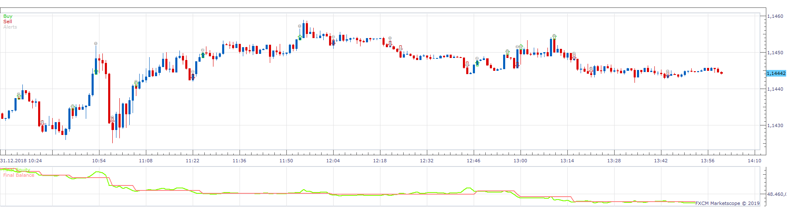
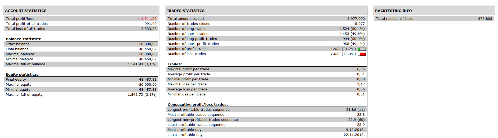

# SuperTrend Band Strategy

> Source: https://fxcodebase.com/code/viewtopic.php?f=31&t=68931  
> Forum: 31 · Topic 68931 · 17 post(s)

---

## SuperTrend Band Strategy

**Apprentice** · Wed Sep 18, 2019 6:37 am

 

LONG RULES
Price >= DN line : Open Long
UP line is Trailing Stop for Long Position
SHORT RULES
Price <= UP line : Open Short
DN line is Trailing Stop for Short Position

Based on SuperTrend Band.lua
[viewtopic.php?f=17&t=68919](https://fxcodebase.com/code/viewtopic.php?f=17&t=68919)

 [SuperTrend Band Strategy.lua](files/128745/SuperTrend%20Band%20Strategy.lua)

---

## Re: SuperTrend Band Strategy

**SerifKocdemir** · Sun Sep 22, 2019 5:28 pm

Thank you so much.
It is work so correctly

SUPERTRENDBAND STRATEGY WORK VERYWELL
I HAVE CHANGED LITTLE BIT SUPERTRENDBAND INDICATOR ,
I HAVE ADDED LIMIT BUT I TRIED AGAIN AND AGAIN AND I COULDN'T CHANGE STRATEGY
INDICATOR IS WOORK GOOD.
CAN YOU FIX OR MAKE NEW STRATEGY FOR NEW MODIFIED SUPERTRENDBAND INDICATOR.
THANK YOU.

STARTEGY RULES
LONG RULES
Price >= DN line : Open Long
UP line is Trailing Stop for Long Position
SHORT RULES
Price <= UP line : Open Short
DN line is Trailing Stop for Short Position

SuperTrend Band
[viewtopic.php?f=17&t=68919](https://fxcodebase.com/code/viewtopic.php?f=17&t=68919)

SuperTrend BandSRF.lua

---

## Re: SuperTrend Band Strategy

**Apprentice** · Thu Dec 26, 2019 4:36 pm

Your request is added to the development list.
Development reference 490.

---

## Re: SuperTrend Band Strategy

**Apprentice** · Fri Dec 27, 2019 6:43 am

[SuperTrend_Band_StrategySRF.lua](files/130492/SuperTrend_Band_StrategySRF.lua)

Try this version.

---

## Re: SuperTrend Band Strategy

**SerifKocdemir** · Sun Dec 29, 2019 10:06 pm

SuperTrend_Band_StrategySRF.lua

Thank you so much Apprentice
There are a few little problem for you but big problem for just like me

1.Strategy make buy but than never sell or never close long position
2.Strategy don't make short position and I can not know close short position?

---

## Re: SuperTrend Band Strategy

**SerifKocdemir** · Wed Jan 15, 2020 8:15 pm

Is there anybody can working Strategy for SupertrendbandSRF?

LONG RULES
Price >= DN line : Open Long
UP line is Trailing Stop for Long Position
UP < Price : Close Positin
SHORT RULES
Price <= UP line : Open Short
DN line is Trailing Stop for Short Position
DN > Price : Close Positin

---

## Re: SuperTrend Band Strategy

**Apprentice** · Sun Jan 19, 2020 5:14 am

Your request is added to the development list.
Development reference 564.

---

## Re: SuperTrend Band Strategy

**Apprentice** · Mon Jan 20, 2020 9:39 am

This is the exact rules used in SuperTrend_Band_StrategySRF (file 27064)

---

## Re: SuperTrend Band Strategy

**RENKOTRADER** · Thu Jun 04, 2020 8:14 am

I am currently using a SuperTrend (dot version) Indicator with a mean renko chart view. I am interested in automating my manuel trading with a simple SuperTrend strategy, however, once again your strategy takes it's data source from a chart time frame and not a chart view. As a long term FXCM account holder I would greatly appreciate if someone could develop this strategy for my trading technique. Thank you

---

## Re: SuperTrend Band Strategy

**Apprentice** · Sat Jun 06, 2020 3:40 pm

Your request is added to the development list.
Development reference 1426.

---

## Re: SuperTrend Band Strategy

**Apprentice** · Mon Jun 08, 2020 5:42 am

[SuperTrend Band Mean Renko Strategy.lua](files/134666/SuperTrend%20Band%20Mean%20Renko%20Strategy.lua)

Try this version.

---

## Re: SuperTrend Band Strategy

**RENKOTRADER** · Mon Jun 08, 2020 6:31 am

Thank you for this strategy, however when trying to run the strategy it gives me an error message asking me to install Mean Renko View.lua. I have reinstalled both Mean Renko View.lua, which I prefer, and Mean Renko View 2.lua, but still get the same error message. What should I do?

---

## Re: SuperTrend Band Strategy

**Apprentice** · Tue Jun 09, 2020 6:22 am

Please use Mean Renko Bars View.lua posted dere (top/first post of a topic)
[viewtopic.php?f=17&t=60743](https://fxcodebase.com/code/viewtopic.php?f=17&t=60743)
DO not use other versions or rename them.

---

## Re: SuperTrend Band Strategy

**RENKOTRADER** · Fri Jun 12, 2020 5:27 am

Unfortunately there is still a problem with the Super Trend Band mean renko strategy. The strategy shows stop alerts at the correct turn around settings but does not execute order to close the open position, also this stop order is not shown in the events listing as either succesful or failed. The strategy executes successfully the turn around order at the correct settings but it executes the same order 3 times. This means that I must correct these errors manually.

I am confident that you can rectify these problrems, which is why I am giving you this feedback, and the end result will be to offer a worthwhile and very workable strategy for my trading technique.

Thanking you for your most urgent reply

---

## Re: SuperTrend Band Strategy

**Apprentice** · Tue Jun 16, 2020 7:10 am

Your request is added to the development list.
Development reference 1499.

---

## Re: SuperTrend Band Strategy

**Apprentice** · Wed Jun 17, 2020 6:33 am

It closes positions opened by this strategy only.
This can be changed by the "Allow strategy to trade" parameter.

---

## Re: SuperTrend Band Strategy

**RENKOTRADER** · Wed Jun 17, 2020 12:08 pm

This is correct, I now realise that the stop function did not execute only after I changed the "use position cap" to yes, which you suggested as possible correction turn around orders, but this still does not alter the fact that the strategy executes the same lots size turn around order 3 to 4 times in concession. This might be because it executes the turn around each time the band poisition is crossed which is obvoiusly not correct as it should only execute the turn around order once.
