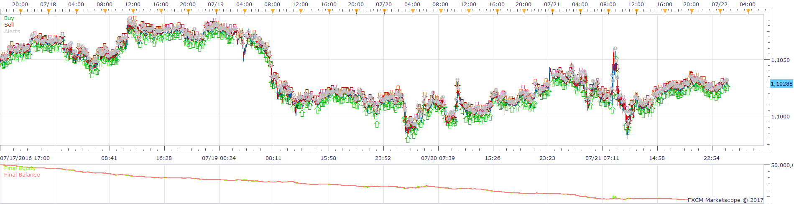
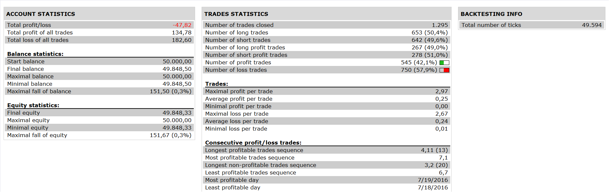

# SuperTrend Crossover Strategy

> Source: https://fxcodebase.com/code/viewtopic.php?f=31&t=64320  
> Forum: 31 · Topic 64320 · 6 post(s)

---

## SuperTrend Crossover Strategy

**Apprentice** · Sat Jan 21, 2017 6:22 am

 

Open Long
ST1/ST2 CrossOver
Open Short
ST1/ST2 CrossUnder

 [SuperTrend Crossover Strategy.lua](files/110640/SuperTrend%20Crossover%20Strategy.lua)

ST.lua is available here.
[viewtopic.php?f=17&t=605&p=110639#p110639](https://fxcodebase.com/code/viewtopic.php?f=17&t=605&p=110639#p110639)

The Strategy was revised and updated on January 19, 2019.

---

## Re: SuperTrend Crossover Strategy

**Desrow** · Sun Jan 22, 2017 3:40 am

Apprentice,

Strategy will not run, it keeps asking for ST.lua (208) which I have downloaded and on my chart.

I also have SuperTrend.lua, both of these indicators work fine but not the Strategy.

Any suggestions?

Thanks

---

## Re: SuperTrend Crossover Strategy

**Apprentice** · Sun Jan 22, 2017 5:50 am

Can you restart your TS.

---

## Re: SuperTrend Crossover Strategy

**Desrow** · Sun Jan 22, 2017 8:42 am

Did a re-start, same result with the following error message.

I have had this happen on several other strategies also.

---

## Re: SuperTrend Crossover Strategy

**Desrow** · Fri Jan 27, 2017 10:02 am

Apprentice,

Any idea about the problem in my last post?

Would like to try the Strategy but it will not load.

Thanks

---

## Re: SuperTrend Crossover Strategy

**Apprentice** · Sat Jan 28, 2017 9:21 am

Have just tested this strategy and Backtester and simulator.
Everything works as expected.

Try uninstall all strategys / indicator from your TS.
Re-Download / Re-Install / Re-Test.
Make sure you are not changing file nemes.

If problem persists, send me both files via email.
