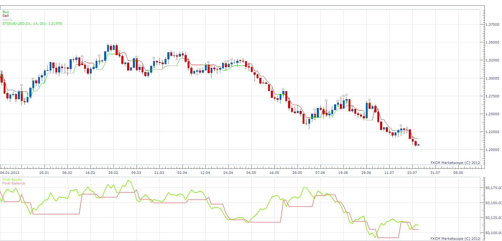

# SuperTrend Strategy

> Source: https://fxcodebase.com/code/viewtopic.php?f=31&t=27809  
> Forum: 31 · Topic 27809 · 14 post(s)

---

## SuperTrend Strategy

**Apprentice** · Tue Dec 18, 2012 3:56 pm

Open Long
Price/ST CrossOver
Open Short
Price/ST CrossUnder

 [SuperTrend Strategy.lua](files/48731/SuperTrend%20Strategy.lua)

Please install SuperTrend (ST) Indicator
[viewtopic.php?f=17&t=27663](https://fxcodebase.com/code/viewtopic.php?f=17&t=27663)

The Strategy was revised and updated on January 18, 2019.

---

## Re: SuperTrend Strategy

**elliotwave5** · Wed Dec 19, 2012 2:00 am

ran supertrend on a backtest
a) written for m5 can it be altered to h4?
b) 27 errors on backtest

simply wanted alert to be prompted strategy is great thanks but errors?

---

## Re: SuperTrend Strategy

**elliotwave5** · Wed Dec 19, 2012 2:16 am

pls ignore prev post -
another observation based on ST indicator long position should have been triggered on oct 12 for EUR/USD H4 and remained long until current 275 pip move
but strategy exited trade too soon. was it stopped out or was profit target hit? please explain

---

## Re: SuperTrend Strategy

**elliotwave5** · Sun Mar 31, 2013 9:24 pm

looking for buy and sell on bar when colour changes and not when crossover occurs
see eur / usd D1
once 200 Day ma crosses super trend line and Price further confirmation to add second position
can this strategy be amended please?

---

## Re: SuperTrend Strategy

**Apprentice** · Mon Apr 01, 2013 4:50 am

Your request is added to the development list.

---

## Re: SuperTrend Strategy

**elliotwave5** · Mon Apr 01, 2013 8:52 am

thank you

---

## Re: SuperTrend Strategy

**mjf1288** · Tue Apr 02, 2013 2:44 pm

It closes positions on opposite signals, there should be an option to choose whether or not you want it to do this. Thanks

---

## Re: SuperTrend Strategy

**GeorgeR** · Thu Jun 06, 2013 6:07 am

Hi. I would ask if it's possible to have the file ".fxswproj" for FX Strategy Wizard in order to make some modifications.
Thank you very much.

---

## Re: SuperTrend Strategy

**JOKER83** · Wed Aug 13, 2014 5:45 am

Hi there
I would like to super trend strategy trade it open but will not close trade!
can I set it?

---

## Re: SuperTrend Strategy

**Apprentice** · Fri Sep 16, 2016 5:45 am

Major update.

---

## Re: SuperTrend Strategy

**Apprentice** · Sat Dec 17, 2016 10:56 am

Strategy was revised and updated.

---

## Re: SuperTrend Strategy

**chai88888** · Fri Aug 19, 2022 4:08 am

can you please tweak the strategy a little bit.

open long if the previous green line is higher than the first green line

vice versa thanks

---

## Re: SuperTrend Strategy

**Apprentice** · Fri Aug 19, 2022 4:34 am

We have added your request to the development list.
Development reference 498.

---

## Re: SuperTrend Strategy

**Apprentice** · Wed Aug 31, 2022 11:09 am

Something Like this?
Open Long
Price[0] > ST[0]
ST[-1]> ST[0]
Vice Versa for Short

 [SuperTrend Strategy.lua](files/147303/SuperTrend%20Strategy.lua)
