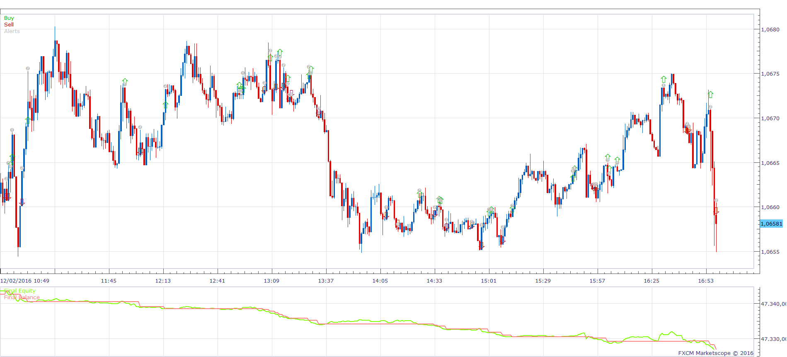
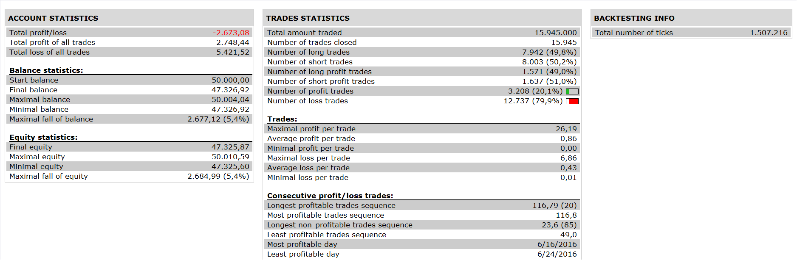

# T3 and FAN_MA2 Strategy

> Source: https://fxcodebase.com/code/viewtopic.php?f=31&t=64196  
> Forum: 31 · Topic 64196 · 1 post(s)

---

## T3 and FAN_MA2 Strategy

**Apprentice** · Sat Dec 10, 2016 8:00 am

 

Long
price is above T3 Moving Average line
 and 3rd bar positive on FAN_MA2

Short
when price is below T3 Moving Average line
 and 3rd bar negative on FAN_MA2

 [T3 and FAN_MA2 Strategy.lua](files/109687/T3%20and%20FAN_MA2%20Strategy.lua)

T3/GD are available here.
[viewtopic.php?f=17&t=1302&hilit=T3+Moving+Average](https://fxcodebase.com/code/viewtopic.php?f=17&t=1302&hilit=T3+Moving+Average)

Fan_MA2 is available here.
[viewtopic.php?f=17&t=4104&p=10289&hilit=FAN_MA2#p10289](https://fxcodebase.com/code/viewtopic.php?f=17&t=4104&p=10289&hilit=FAN_MA2#p10289)

The Strategy was revised and updated on December 10, 2018.
