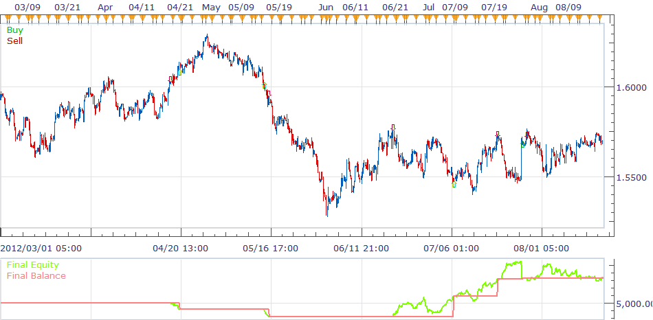
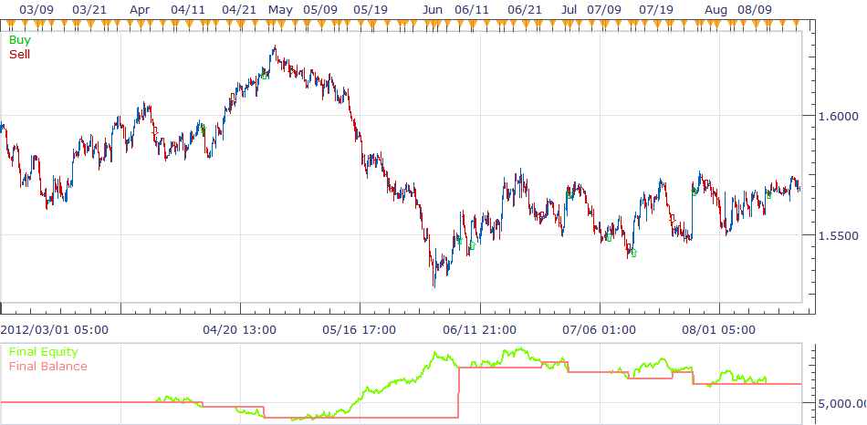
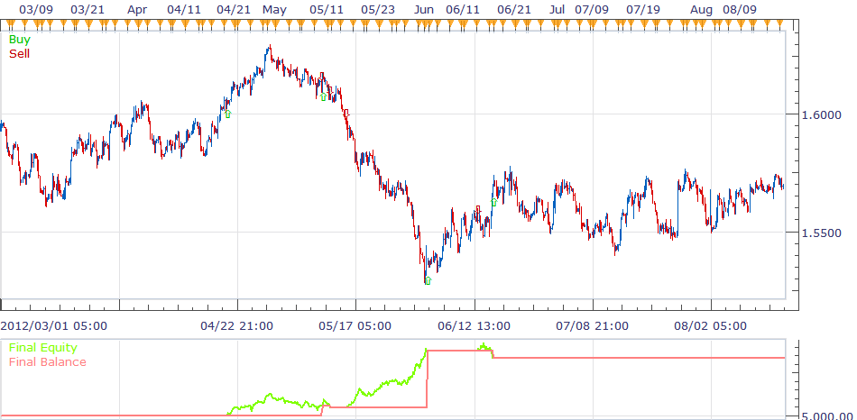

# TBB_S strategy

> Source: https://fxcodebase.com/code/viewtopic.php?f=31&t=20193  
> Forum: 31 · Topic 20193 · 3 post(s)

---

## TBB_S strategy

**richardtao** · Thu Jun 14, 2012 5:31 am

The TBB_S is dedicated to TBB indicator. so to apply TBB_S strategy must load TBB indicator first.
The parameter “Allow Stop” defines the stop type.
One who have to input initial stop pips when selecting [Manual]! Otherwise the position will not close until the next reversal action took place.
To select [PreStp] set the strategy put the stop entry by STP value automatically.
To select [PostStp] set the strategy will close position when price was break through the STP value after the specific time period.
notice! this strategy is fit for the most situation NOT for the all.

 [TBB_S.bin](files/35502/TBB_S.bin)

---

## Re: TBB_S strategy

**richardtao** · Fri Aug 31, 2012 3:00 am

This is TBB_S strategy updated version.
The user apply TBB_S strategy must load TBB indicator version 2 first.
[download/file.php?id=7239](https://fxcodebase.com/code/download/file.php?id=7239)
The second parameter change to "T: Type of strategy" which defines the strategy type.
Strategy 1:reverse strategy

 

Strategy 2:imminent strategy

 

Strategy 3:chase after strategy

 

The parameter “Allow Stop” defines the stop type.
To select [PostStp] set the strategy will close position when price was break through trailing stop.
To select [PreStp] set the strategy put the stop entry by trailing stop value automatically.
To select [FixStp] user could set fix stop and limit order by pips. Otherwise, the position will not close until the next reversal action took place. It means that user just like to wait next signal.
file of version 2:

 [TBB_S.bin](files/39418/TBB_S.bin)

---

## Re: TBB_S strategy

**Apprentice** · Mon Dec 05, 2016 9:51 am

Bump up.
