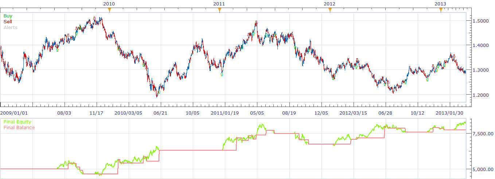
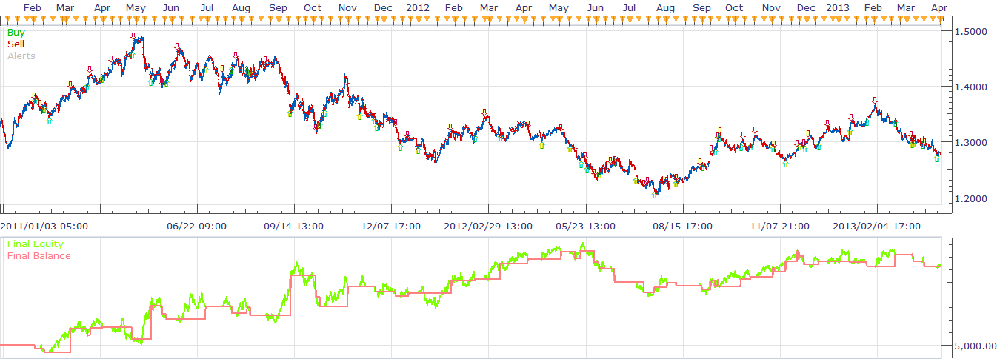
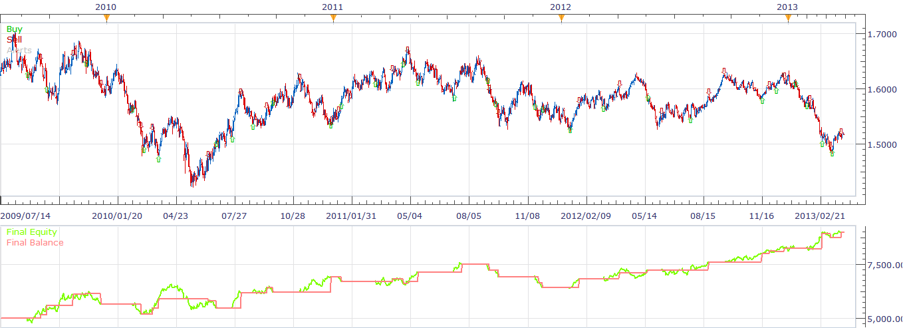
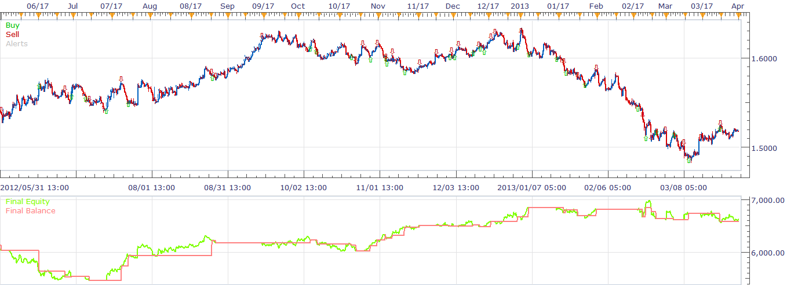

# TDA_S strategy

> Source: https://fxcodebase.com/code/viewtopic.php?f=31&t=34252  
> Forum: 31 · Topic 34252 · 2 post(s)

---

## TDA_S strategy

**richardtao** · Tue Apr 09, 2013 4:07 am

 

 

 

The user apply TDA_S strategy must load TDA indicator first.
[download/file.php?id=8933](https://fxcodebase.com/code/download/file.php?id=8933)

The parameter “Allow Stop” defines the stop type.
To select [PostStp] set the strategy will close position when price was break through the STP value after the specific time period.
To select [PreStp] set the strategy put the stop entry by STP value automatically.
To select [FixStp] user have to input initial stop pips otherwise the position will not close until the next reversal action took place.

 [TDA_S.bin](files/58434/TDA_S.bin)

---

## Re: TDA_S strategy

**Apprentice** · Fri Dec 09, 2016 4:36 am

Bump up.
