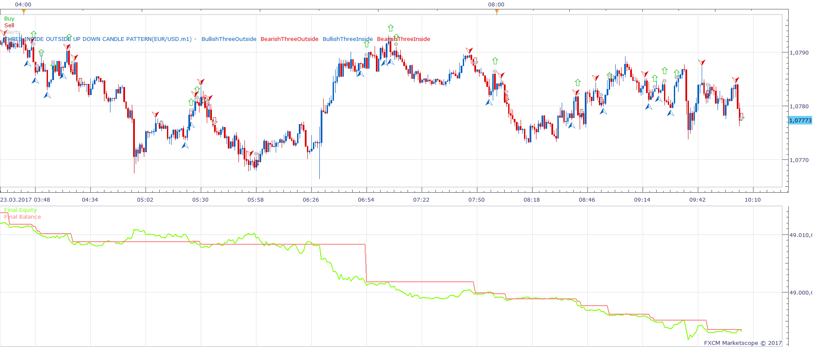
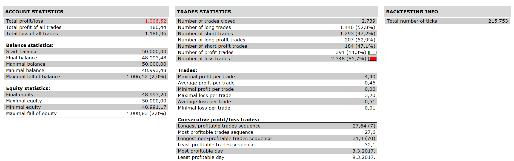

# Three Inside-Outside Up-Down candle pattern Strategy

> Source: https://fxcodebase.com/code/viewtopic.php?f=31&t=65038  
> Forum: 31 · Topic 65038 · 6 post(s)

---

## Three Inside-Outside Up-Down candle pattern Strategy

**Apprentice** · Tue Aug 29, 2017 8:48 am

 

Based on Three Inside Outside Up Down candle pattern indicator.
[viewtopic.php?f=17&t=65037](https://fxcodebase.com/code/viewtopic.php?f=17&t=65037)

 [Three Inside-Outside Up-Down candle pattern Strategy.lua](files/114554/Three%20Inside-Outside%20Up-Down%20candle%20pattern%20Strategy.lua)

---

## Re: Three Inside-Outside Up-Down candle pattern Strategy

**papynou34** · Mon Mar 19, 2018 12:12 pm

Hello all,
Is it possible to add an option in the strategy : place the stop just at the bottom of the candle where the signal appears if bullish and uuper the candle in case of bearish? (Arrow on the scheme).

---

## Re: Three Inside-Outside Up-Down candle pattern Strategy

**Apprentice** · Mon Mar 26, 2018 10:20 am

Your request is added to the development list under Id Number 4093

---

## Re: Three Inside-Outside Up-Down candle pattern Strategy

**Apprentice** · Tue Mar 27, 2018 10:27 am

Try this version.

 [Three Inside-Outside Up-Down candle pattern Strategy.papynou34.lua](files/118397/Three%20Inside-Outside%20Up-Down%20candle%20pattern%20Strategy.papynou34.lua)

---

## Re: Three Inside-Outside Up-Down candle pattern Strategy

**Reymondpolanco** · Tue Oct 16, 2018 12:10 am

> **Apprentice wrote:**
>
>
> 1.png
>
>
>
>
> 2.png
>
>
> Based on Three Inside Outside Up Down candle pattern indicator.
> [viewtopic.php?f=17&t=65037](https://fxcodebase.com/code/viewtopic.php?f=17&t=65037)
>
>
> Three Inside-Outside Up-Down candle pattern Strategy.lua

Wich parameters did you use to get this results? Take Profit? Stop Loss? Timeframe?

---

## Re: Three Inside-Outside Up-Down candle pattern Strategy

**Apprentice** · Fri Oct 26, 2018 5:05 am

While backtesting, I usually use the default parameter.
