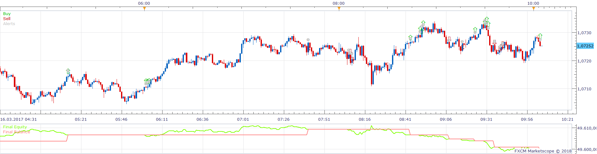
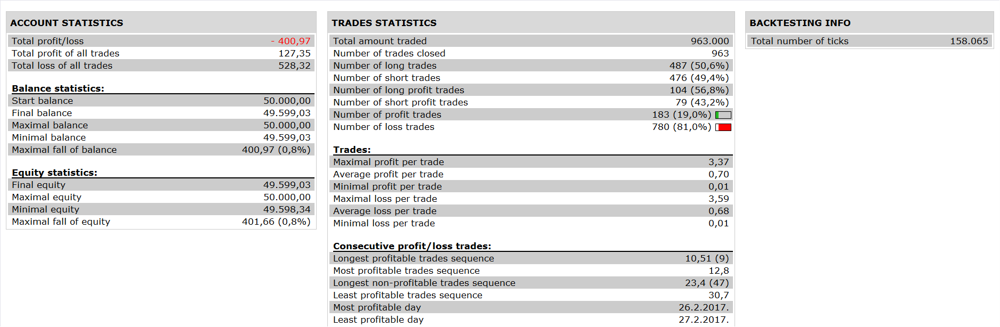

# Three Regression Line Strategy

> Source: https://fxcodebase.com/code/viewtopic.php?f=31&t=65646  
> Forum: 31 · Topic 65646 · 1 post(s)

---

## Three Regression Line Strategy

**Apprentice** · Thu Jan 18, 2018 8:55 am

 

Enter Long if:
R3 is Green
R1 is Green AND R1 > R3
R2 is Green AND R2 >R3
Note: for Long R1 does not have to be > R2
Exit Long if R1 is Red AND if R2 is Red AND R1<R3

Vice Versa for Short

 [Three Regression Line Strategy.lua](files/117115/Three%20Regression%20Line%20Strategy.lua)

Regression_Line.lua is available here.
[viewtopic.php?f=17&t=2342](https://fxcodebase.com/code/viewtopic.php?f=17&t=2342)
