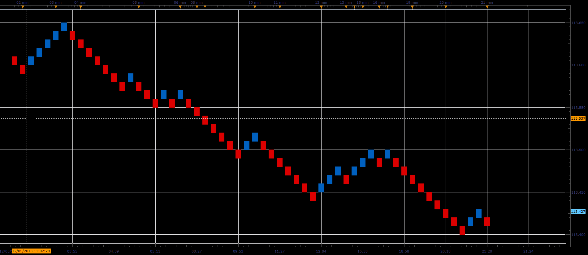
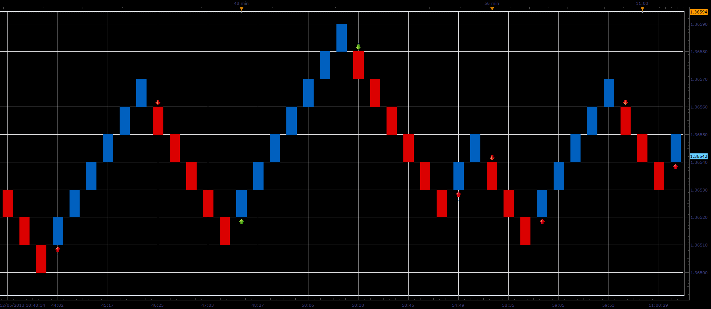
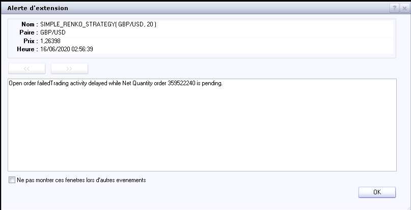

# Tick Renko candles and Simple Renko strategy

> Source: https://fxcodebase.com/code/viewtopic.php?f=31&t=60066  
> Forum: 31 · Topic 60066 · 48 post(s)

---

## Tick Renko candles and Simple Renko strategy

**Alexander.Gettinger** · Thu Dec 05, 2013 11:44 am

**1. View-indicator "Tick Renko candles".**

The indicator draws Renko candles based on tick data.

 

Download:

 [Tick_Renko_Candles.lua](files/91360/Tick_Renko_Candles.lua)

**2. Sample of Renko strategy.**

The strategy opens/closes orders for each change of direction Renko bars.

 

Download:

 [Simple_Renko_Strategy.lua](files/91360/Simple_Renko_Strategy.lua)

The Strategy was revised and updated on December 18, 2018.

---

## Re: Tick Renko candles and Simple Renko strategy

**panos59** · Thu Dec 05, 2013 1:53 pm

Thanks alot for the renko strategy..however the indicator crashes..

---

## Re: Tick Renko candles and Simple Renko strategy

**fjasonfx** · Thu Dec 05, 2013 4:51 pm

Hey Alex or anybody else that can help me out,
New guy here. I downloaded both the indicator and strategy to FT2 but I cannot find the indicator anywhere. I assume it is on my FT2 since when I try to reload it it ask if I want to replace it. I just can't find it anywhere or I just need to be told how to get it to show on my charts. Also when I try to back test the strategy I keep getting an index out of range error. If anybody here could help me out with that it would be much appreciated.

Thanks,
Jason

---

## Re: Tick Renko candles and Simple Renko strategy

**Valeria** · Thu Dec 05, 2013 10:34 pm

Hi Jason,

To install the extension to Trading Station just drag and drop the downloading link from the web-site to Trading Station or Marketscope. Please watch the [video](https://fxcodebase.com/code/viewtopic.php?f=17&t=59681&p=90581&hilit=install#p90124) which demonstrates it.
To open the installed view please in Marketscope go to File->Create View and in the Create View dialog box choose Tick_Renko_Candles.

---

## Re: Tick Renko candles and Simple Renko strategy

**fjasonfx** · Thu Dec 05, 2013 11:32 pm

Hey Valeria,
 Thanks for the instructions.I was able to get it. I didn't know it was in create view. I'm still not sure about the"index out of range error" I'm getting when I try to back test the strategy. Oh well.

Thanks again,
Jason

---

## Re: Tick Renko candles and Simple Renko strategy

**Alextc** · Mon Dec 09, 2013 3:06 am

Hello, first congratulations on your work is excellent. I have trouble keeping backtesting, there's only one candle in the history. I get the same message that appears fjasonfx.
Sure there something I'm doing wrong. Can you explain the steps for proper use?
thank you very much

---

## Re: Tick Renko candles and Simple Renko strategy

**Alexander.Gettinger** · Tue Dec 10, 2013 8:32 pm

The strategy has been updated.

---

## Re: Tick Renko candles and Simple Renko strategy

**Alexander.Gettinger** · Tue Dec 10, 2013 8:34 pm

> **fjasonfx wrote:**
> Hey Valeria,
> Thanks for the instructions.I was able to get it. I didn't know it was in create view. I'm still not sure about the"index out of range error" I'm getting when I try to back test the strategy. Oh well.

Fixed.

---

## Re: Tick Renko candles and Simple Renko strategy

**panos59** · Wed Dec 11, 2013 5:39 am

Thanks for the strategy update ! However the indicator still paints one candle ..can you fix it ?
THANKS !!

---

## Re: Tick Renko candles and Simple Renko strategy

**Valeria** · Thu Dec 12, 2013 11:56 pm

Hi panos59,

> However the indicator still paints one candle ..can you fix it ?

The history data for tick Renko is very restricted, that is why you get just one brick for the big brick size, say, 10. If brick size equals 1, there are more bricks on the chart. Probably, it is better to use the standard, not tick, Renko view if you want to use big brick size.

---

## Re: Tick Renko candles and Simple Renko strategy

**allenk2013** · Tue Dec 17, 2013 7:56 am

> **Alexander.Gettinger wrote:**
>
>
> > **fjasonfx wrote:**
> > Hey Valeria,
> > Thanks for the instructions.I was able to get it. I didn't know it was in create view. I'm still not sure about the"index out of range error" I'm getting when I try to back test the strategy. Oh well.
>
>
>
> Fixed.

Hi Alexander, I've tried the latest build of strategy & indicators over the following configurations for 2 days: (1) a small 2 pips step over both strategy/indicator ensuring faster tick-renko chart coming; (2) running over EUR/USD, GBP/USD, AUD/USD, USD/JPY concurrently; (2) "Allow strategy to trade" option is enabled; however, after 2-day trial over a demo account, I don't see any buy/sell signals are initiated. As this is a tick-based strategy, I have no idea how to debug it. After comparing the trading codes with other strategies, e.g. DSS Bressert which can successfully generate buy/sell signals here, I also try to modify "valuemap.Quantity = Amount;" without multiplying BaseSize, but all efforts are still in vain. I need your great help. Thanks in advance.

---

## Re: Tick Renko candles and Simple Renko strategy

**mazatov** · Fri Jan 31, 2014 10:09 am

Hello,

I 've been getting the following error every time I try to run the backtest on this strategy.

...works\FXTS2\Indicators\Custom\Tick_Renko_Candles.lua:245: Index is out of range;01/31/2014 10:06:50
Backtesting started;01/31/2014 10:06:50
Failed to load SIMPLE_RENKO_STRATEGY: ...ks\FXTS2\Indicators\Custom\Simple_Renko_Strategy.lua:4: attempt to index global 'strategy' (a nil value);01/31/2014 10:06:49

And it seems to not work on the live trading as well. I had the strategy on for a few days with only 5 as size of the brick but it didn't make any trade even though the market moved a lot. Anyone else had ths problem by any chance and knows what to do about it ??

Thanks!

---

## Re: Tick Renko candles and Simple Renko strategy

**Apprentice** · Sat Feb 01, 2014 2:35 pm

I have askуed Alex to reply to this one.

---

## Re: Tick Renko candles and Simple Renko strategy

**KrembuFX** · Thu Feb 20, 2014 1:52 pm

Hi,
I have tested this renko chart and many other here in the forum. this is by far the best.

only issues i have with this, and i hope you can solve this are:

Is there a possibility to load more bars at the start of new chart? (my workaround is to leave the program running)

---

## Re: Tick Renko candles and Simple Renko strategy

**automan** · Mon Feb 24, 2014 12:39 pm

Indicator (chart) works fine

but strategy does not open any trades?

---

## Re: Tick Renko candles and Simple Renko strategy

**KrembuFX** · Thu Feb 27, 2014 3:05 pm

strategy not work for me also..

can you fix strategy?

---

## Re: Tick Renko candles and Simple Renko strategy

**eyalbrin** · Tue Mar 04, 2014 8:00 am

Hello
The strategy does not work
is there an updated version
thank you

---

## Re: Tick Renko candles and Simple Renko strategy

**easytrading** · Mon Nov 03, 2014 10:51 am

Hello Developing Team,
The Tick Renko indicator is working very nice ,but the simple Renko strategy does not open any trades.I set allow to trade to "yes" in my live account. Help wanted please with my many thanks to all of you for the great job you are doing.

---

## Re: Tick Renko candles and Simple Renko strategy

**Apprentice** · Wed Nov 05, 2014 3:49 am

Can you post whole strategy parameter section,
so that we have access to all settings used.

---

## Re: Tick Renko candles and Simple Renko strategy

**easytrading** · Wed Nov 05, 2014 6:52 pm

hello Apprentice,
below are the whole strategy prameters that i am using in this strategy:

symbol : EUR/USD
price type :Bid
Renko step :5
Type of signal irect
Allow strategy to trade:Yes
Allowed side :Both
Account to trade on here is my live account #)
Trade Amount in Lots :5
set limit orders :No
set stop orders :No
Trailing stop order :No
show alert :Yes
play sound :Yes
send Email :No

and in the simple tick Renko indicatore view i also set the the Renko step to 5 for the same symble EUR/USD.
hoping i am not doing any thing Wrong,and thank you for your advice in advance.

---

## Re: Tick Renko candles and Simple Renko strategy

**easytrading** · Sun Nov 09, 2014 11:42 am

hello Apprentice,
I posted to you the whole parameters i used in this strategy as you requested from me to see the reason why the strategy is not opening any trades, did you find any thing ? and is it possible to review it and fix it and bring it to live again please ? your help is much much appreciated .

---

## Re: Tick Renko candles and Simple Renko strategy

**Univest** · Tue Nov 11, 2014 4:58 pm

thank you. very nice.

Can you please add upper and lower limit that has to be hit before new bar is created?
Its like the logicounter on this video: [https://www.youtube.com/watch?v=ibVJ1pz6tS0](https://www.youtube.com/watch?v=ibVJ1pz6tS0)

Would also be nice if it loaded more tick data.

---

## Re: Tick Renko candles and Simple Renko strategy

**Valeria** · Fri Nov 14, 2014 1:37 am

Hi easytrading,

According to the logic of the strategy, it can open just one position for the instrument at a time. So if you have an open position, you cannot open another one. Please check whether this is your case or not.

---

## Re: Tick Renko candles and Simple Renko strategy

**easytrading** · Fri Nov 14, 2014 3:33 am

hello valeria,
belieave me i wish if it opens one position ,but the problem it's not opening any one. and if you read all the posts in this thread you will see they all have the same problem and no one mentioned it works with him. did you try it by your self ? please valeria we are all waiting your fixing for this strategy asap.with much much appreciation.thank you

---

## Re: Tick Renko candles and Simple Renko strategy

**Alexander.Gettinger** · Tue Nov 18, 2014 4:10 pm

I fixed the strategy. Now it works well.

---

## Re: Tick Renko candles and Simple Renko strategy

**fxcyberman** · Mon Dec 08, 2014 1:31 pm

hello, please kindly add an option for numbers of consecutive bars color changed to minimize the noise. thanks in advance.

---

## Re: Tick Renko candles and Simple Renko strategy

**Apprentice** · Tue Dec 09, 2014 5:06 am

Your request is added to a development order.

---

## Re: Tick Renko candles and Simple Renko strategy

**fxcyberman** · Tue Dec 09, 2014 8:40 am

Sorry, one more , i.e. time control and mandatory closing time. please.
thank you.

---

## Re: Tick Renko candles and Simple Renko strategy

**cnikitopoulos94** · Fri Oct 02, 2015 9:26 am

I was wondering. I thought that fxcm is renko didnt work properly due to the way it has a format for renko candles....

Does FXCM renko actually form the Renko candles correctly?

---

## Re: Tick Renko candles and Simple Renko strategy

**Julia CJ** · Mon Oct 05, 2015 1:40 am

Hi Cnikitopoulos94,

It would be great if you tell what exactly you do not like in the current implementation. Please describe with as much details as possible.

---

## Re: Tick Renko candles and Simple Renko strategy

**cnikitopoulos94** · Mon Oct 05, 2015 7:41 am

Hi julia,

I dont have a problem with it, I am just confused because last time I spoke with an FXCM representative about fixing a strategy using RENKO he told me it was not possible due to the fact that RENKO doesnt work the way its suppose too... All though this was two months ago. I think he said it was due to the fact Trading Station has a main format revolving around time which causes a confliction of what your suppose to see compared to what you see on the Renko View.

---

## Re: Tick Renko candles and Simple Renko strategy

**cnikitopoulos94** · Wed Oct 07, 2015 2:32 am

Sorry Julia for not posting I thought I had already tried posting..

When I tried making a strategy for Renko an FXCM representative told me it wouldnt be possible doing due to the fact that in trading station is coded heavily in time and because renko is not a time indicator it contradicts the software.

---

## Re: Tick Renko candles and Simple Renko strategy

**cnikitopoulos94** · Mon Oct 12, 2015 11:17 am

I tried updating the view to Tick Renko Candles however all I get is this..

Any help would be greatly appreciated...

---

## Re: Tick Renko candles and Simple Renko strategy

**PromQueen** · Tue Oct 20, 2015 1:48 pm

Hi,

This strategy seems to work only for EUR/USD. Is it possible to include all currency pairs?

best

---

## Re: Tick Renko candles and Simple Renko strategy

**AugustRanieri** · Tue Oct 20, 2015 3:19 pm

Hi,

Thanks for a wonderful strategy. I am currently using it in my demo account after optimizing the strategy. If I might make a suggestion, It is executing trades perfectly, however the max allowable amount on lot size is 100K. Is it possible to increase this amount, let's say up to 600K or more?

Thanks for your consideration.

---

## Re: Tick Renko candles and Simple Renko strategy

**Apprentice** · Thu Oct 22, 2015 4:43 am

Try it now.

---

## Re: Tick Renko candles and Simple Renko strategy

**PromQueen** · Tue Oct 27, 2015 4:35 pm

Hi,

This strategy crashes Trading Station. As soon as several currency pairs are set in strategy dashboard the software freezes.

best

---

## Re: Tick Renko candles and Simple Renko strategy

**cnikitopoulos94** · Sun Nov 15, 2015 11:46 pm

Tried using this and recieve the same issue. just shows white page.

---

## Re: Tick Renko candles and Simple Renko strategy

**cnikitopoulos94** · Tue Nov 24, 2015 7:45 pm

any updates with this?

---

## Re: Tick Renko candles and Simple Renko strategy

**Julia CJ** · Wed Dec 02, 2015 6:39 am

Hi Cnikitopoulos,

Unfortunately, we have not managed to reproduce the issue.
Could you please clarify the issue?
It would be better if you sent the detailed description of errors
at ycherepanova(@)gehtsoft.com.

---

## Re: Tick Renko candles and Simple Renko strategy

**c.alexander** · Thu Dec 31, 2015 11:34 am

Currently real volume can’t be applied to the tick renko chart (it just reads: error) in the same way that it can be applied to the minute based renko chart. Is there anyway for this to be corrected so that real volume can be calculated and applied to the tick renko chart?

---

## Re: Tick Renko candles and Simple Renko strategy

**Apprentice** · Mon Jan 04, 2016 6:06 am

Volume is NOT used for Renko calculation.

---

## Re: Tick Renko candles and Simple Renko strategy

**Apprentice** · Wed Dec 14, 2016 4:29 am

Strategy was revised and updated.

---

## Re: Tick Renko candles and Simple Renko strategy

**Avignon** · Tue Jun 16, 2020 3:59 am

I'm not English native. What is that? I not understand.

 

Thanks.

---

## Re: Tick Renko candles and Simple Renko strategy

**Apprentice** · Tue Jun 16, 2020 4:54 am

Will investigate.
It looks like the trading server failed or refused to execute your order.

---

## Re: Tick Renko candles and Simple Renko strategy

**Avignon** · Tue Jun 16, 2020 4:45 pm

OK, for information it's a demo account.

---

## Re: Tick Renko candles and Simple Renko strategy

**mangonel** · Fri Sep 01, 2023 11:35 am

I still have the same problem. I'm looking for advice on how to improve my trading results. I'm using a strategy that works well in backtesting, but I'm missing trades when I put it into practice.

---

## Re: Tick Renko candles and Simple Renko strategy

**Apprentice** · Sat Oct 21, 2023 8:43 am

I don’t think you are using the latest version.

According to the error message you still use net close orders,
which shouldn’t happen in the latest version of the code [https://fxcodebase.com/code/download/file.php?id=25293](https://fxcodebase.com/code/download/file.php?id=25293)
