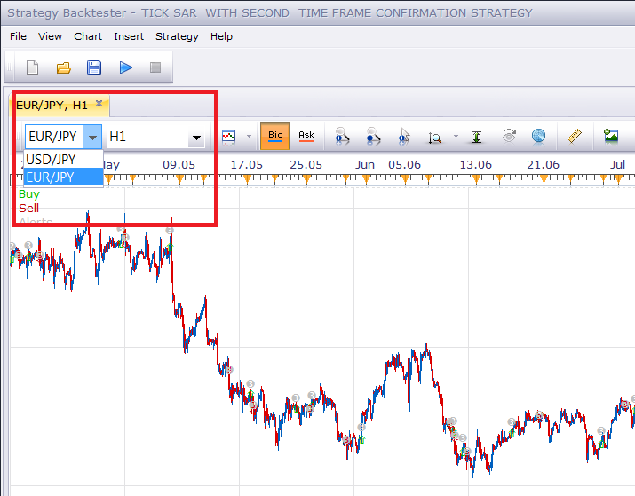

# Tick SAR Strategy

> Source: https://fxcodebase.com/code/viewtopic.php?f=31&t=4727  
> Forum: 31 · Topic 4727 · 31 post(s)

---

## Tick SAR Strategy

**Apprentice** · Mon Jun 13, 2011 11:55 am

Signals are generated by changes in SAR indications.

 [Tick SAR Strategy.lua](files/11699/Tick%20SAR%20Strategy.lua)

 

MTF version of this strategy
If the shortest TF switch the direction
And the longer TF is in the same direction
position will be opened.

 [Tick SAR With Second Time Frame Confirmation Strategy.lua](files/11699/Tick%20SAR%20With%20Second%20Time%20Frame%20Confirmation%20Strategy.lua)

To work, please install Tick_sar Indicator
[viewtopic.php?f=17&t=2450&p=5320&hilit=tick_sar#p5320](https://fxcodebase.com/code/viewtopic.php?f=17&t=2450&p=5320&hilit=tick_sar#p5320)

The Strategy was revised and updated on January 22, 2019.

---

## Re: Tick SAR Strategy

**mr.cold** · Mon Jun 13, 2011 2:53 pm

Thank you very much, Apprentice. Great work.

---

## Re: Tick SAR Strategy

**Rpleandro** · Tue Jun 14, 2011 3:08 pm

The limit function is not working for me, am I doing something wrong or is this a glitch that needs to be fixed, thanx. PS if you help me I'll donate...

---

## Re: Tick SAR Strategy

**Apprentice** · Wed Jun 15, 2011 2:29 am

Unfortunately yesterday I discovered that the template that I use to have a bug.
The worst thing I need to update all or nearly all strategies.
The plan is to do it within 10 days.
So much of my vacation by the sea.

---

## Re: Tick SAR Strategy

**Rpleandro** · Wed Jun 15, 2011 9:34 am

I see, so this also explains the glitch in the Heiken-Ashi. I'll wait patiently Apprentice. Can you please e-mail me when the work is done? Let me know how I can donate a few bucks for the cause. Thanx Bro...

---

## Re: Tick SAR Strategy

**Apprentice** · Wed Jun 15, 2011 1:06 pm

Stop / Limit Bug Fixed.

---

## Re: Tick SAR Strategy

**t1982t** · Sat Jun 25, 2011 11:53 am

error 143: Please, download and install TICK_SAR.LUA inicator
I download it two times! )=

---

## Re: Tick SAR Strategy

**Apprentice** · Sun Jun 26, 2011 5:33 am

Have you install it?

Here you can find the article on how to do it.
[viewtopic.php?f=17&t=17](https://fxcodebase.com/code/viewtopic.php?f=17&t=17)

---

## Re: Tick SAR Strategy

**t1982t** · Sun Jun 26, 2011 12:48 pm

Yes, I have. I can actually open and use the indicator, but but when I go to test the strategy shows me the message

---

## Re: Tick SAR Strategy

**Apprentice** · Mon Jun 27, 2011 5:53 am

Very strange.
Have you changed names of indicators,
Like Tick_Sar (1). Lua

---

## Re: Tick SAR Strategy

**t1982t** · Mon Jun 27, 2011 7:59 am

Nope

---

## Re: Tick SAR Strategy

**t1982t** · Mon Jun 27, 2011 8:09 am

.....oops, I mean yes, it had a (1), now it is working. Thank you.

---

## Re: Tick SAR Strategy

**spinemaligna** · Wed Jan 04, 2012 5:43 am

Happy New year to all,

I have tried the strategy in many time frames and the result is the same. The signals lag the change of SAR by one candle. This has the result of turning winning positions into losers most of the time.
I have tried it on both open and close positions to no effect. In fact on the open position it operates two candles late.
I understand that on the ordinary SAR this is to be expected but I thought that since this operates on tick data the signal would be more accurate.
Any ideas or tweaks to make this work properly.
Hopefully this link should explain

[https://skydrive.live.com/redir.aspx?cid=293d8dbbfa5b4d89&resid=293D8DBBFA5B4D89!580&parid=root](https://skydrive.live.com/redir.aspx?cid=293d8dbbfa5b4d89&resid=293D8DBBFA5B4D89!580&parid=root)

Ross

---

## Re: Tick SAR Strategy

**spinemaligna** · Mon Jan 23, 2012 4:10 am

Any response to my last post would be appreciated, if only an acknowledgement.

Ross

---

## Re: Tick SAR Strategy

**rsarda1** · Fri Mar 09, 2012 1:24 am

HI,
I am new to this, please pardon mi ignorance.

I would like to use ASHI with SAR (eider Parabolic or Tick), but signals buy sell should only generate when the trend is on. Similar as you have done on Trendbar.lua but for ASHI,

 If possible have a filter measuring the angle of the trend as to calculate the strength of the trend.

I have tried to install the TIC SAR strategy but it seams like is not working in the Backtester, could you post what and how is it need to be instated.

Thank you.

---

## Re: Tick SAR Strategy

**Apprentice** · Sun Mar 11, 2012 5:18 am

I have test this strategy, works as expected.
Two possible reasons for your problem.
You have not installed an tick_sar indicator.
OR, AND, you have not set Allow strategy, to trade parameter to yes.

---

## Re: Tick SAR Strategy

**Apprentice** · Sat Mar 24, 2012 1:43 pm

Requested can be found here.
[viewtopic.php?f=31&t=15116](https://fxcodebase.com/code/viewtopic.php?f=31&t=15116)

---

## Re: Tick SAR Strategy

**josh2011** · Thu Mar 29, 2012 7:56 am

Hello Apprentice,

Thanks for the great job. I requested for an upgrade on the TICK SAR Strategy months back, yet no reply or even an upgrade.

I simply requested that the following conditions be included so that users can choose to enable this parameter or not:

1. The FIRST SAR reversal dot should open trade once it appears and not wait for candle close before it opens a trade. If however, the dot changes back to its trending color, the trade is left open and closes at the closing of that candle.
NB: I am aware that the SAR reversal dot may not appear immediately a new candle is forming (could appear when the candle is mid way). This is not an issue however.
2. Opportunity to allow open trade(s) to close once the candle closes. See attachment.

---

## Re: Tick SAR Strategy

**dewaal** · Mon Mar 25, 2013 9:46 am

Dear Apprentice
The TIC SAR Strategy only allows you to put "trade amount in lots" up to 100. Can you please change this to 1000. This is necessary as to smaller currencies needs larger lots.
Yours truly

---

## Re: Tick SAR Strategy

**Apprentice** · Mon Mar 25, 2013 5:28 pm

Limit increased to 10.000

---

## Re: Tick SAR Strategy

**dewaal** · Tue May 07, 2013 8:09 am

Dear Apprentice
Can you please ad to the TIC SAR Strategy a START/STOP time for trading with manditory closing time.

VERY PLEASE !!!

---

## Re: Tick SAR Strategy

**Apprentice** · Wed May 08, 2013 5:17 am

Your request is added to the development list.

---

## Re: Tick SAR Strategy

**zoltanh** · Mon Oct 13, 2014 2:20 pm

hi,
Could you program a MTF version of this strategy?
If the shortest TF switch the direction and the longer TFs are in the same direction, position should be opened.
thanks

---

## Re: Tick SAR Strategy

**Apprentice** · Tue Oct 14, 2014 3:58 am

Your request is added to the development list.

---

## Re: Tick SAR Strategy

**Wrongside Red** · Thu Oct 23, 2014 4:41 pm

When I try to start this strategy with "T" selected for Time Frame, I get the following error:

Tick SAR Strategy.lua:101: timeframe must not be tick

What's my problem?

---

## Re: Tick SAR Strategy

**Apprentice** · Fri Oct 24, 2014 2:12 am

"t1" time frame is not allowed time frame for this strategy.

---

## Re: Tick SAR Strategy

**Apprentice** · Fri Oct 24, 2014 2:29 am

Tick SAR Strategy StrategyUpdate.
Tick SAR With Second Time Frame Confirmation Strategy Added.

---

## Re: Tick SAR Strategy

**Wrongside Red** · Fri Oct 24, 2014 4:31 am

Thank you kindly, Apprentice.

When I backtest the "Tick SAR With Second Time Frame Confirmation Strategy" on any Yen pairs, the strategy always trades USD/JPY... even when I am only testing GBP/JPY and EUR/JPY.

Bug?

---

## Re: Tick SAR Strategy

**Apprentice** · Fri Oct 24, 2014 5:34 am

I am sure that this is not the indicator bug.
I believe this is known TS bug.
Simply selected desired instrument.

(Update)
This is a bug and will be fixed in the future TS release.

---

## Re: Tick SAR Strategy

**JOKER83** · Thu Feb 05, 2015 12:06 pm

HI

IN BACKTEST I HAVE NO CLOSE OPTION ON
BUT THE BACKTEST MAKE CLOSE OPTION ?

HOW I MAKE PICTURES HER INSITE

HELPHELP

---

## Re: Tick SAR Strategy

**Apprentice** · Fri Jan 05, 2018 8:12 am

The strategy was revised and updated.
