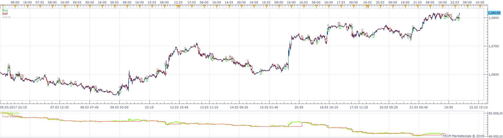
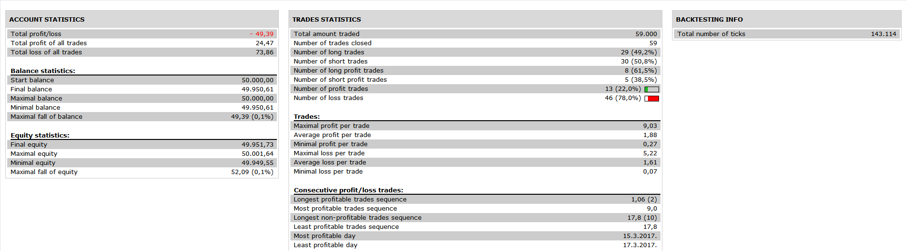
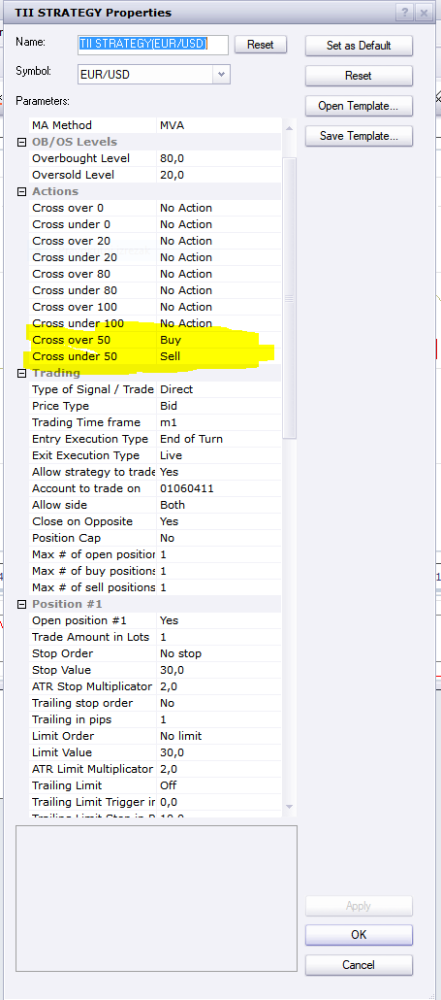
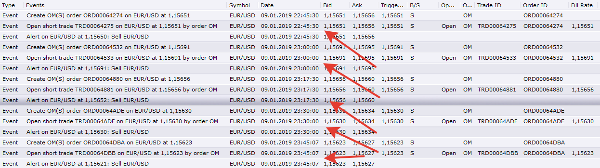

# TII Strategy

> Source: https://fxcodebase.com/code/viewtopic.php?f=31&t=68534  
> Forum: 31 · Topic 68534 · 13 post(s)

---

## TII Strategy

**Apprentice** · Tue Jun 04, 2019 10:38 am

 

Based on indicator
[viewtopic.php?f=17&t=28055](https://fxcodebase.com/code/viewtopic.php?f=17&t=28055)

At Indicator / level cross (0, 20,50, 80 and 100)
you have option to add sell/ buy/ close / alert

 [TII Strategy.lua](files/126710/TII%20Strategy.lua)

---

## Re: TII Strategy

**ASTERIA** · Wed Jun 05, 2019 5:10 am

Thank you apprentice for your response.
I observe that the strategy doesn’t work at LIVE

---

## Re: TII Strategy

**Apprentice** · Wed Jun 05, 2019 5:33 am

You will have to define some trading action.
Work on Demo.

---

## Re: TII Strategy

**ASTERIA** · Wed Jun 05, 2019 6:36 am

Hi,
THE STRATEGY OPENS TRADES, BUT ONLY IN "END OF TURN"
DOES NOT OPEN TRADES IN THE "LIVE."

---

## Re: TII Strategy

**Apprentice** · Thu Jun 06, 2019 5:42 am

I have no issues in Live mode.
Can you please share all the parameters used?

---

## Re: TII Strategy

**ASTERIA** · Thu Jun 06, 2019 6:49 am

Hi

---

## Re: TII Strategy

**ASTERIA** · Fri Jun 14, 2019 8:23 am

Hi Apprentice,

I observe every day the strategy and the indicator TII on the chart and it is absolutely sure that the strategy does not open trade at live mode.

Thank you

---

## Re: TII Strategy

**Apprentice** · Tue Jul 02, 2019 4:49 am

Still, have no issues. Also, this strategy/indicator uses EMA, so the result of the strategy may not match to the indicator. EMA is dataset size depended. It'll give different values on the same chart but with a different number of bars available. It if trades but not at the right time then it could be the result of EMA behavior.

---

## Re: TII Strategy

**ASTERIA** · Sat Jul 13, 2019 4:47 am

Hi Apprentice,
I have test the strategy in timeframes H1, H4, H8 and the strategy open trades only at the end of timeframe.

Thank you

---

## Re: TII Strategy

**Apprentice** · Sun Jul 14, 2019 4:43 am

Have you tried "Live" execution type?

---

## Re: TII Strategy

**ASTERIA** · Sun Jul 14, 2019 5:12 am

of course

---

## Re: TII Strategy

**Apprentice** · Mon Jul 29, 2019 6:38 am

Have no issues with that. Indeed, sometimes it opens right at the bar close.
But in other cases, it opens in the middle of the bar. Live mode is working correctly.

---

## Re: TII Strategy

**ASTERIA** · Tue Aug 27, 2019 5:26 am

Hi Apprentice,
Another problem I have noticed in strategy is that it doesn’t open trades when have cross over 0 and cross under 100

Thank you
