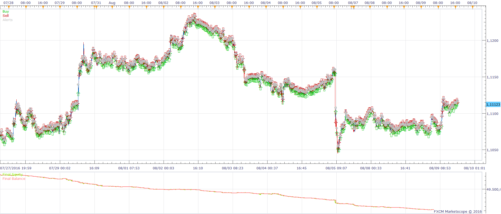
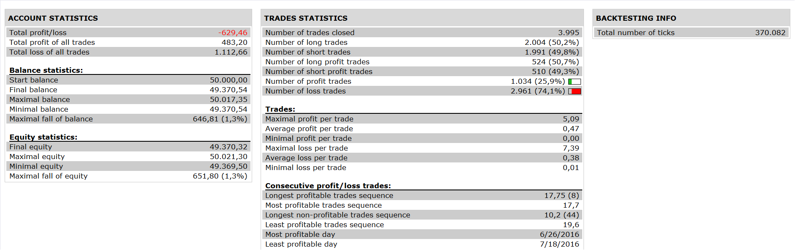

# Tilson T3 Oscillator Strategy

> Source: https://fxcodebase.com/code/viewtopic.php?f=31&t=64253  
> Forum: 31 · Topic 64253 · 2 post(s)

---

## Tilson T3 Oscillator Strategy

**Apprentice** · Wed Dec 28, 2016 6:46 pm

 

Open Long:
t3o short > t3o long and t3o long cross over buy level
Open Short
t3o short< t3o long and t3o long cross under sell level

 [Tilson T3 Oscillator Strategy.lua](files/110304/Tilson%20T3%20Oscillator%20Strategy.lua)

T3O.lua is available here.
[viewtopic.php?f=17&t=1305](https://fxcodebase.com/code/viewtopic.php?f=17&t=1305)

---

## Re: Tilson T3 Oscillator Strategy

**Apprentice** · Mon Feb 05, 2018 6:52 am

The strategy was revised and updated.
