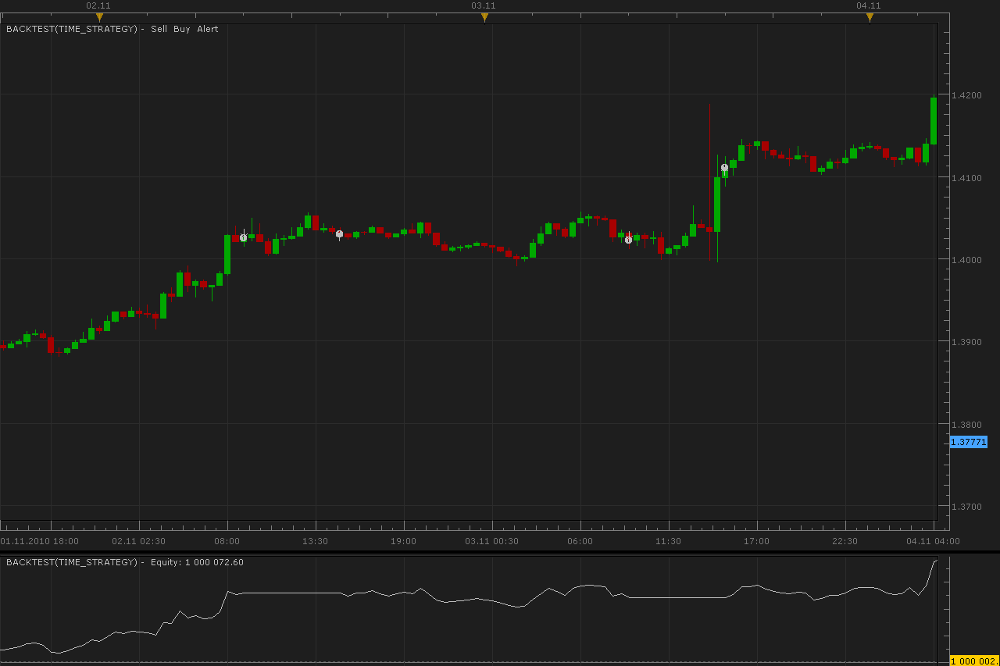

# Time strategy

> Source: https://fxcodebase.com/code/viewtopic.php?f=31&t=2644  
> Forum: 31 · Topic 2644 · 26 post(s)

---

## Time strategy

**Alexander.Gettinger** · Wed Nov 10, 2010 1:43 am

In specified time strategy opens the order specified type. Closing on time also.

 

The Strategy was revised and updated on December 17, 2018.

---

## Re: Time strategy

**alepan72** · Wed Nov 10, 2010 5:22 am

Can you explain what this strategy does? I load it in EUR/USD 15m to start 12.00 and end 14.30 with a sell order, but nothing gonna happens...

Best regards for your services!!!

---

## Re: Time strategy

**Alexander.Gettinger** · Thu Nov 11, 2010 4:31 am

Set you "Allow strategy to trade" to "yes"?

---

## Re: Time strategy

**alepan72** · Thu Nov 11, 2010 4:45 am

Yes, I do....

Take a look at,

---

## Re: Time strategy

**Alexander.Gettinger** · Fri Nov 12, 2010 12:15 am

At first thought all it is correct.

---

## Re: Time strategy

**Alexander.Gettinger** · Fri Nov 12, 2010 12:19 am

> **alepan72 wrote:**
> Can you explain what this strategy does?

For your picture: at 10:00:00 strategy must open BUY order and at 12:00:00 close it.

---

## Re: Time strategy

**georgecheng** · Mon Apr 11, 2011 11:15 am

Anyone tested out this strategy? Can it work? I can't make this function to work. Anyone can tell me the time is in EST right? On top of that, can it work on micro trading account? Thanks

---

## Re: Time strategy

**Bull433** · Thu May 26, 2011 10:30 am

Hi Alexander,

I need your help please, I'm very very newbie using this code, (I'm always use MT4), and I use a similar strategy and I need please if you can help me with the code.

The strategy was developed for news trade (I do that with great success on MT4), the main idea is set the time when the news will be released ie at 09:30.... 3 second before, I mind at 09:29:57 open an OCO order to set a BuyStop and a SellStop x pips from the actual price (the price at 09:29:57) for example if current price is 1.4120 and we set a 6 pips "buffer", the system automatically set a BuyStop at 1.4126 and a SellStop at 1.4114.... Also we can pre-set a Limit and Stop....

But it's very important to set a delete all pending orders at a few seconds after the news was released if the Buy or Sell pending wasn't trigger... (I use 10 sec.)

If you need I can send you some pictures where you can see how this strategy work.

Thank you in advance

---

## Re: Time strategy

**Apprentice** · Thu May 26, 2011 2:13 pm

Your request has been added to developmental cue.

---

## Re: Time strategy

**syncoopate** · Sat Aug 11, 2012 4:04 am

Hi, why the strategy won't work if I insert more opening hours.You can get this change.Thank you and happy trading all .... syncoopate

---

## Re: Time strategy

**surfandturf** · Thu Jan 03, 2013 4:38 am

Dear Alexander,
your strategy doesnt work. Could you please fix it. Same problem as a previous user. You did not resolve the problem. Backtesting works, the strategy doesnt show on the marketscope screen as usual in green writing (active), it shows instead on the main page of the FXCM Station, but it does not open trades. I have a FIFO account.

---

## Re: Time strategy

**Apprentice** · Thu Jan 03, 2013 3:58 pm

I have test this one.
Works in Backtester and in live trading.
Try to use server time, not the other time zones.

---

## Re: Time strategy

**surfandturf** · Fri Jan 11, 2013 4:56 am

Dear Alexander,
it is not the time zone, which was the problem. The trade is only executed after finishing the bar. Lets say the entry is at 10:00 and the chosen Timeframe is 15 minutes, it will execute at 10:15. This is not logical to me. However, I found out what the problem was. This is information for all the others which might also have the same problem.

---

## Re: Time strategy

**surfandturf** · Fri Jan 11, 2013 5:36 am

Dear Alexander,
it seems not possible to open several trades with different currencies. I am looking for a programm which can open and close to a specified time several trades in different currencies. This program seems to be suited for that. Can you make this changes or can you let me know, if there is another programm which can do that. I havent found any so far.

---

## Re: Time strategy

**dcaliano** · Mon Jul 28, 2014 6:40 pm

Any way you could add a Day of Week filter to this strategy?
I would just want to run it on Thursday, for example.

---

## Re: Time strategy

**Apprentice** · Tue Jul 29, 2014 2:41 am

Modification added.

---

## Re: Time strategy

**dcaliano** · Tue Jul 29, 2014 7:30 am

Thanks, Apprentice. Where do I download it?

---

## Re: Time strategy

**dcaliano** · Wed Jul 30, 2014 12:05 pm

I found it. Works great. Thanks again, Apprentice.

---

## Re: Time strategy

**dcaliano** · Sat Sep 06, 2014 9:32 am

Could I ask for two more modifications? First, for the entry time, can there be
two inputs, a beginning time window and an ending time window. And second, an
additional input that would be a number for buying at the highest high of a certain
number of bars back or selling at the lowest low of a certain number of bars back.
The strategy would go long, for example, if it made a new 2-bar high within the entrytime
window, or go short, for example, if it made a new 7-bar low within the entrytime window.

---

## Re: Time strategy

**Apprentice** · Sun Sep 07, 2014 3:23 am

Your request is added to the development list.

---

## Re: Time strategy

**dcaliano** · Sun Sep 07, 2014 11:13 am

Thanks. Will you post here when it is done? Would your
best guess be weeks or months?

---

## Re: Time strategy

**Apprentice** · Tue Sep 09, 2014 1:53 am

I'm a bit busy.
And probably will not work on this project.
So I can not be sure.

---

## Re: Time strategy

**moomoofx** · Tue Nov 18, 2014 1:00 am

This strategy has been updated to meet the latest requested requirements.

Now there are windows for opening and closing trades. Actually, previously this was supported through the Valid Interval parameter but I guess people didn't understand it so I have removed the Valid Interval parameter since it is now legacy.

Additionally, there is a new parameter called Breakout filter which if enabled, only places the trades that exceed the previous n bars high/low.

Related to the above, the price subscription used by the strategy now depends on the direction of the strategy. If you are buying, it will request ask prices. If you are selling, it will request bid prices.

Please re-download from the first post to get the latest.

Cheers,
MooMooForex

---

## Re: Time strategy

**dcaliano** · Fri Nov 28, 2014 11:32 am

That's great. Thanks MooMooForex.

---

## Re: Time strategy

**dcaliano** · Mon Jul 27, 2015 10:52 am

I have the exact same time parameters for EURUSD and GBPUSD. One would get triggered,
the other won't . What could be the reason? Both are green on the chart. Both are "allowed to trade"

---

## Re: Time strategy

**Apprentice** · Tue Dec 13, 2016 4:35 am

Strategy was revised and updated.
