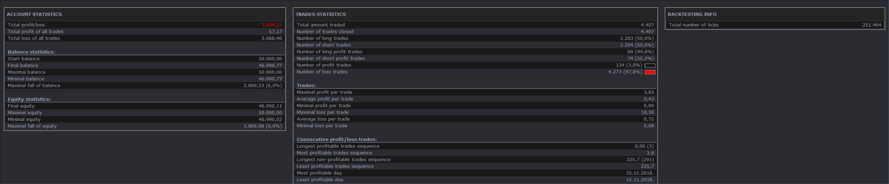

# TITI-TOTO_Strategy

> Source: https://fxcodebase.com/code/viewtopic.php?f=31&t=70850  
> Forum: 31 · Topic 70850 · 2 post(s)

---

## TITI-TOTO_Strategy

**Apprentice** · Sun Jan 24, 2021 7:12 pm

Based on the request.
[viewtopic.php?f=27&t=70723](https://fxcodebase.com/code/viewtopic.php?f=27&t=70723)

 [TITI-TOTO_Strategy.lua](files/140330/TITI-TOTO_Strategy.lua)

 [TOTO.bin](files/140330/TOTO.bin)

 [TITI.bin](files/140330/TITI.bin)

---

## Re: TITI-TOTO_Strategy

**RAOUF31** · Fri Jan 29, 2021 6:47 am

Hello first thank you for the work done. Is it possible to change the strategy so that one realizes a sale on a red candle fence of the indicator TITI or TOTO, cut the sale when a candle closes green. Take a position to buy when a candle closes green with the TOTO or TITI flag and cut the purchase when a red fence candle with the TOTO or TITI flag? Thanks in advance
