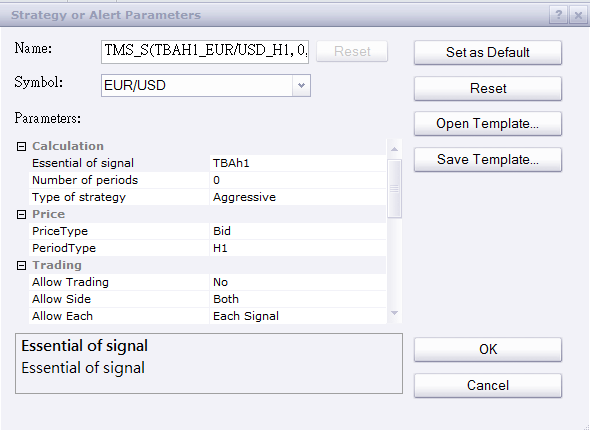

# TMS_S strategy

> Source: https://fxcodebase.com/code/viewtopic.php?f=31&t=64905  
> Forum: 31 · Topic 64905 · 1 post(s)

---

## TMS_S strategy

**richardtao** · Thu Jul 06, 2017 1:21 am

The TMS_S strategy is applying to Trading Station II.
This strategy could combine with TAAh4,TBAh1,TCAh1,TDAh4 … serial indicators.

The first parameter is "E: Essential of signal" which defines the serial indicators as above by TAO.

 

 [TMS_S.bin](files/113432/TMS_S.bin)
